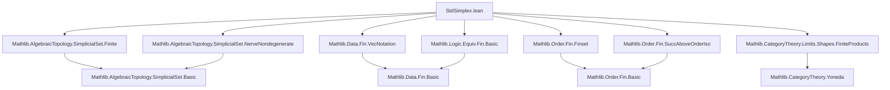

### Technical Brief: `StdSimplex.lean`

---

#### **1. Key Definitions & Theorems**

| Name | Type / Signature | Purpose |
|------|------------------|---------|
| `stdSimplex : CosimplicialObject SSet.{u}` | `CosimplicialObject SSet` | The cosimplicial object sending `⦋n⦌` to the standard simplex `Δ[n]`, defined as `uliftYoneda`. |
| `Δ[n]` | `SSet` | Notation for `stdSimplex.obj (SimplexCategory.mk n)`, the *n*-th standard simplex. |
| `objEquiv {n m}` | `(stdSimplex.obj n).obj m ≃ (m.unop ⟶ n)` | Equivalence between *m*-simplices of `Δ[n]` and morphisms `⦋m⦌ → ⦋n⦌` in `SimplexCategory`. |
| `objMk` | `(Fin (m + 1) →o Fin (n + 1)) → Δ[n] _⦋m⦌` | Constructor for *m*-simplices via monotone maps. |
| `asOrderHom` | `Δ[n] _⦋m⦌ → OrderHom (Fin (m + 1)) (Fin (n + 1))` | Forgets the equivalence and returns the underlying monotone map. |
| `const n k m` | `Δ[n] _⦋m⦌` | Degenerate *m*-simplex constant at vertex `k : Fin (n + 1)`. |
| `edge n a b hab` | `Δ[n] _⦋1⦌` | Edge (1-simplex) from `a` to `b` when `a ≤ b`. |
| `triangle a b c hab hbc` | `Δ[n] _⦋2⦌` | 2-simplex with vertices `a, b, c` when `a ≤ b ≤ c`. |
| `face S` | `Δ[n].Subcomplex` | Subcomplex of `Δ[n]` consisting of simplices whose image lies in `S ⊆ Fin (n + 1)`. |
| `yonedaEquiv` | `(stdSimplex.obj n ⟶ X) ≃ X.obj (op n)` | Yoneda isomorphism for standard simplices. |
| `nonDegenerateEquiv` | `(Δ[n].nonDegenerate d) ≃ (Fin (d + 1) ↪o Fin (n + 1))` | Bijection between nondegenerate *d*-simplices of `Δ[n]` and order embeddings `Fin (d + 1) ↪o Fin (n + 1)`. |
| `faceRepresentableBy` | `(face S).RepresentableBy ⦋m⦌` | Shows `face S` is representable when `S ≅ Fin (m + 1)` as posets. |
| `isoOfRepresentableBy` | `X.RepresentableBy ⦋m⦌ → Δ[m] ≅ X` | If `X` is representable by `⦋m⦌`, then `X ≅ Δ[m]`. |
| `faceSingletonComplIso` | `Δ[n] ≅ face {i}ᶜ` | Isomorphism between `Δ[n]` and the face of `Δ[n+1]` missing vertex `i`. |
| `faceSingletonIso` | `Δ[0] ≅ face {i}` | Isomorphism between `Δ[0]` and the 0-face at vertex `i`. |
| `facePairIso` | `Δ[1] ≅ face {i, j}` | Isomorphism between `Δ[1]` and the 1-face spanned by `i < j`. |
| `isoNerve` | `Δ[n] ≅ nerve (ULift (Fin (n + 1)))` | Standard simplex is the nerve of the discrete poset `ULift (Fin (n + 1))`. |
| `mem_nonDegenerate_iff_strictMono` | `s ∈ Δ[n].nonDegenerate d ↔ StrictMono s` | Characterization of nondegenerate simplices in `Δ[n]`. |
| `instance Finite` | `Finite ((stdSimplex.obj n).obj d)` | Each level of `Δ[n]` is finite. |
| `instance HasDimensionLE` | `(Δ[n]).HasDimensionLE n` | `Δ[n]` has dimension ≤ *n*. |

---

#### **2. Naming Conventions**

- **Prefixes**:
  - `stdSimplex.`: Module-level namespace for standard simplex constructions.
  - `objEquiv`, `objMk`, `asOrderHom`: Functional views of simplices as morphisms.
  - `const`, `edge`, `triangle`: Concrete low-dimensional simplices.
  - `face`: Subcomplexes defined by subsets of vertices.
  - `isoOfRepresentableBy`, `faceRepresentableBy`: Representability arguments.
  - `yonedaEquiv`: Yoneda lemma applications.

- **Suffixes**:
  - `_equiv`, `_iso`: Equivalences / isomorphisms.
  - `_app_apply`: Lemmas about components of natural transformations.
  - `_mono`, `_strictMono`: Monotonicity / strict monotonicity conditions.

- **Notation**:
  - `Δ[n]`: Standard *n*-simplex.
  - `⦋n⦌`: Object in `SimplexCategory`.
  - `δ i`: Standard face map `Δ[n] → Δ[n+1]` omitting vertex `i`.

---

#### **3. Tactic Stack**

Frequently used tactics in proofs:
- `rfl`: For definitional equalities (e.g., `objEquiv_symm_apply`).
- `aesop`: For automated reasoning in subcomplex, face, and monotonicity contexts.
- `simp only [...]`: Fine-grained simplification, especially with `objEquiv`, `mem_face_iff`, `yonedaEquiv`.
- `ext`: Extensionality for functions, order homs, subcomplexes.
- `fin_cases`: Case analysis on `Fin` elements.
- `apply congr_arg`, `congr'`: Equality proofs via congruence.
- `decide`: For closed-form decidability (e.g., `faceSingletonIso_zero_hom_comp_ι_eq_δ`).
- `induction ... using SimplexCategory.rec`: Structural induction on `SimplexCategory`.

---

#### **4. Proof Logic**

- **Structure of proofs**:
  - Most proofs are *definitionally driven*: they unfold definitions (`objEquiv`, `face`, `yonedaEquiv`) and reduce to properties of `OrderHom`, `Fin`, and `Finset`.
  - **Induction** is used on `SimplexCategory` (i.e., on `n`) to prove representability or finiteness.
  - **Equivalence chaining**: Many lemmas use `objEquiv` to translate between simplices and morphisms, then apply category-theoretic reasoning (e.g., Yoneda, naturality).
  - **Subcomplex reasoning**: Face subcomplexes are handled via `mem_face_iff`, often reducing to pointwise membership in `S ⊆ Fin (n + 1)`.
  - **Nondegeneracy**: Characterized via strict monotonicity or injectivity of the underlying order hom, then linked to embeddings via `OrderEmbedding.ofStrictMono`.

- **Typical flow**:
  1. Unfold definitions (e.g., `face`, `objEquiv`, `yonedaEquiv`).
  2. Reduce to properties of monotone maps or subsets of `Fin`.
  3. Use `Fin`-specific lemmas (`Fin.monotone_iff_le_succ`, `Fin.ext_iff`, `Finset.image_subset_iff`).
  4. Apply `aesop` or `simp` to finish.

---

#### **5. Imports**

| Module | Purpose |
|--------|---------|
| `Mathlib.AlgebraicTopology.SimplicialSet.Finite` | Finiteness of simplicial sets, degeneracy, nondegeneracy. |
| `Mathlib.AlgebraicTopology.SimplicialSet.NerveNondegenerate` | Nerve construction and nondegenerate simplices. |
| `Mathlib.Data.Fin.VecNotation` | Notation for vectors (`![a, b, c]`) and `Fin`-indexed functions. |
| `Mathlib.Logic.Equiv.Fin.Basic` | Basic equivalences on `Fin`. |
| `Mathlib.Order.Fin.Finset` | Finite subsets of `Fin`, monotonicity, embeddings. |
| `Mathlib.Order.Fin.SuccAboveOrderIso` | Order isomorphisms like `Fin (n + 1) ≃ {i}ᶜ`. |
| `Mathlib.CategoryTheory.Limits.Shapes.FiniteProducts` | Finite products in categories (used for `uliftYoneda`). |

---

#### **6. Mermaid Diagrams**

##### **Dependency Graph (Module-Level)**



##### **Overview of `StdSimplex.lean` Theory**

```mermaid
flowchart LR
  A[SimplexCategory] -->|uliftYoneda| B[stdSimplex : CosimplicialObject SSet]
  B --> C[Δ[n] : SSet]
  C --> D[objEquiv : (Δ[n] _⦋m⦌) ≃ (⦋m⦌ → ⦋n⦌)]
  D --> E[Monotone maps Fin(m+1) → Fin(n+1)]
  C --> F[face S : Subcomplex]
  C --> G[nonDegenerate d : Type]
  G --> H[Order embeddings Fin(d+1) ↪o Fin(n+1)]
  C --> I[isoNerve : Δ[n] ≅ nerve(ULift(Fin(n+1)))]
  C --> J[δ i : Δ[n] → Δ[n+1]]
  F --> K[faceSingletonComplIso : Δ[n] ≅ face{i}ᶜ]
  F --> L[faceSingletonIso : Δ[0] ≅ face{i}]
  F --> M[facePairIso : Δ[1] ≅ face{i,j}]
```

---

#### **7. Theory Summary**

- **Core idea**: The standard simplex `Δ[n]` is the representable simplicial set `Hom(-, ⦋n⦌)`, i.e., the Yoneda embedding of `SimplexCategory`.
- **Simplices = monotone maps**: An *m*-simplex of `Δ[n]` is a monotone function `Fin (m+1) → Fin (n+1)`.
- **Faces = subsets**: Subcomplexes `face S` cut out by subsets `S ⊆ Fin (n+1)`.
- **Nondegenerate simplices = embeddings**: Strictly monotone maps ↔ order embeddings.
- **Representability**: Any face `face S` where `S ≅ Fin (m+1)` is isomorphic to `Δ[m]`.
- **Nerve interpretation**: `Δ[n]` is the nerve of the discrete poset `ULift (Fin (n+1))`.

This file forms the foundational toolkit for working with standard simplices, boundaries, horns, and their subcomplexes in homotopical algebra and simplicial homotopy theory.

--- 

Let me know if you'd like a formalization roadmap or a summary of related files (`SimplicialSet.Boundary.lean`, `SimplicialSet.Horn.lean`).
