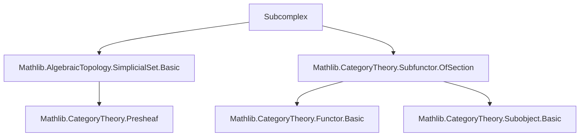

Here is the structured technical brief extracted from `Subcomplex.lean`:

---

### **1. Key Definitions & Theorems**

| Name | Type / Signature | Purpose |
|------|------------------|---------|
| `Subcomplex X` | `abbrev Subcomplex := Subfunctor X` | Type of subcomplexes of a simplicial set `X`, identified with subfunctors of `X`. |
| `ι A` | `A : X.Subcomplex → Quiver.Hom (V := SSet) A X` | Inclusion morphism of a subcomplex `A` into `X`, viewed in `SSet`. |
| `homOfLE h` | `S₁ ≤ S₂ → (S₁ : SSet) ⟶ (S₂ : SSet)` | Morphism induced by inclusion of subcomplexes. |
| `eqToIso h` | `S₁ = S₂ → (S₁ : SSet) ≅ S₂` | Isomorphism induced by equality of subcomplexes. |
| `toSSetFunctor` | `X.Subcomplex ⥤ SSet` | Functor sending a subcomplex to its underlying simplicial set. |
| `topIso X` | `((⊤ : X.Subcomplex) : SSet) ≅ X` | Isomorphism between top subcomplex and `X`. |
| `ofSimplex x` | `x : X _⦋n⦌ → X.Subcomplex` | Subcomplex generated by a single simplex `x`. |
| `range f` | `f : X ⟶ Y → Y.Subcomplex` | Range of `f`, as a subcomplex of `Y`. |
| `toRange f` | `X ⟶ range f` | Factorization of `f` through its range. |
| `lift f hf` | `range f ≤ B → X ⟶ B` | Factorization of `f` through a subcomplex `B` containing its range. |
| `preimage A p` | `A : X.Subcomplex → p : Y ⟶ X → Y.Subcomplex` | Preimage of a subcomplex under a morphism. |
| `image A f` | `A : X.Subcomplex → f : X ⟶ Y → Y.Subcomplex` | Image of a subcomplex under a morphism. |
| `toImage A f` | `(A : SSet) ⟶ A.image f` | Factorization of inclusion `A.ι ≫ f` through the image. |
| `fromPreimage A p` | `(A.preimage p : SSet) ⟶ (A : SSet)` | Morphism induced by universal property of preimage. |

**Theorems (selected):**
- `homOfLE_ι : homOfLE h ≫ S₂.ι = S₁.ι`
- `range_eq_top_iff : range f = ⊤ ↔ Epi f`
- `image_ofSimplex : (ofSimplex x).image f = ofSimplex (f.app _ x)`
- `preimage_range : (range f).preimage f = ⊤`
- `image_monotone : Monotone (image f)`
- `preimage_eq_top_iff : B.preimage f = ⊤ ↔ range f ≤ B`

---

### **2. Naming Conventions**

- **Prefixes:**
  - `ofSimplex`: subcomplex generated by a simplex.
  - `preimage`, `image`: operations on subcomplexes along morphisms.
  - `toRange`, `toImage`, `lift`, `fromPreimage`: canonical factorizations.
- **Suffixes:**
  - `_ι`: morphism involving inclusion (e.g., `ι`, `homOfLE_ι`, `toImage_ι`).
  - `_app_val`, `_app_coe`: component-wise description of natural transformations.
- **General:**
  - `homOfLE`, `eqToIso`, `toSSet`, `toSSetFunctor`: standard categorical constructions.
  - `mono_`, `epi_`, `isIso_`: properties of morphisms.

---

### **3. Tactic Stack**

Frequently used tactics:
- `aesop`: for automated reasoning in `SSet`, especially naturality and extensionality.
- `rw`, `rfl`, `simp`, `ext`: for equality proofs and extensionality.
- `infer_instance`: for typeclass inference (e.g., `Mono`, `Epi`, `DecidableEq`).
- `cases`, `obtain`, `rintro`: for destructuring hypotheses.
- `subsingleton`, `subsingleton'`: for uniqueness arguments.
- `apply`, `exact`, `refine`: for constructing morphisms.

---

### **4. Proof Logic**

- **Induction / Extensionality**: Proofs often rely on extensionality in `SSet` (`ext`) and pointwise reasoning (`app`).
- **Factorization Lemmas**: Many results (e.g., `toRange_ι`, `lift_ι`, `toImage_ι`) are proven by `rfl`, indicating they are definitional.
- **Monotonicity & Lattice Structure**: Properties like `image_monotone`, `preimage_iSup`, etc., use lattice-theoretic reasoning (`le_antisymm`, `iSup_le_iff`, etc.).
- **Universal Properties**: `lift`, `toImage`, `fromPreimage` are defined via universal properties of subfunctors; their lemmas follow from `Subfunctor` theory.
- **Balanced Category Proof**: `Balanced SSet` is proven directly via `NatTrans.isIso_iff_isIso_app`, avoiding heavy imports.

---

### **5. Imports**

- `Mathlib.AlgebraicTopology.SimplicialSet.Basic`: core simplicial set theory.
- `Mathlib.CategoryTheory.Subfunctor.OfSection`: subfunctor machinery (used for `Subcomplex` as `Subfunctor`).
- `Mathlib.CategoryTheory.Limits.Basic` (via `Limits`): for limits/colimits (e.g., `iSup`, `iInf`).
- `Mathlib.CategoryTheory.NatTrans.Basic`: for natural transformations.
- `Mathlib.CategoryTheory.Subobject.Basic`: for `Mono`, `Epi`, `IsIso`, etc.

---

### **6. Mermaid Diagrams**

#### **Dependency Graph (Module-Level)**



#### **Overview of `Subcomplex.lean`**

```mermaid
graph TD
  A[SSet.{u}] --> B[Subcomplex X]
  B --> C[toSSet : Subcomplex → SSet]
  B --> D[ι : A ⟶ X]
  B --> E[≤ : Subcomplex → Subcomplex → Prop]
  E --> F[homOfLE : S₁ ≤ S₂ → S₁ ⟶ S₂]
  B --> G[range f]
  B --> H[image A f]
  B --> I[preimage A p]
  G --> J[toRange : X ⟶ range f]
  H --> K[toImage : A ⟶ A.image f]
  I --> L[fromPreimage : A.preimage p ⟶ A]
  B --> M[topIso : ⊤ ≅ X]
  B --> N[isInitialBot : IsInitial ⊥]
```

#### **Lattice Structure of Subcomplexes**

```mermaid
graph TD
  A[Subcomplex X] -->|≤| B[Subfunctor X]
  B -->|complete lattice| C[Set (X.obj n)]
  C -->|pointwise| D[SSet]
  A -->|ι| X[X]
  A -->|homOfLE| Y[Y]
```

---

Let me know if you'd like a formalized summary in Lean or a theory roadmap for future extensions (e.g., sheaf theory, spectral sequences).
