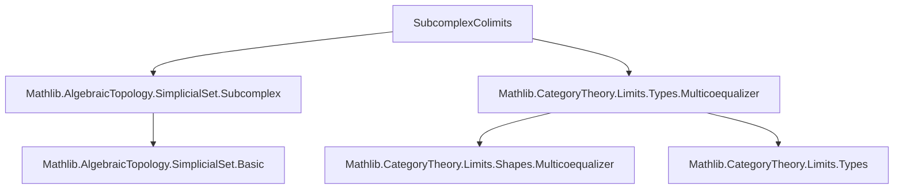

**Technical Brief: `SubcomplexColimits.lean`**

---

### 1. **Key Definitions & Theorems**

| Name | Type / Signature | Purpose |
|------|------------------|---------|
| `MulticoequalizerDiagram` | `abbrev MulticoequalizerDiagram := CompleteLattice.MulticoequalizerDiagram A U V` | Encodes a multicoequalizer diagram in the complete lattice of subcomplexes of a simplicial set `X`. |
| `isColimit` | `IsColimit (h.multicofork.map toSSetFunctor)` | Shows that the image of the multicofork under the forgetful functor `toSSetFunctor` is a colimit in `SSet`. |
| `isColimit'` | `IsColimit (h.multicofork.toLinearOrder.map toSSetFunctor)` | Variant of `isColimit` assuming `ι` is linearly ordered; simplifies the diagram by restricting to `i < j`. |
| `BicartSq` | `abbrev BicartSq (A₁ A₂ A₃ A₄ : X.Subcomplex) := Lattice.BicartSq A₁ A₂ A₃ A₄` | Abbreviates bicartesian squares (pullbacks + pushouts) in the subcomplex lattice. |
| `BicartSq.isPushout` | `IsPushout ...` | Proves that any bicartesian square in `Subcomplex X` yields a pushout square in `SSet`. |

---

### 2. **Naming Conventions**

- **Prefixes**:
  - `isColimit`, `isPushout`: indicate that a universal property (colimit/pushout) holds.
  - `MulticoequalizerDiagram`, `BicartSq`: abbreviations for lattice-theoretic structures.
- **Suffixes**:
  - `'` (prime): variant with additional assumptions (e.g., `isColimit'` assumes `LinearOrder ι`).
- **Structure fields**:
  - `eq_inf`, `iSup_eq`, `sup_eq`, `inf_eq`: lattice-theoretic equalities encoding diagram conditions.

---

### 3. **Tactic Stack**

Frequent tactics used in proofs:

- `simp` / `simp_rw`: simplifying lattice operations (`inf`, `iSup`, `sup`) and functor actions.
- `rw`: rewriting using hypotheses like `h.eq_inf`, `sq.sup_eq`.
- `dsimp`: simplifying definitional equalities (e.g., unfolding `obj n`).
- `exact`: applying known lemmas (e.g., `Types.isColimitOfMulticoequalizerDiagram`, `Types.isPushout_of_bicartSq`).
- `evaluationJointlyReflectsColimits`: key lemma used to reduce colimit verification objectwise.
- `rfl`: for definitional equalities (e.g., `w := rfl` in `isPushout`).

---

### 4. **Proof Logic**

- **General strategy**:
  1. **Lift lattice diagram to `SSet`** via `toSSetFunctor`.
  2. **Reduce colimit verification to each degree `n : Δᵒ`** using `evaluationJointlyReflectsColimits`.
  3. **Apply known results in `Type*`** (e.g., `Types.isColimitOfMulticoequalizerDiagram`, `Types.isPushout_of_bicartSq`) after showing the objectwise diagram satisfies the lattice-theoretic conditions.
  4. Use equivalence lemmas like `Multicofork.isColimitMapEquiv`, `PushoutCocone.isColimitMapCoconeEquiv` to transfer colimit structures.

- **Induction / cases**: Not used directly; instead, the proofs rely on *objectwise* reflection of colimits and known categorical facts about `Type*`.

---

### 5. **Imports**

| Import | Role |
|--------|------|
| `Mathlib.AlgebraicTopology.SimplicialSet.Subcomplex` | Defines `Subcomplex X`, its lattice structure, and morphisms. |
| `Mathlib.CategoryTheory.Limits.Types.Multicoequalizer` | Provides `MulticoequalizerDiagram`, multicoforks, and colimit criteria in `Type*`. |

---

### 6. **Mermaid Diagrams**

#### **Dependency Graph (Module Level)**



#### **Overview of Theoretical Flow**

```mermaid
flowchart LR
  A[Subcomplex X as CompleteLattice] --> B[MulticoequalizerDiagram in Subcomplex X]
  A --> C[BicartSq in Subcomplex X]
  B --> D[Map to SSet via toSSetFunctor]
  C --> D
  D --> E[Colimit/Pushout in SSet]
  E --> F[Verified via evaluationJointlyReflectsColimits]
  F --> G[Use Type* colimit lemmas (Types.isColimit*, Types.isPushout*)]
```

#### **Objectwise Verification Schema**

```mermaid
flowchart LR
  h:MulticoequalizerDiagram A U V --> h_n:MulticoequalizerDiagram (A.obj n) (U i).obj n (V i j).obj n
  h_n --> Types.isColimitOfMulticoequalizerDiagram h_n
  Types.isColimitOfMulticoequalizerDiagram h_n --> IsColimit (h.multicofork.map toSSetFunctor)
```

---

### 7. **Summary**

This file establishes that **colimits in the lattice of subcomplexes of a simplicial set `X` are computed objectwise in `SSet`**, via:
- Multicoequalizer diagrams → colimits in `SSet`.
- Bicartesian squares → pushouts in `SSet`.

It leverages the fact that the forgetful functor `SSet → Type^{Δᵒ}` jointly reflects colimits, and that the subcomplex lattice is a complete lattice where colimits are computed via suprema/infima. The proofs are largely mechanical once the objectwise lattice conditions are verified.

--- 

*End of Technical Brief.*
