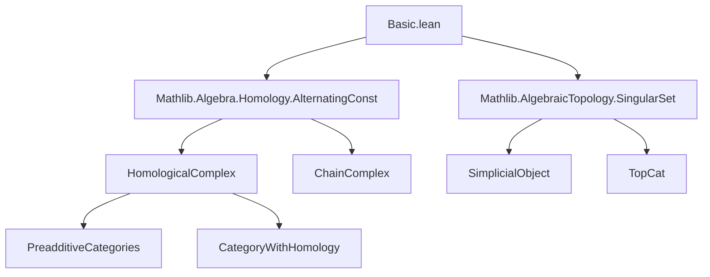

**Technical Brief: Basic.lean — Singular Homology in Lean 4**

---

### 1. **Key Definitions & Theorems**

| Name | Type / Signature | Purpose |
|------|------------------|---------|
| `SSet.singularChainComplexFunctor` | `C ⥤ SSet.{w} ⥤ ChainComplex C ℕ` | Constructs the singular chain complex functor from a coefficient object `X : C` and a simplicial set; generalizes classical singular chains (e.g., `C = Ab`, `X = ℤ`). |
| `singularChainComplexFunctor` | `C ⥤ TopCat.{w} ⥤ ChainComplex C ℕ` | Extends the above to topological spaces via `TopCat.toSSet`. |
| `singularHomologyFunctor` | `C ⥤ TopCat.{w} ⥤ C` | The `n`-th singular homology functor with coefficients in `C`. |
| `singularChainComplexFunctorIsoOfTotallyDisconnectedSpace` | `((singularChainComplexFunctor C).obj R).obj X ≅ ChainComplex.alternatingConst.obj (∐ fun _ : X ↦ R)` | For totally disconnected `X`, identifies its singular chain complex with the alternating complex of the coproduct `∐_X R`. |
| `singularChainComplexFunctor_exactAt_of_totallyDisconnectedSpace` | `n ≠ 0 → ((singularChainComplexFunctor C).obj R).obj X).ExactAt n` | Shows exactness of the singular chain complex in positive degrees for totally disconnected spaces. |
| `isZero_singularHomologyFunctor_of_totallyDisconnectedSpace` | `n ≠ 0 → IsZero (((singularHomologyFunctor C n).obj R).obj X)` | Concludes vanishing of higher singular homology for totally disconnected spaces. |
| `singularHomologyFunctorZeroOfTotallyDisconnectedSpace` | `((singularHomologyFunctor C 0).obj R).obj X ≅ ∐ fun _ : X ↦ R` | Identifies the 0-th singular homology as the free object on `X` (coproduct of copies of `R`). |

---

### 2. **Naming Conventions**

- **Prefixes**:
  - `singularChainComplexFunctor`: Core construction.
  - `singularHomologyFunctor`: Homology derived from the chain complex.
  - `isZero_`, `exactAt`: Properties of chain complexes/homology.
  - `OfTotallyDisconnectedSpace`: Contextual specialization for totally disconnected spaces.

- **Suffixes**:
  - `Functor`: Indicates a functor-level construction.
  - `Iso`: Denotes an isomorphism (e.g., `singularChainComplexFunctorIsoOfTotallyDisconnectedSpace`).
  - `ExactAt`, `HomologyZero`: Describes structural properties at a degree.

- **Pattern**: `singularHomologyFunctorZeroOfTotallyDisconnectedSpace` follows `_<name>_<degree>_<context>`.

---

### 3. **Tactic Stack**

- **Core tactics**:
  - `exact`, `refine`, `assumption`, `apply`, `rw`, `simp`, `simp_rw`
  - `iso_hom_ext`, `hom_ext`, `ext` (for morphism equality in categories)
  - `convert`, `congr`, `change`, `clear`, `revert`
  - `have`, `suffices`, `by_cases`, `intro`, `cases`

- **Category-theoretic helpers**:
  - `whiskeringLeft`, `whiskeringRight`, `postcompose₂`, `constComp`, `mapIso`
  - `homologyFunctor`, `alternatingFaceMapComplex`, `alternatingConst`

- **Homological algebra**:
  - `exactAt_of_iso`, `isZero_homology`, `of_iso`, `homologyFunctor.mapIso`

- **No heavy automation** (e.g., no `aesop`, `linarith`, `ring`), indicating a focus on explicit categorical/homological reasoning.

---

### 4. **Proof Logic**

- **Structure**:
  1. **Construction**: Define functors via composition of known constructions (`postcompose₂`, `whiskering`, `toSSet`).
  2. **Isomorphism**: Use `mapIso` and `≫` (horizontal composition of natural transformations) to build isomorphisms.
  3. **Reduction**: Reduce properties (e.g., exactness, vanishing homology) via isomorphism to known cases (e.g., `alternatingConst_exactAt`).
  4. **Specialization**: Use `[TotallyDisconnectedSpace X]` to trigger simplifications (e.g., `TopCat.toSSetIsoConst X`).
  5. **Zero object & coproducts**: Leverage `hasCoproducts_shrink` and `initialIsInitial.isZero` to ensure technical prerequisites.

- **Induction**: Not used directly; instead, rely on *degree-wise* arguments (e.g., `hn : n ≠ 0`).

- **Logical flow**:
  ```
  [Assume X totally disconnected]
  → construct iso of chain complexes
  → transport exactness/homology properties via iso
  → conclude vanishing or description of homology
  ```

---

### 5. **Imports**

| Import | Role |
|--------|------|
| `Mathlib.Algebra.Homology.AlternatingConst` | Provides `alternatingConst`, `alternatingFaceMapComplex`, and their exactness/homology properties. |
| `Mathlib.AlgebraicTopology.SingularSet` | Supplies `TopCat.toSSet`, singular set construction, and related whiskering. |

- **No direct reliance on homology theory beyond `HomologicalComplex.homologyFunctor`** (imported via `Homology.AlternatingConst`).

---

### 6. **Mermaid Diagrams**

#### **Dependency Graph (Module-Level)**



#### **Overview of Theory Flow**

```mermaid
graph LR
  S[Topological Space X] -->|toSSet| SS[Simplicial Set]
  SS -->|alternatingFaceMapComplex| CC[Chain Complex]
  C[Coefficient Object] -->|sigmaConst| SS
  CC -->|HomologyFunctor(-, n)| Hn[n-th Homology]
  X[Totally Disconnected] -->|Iso| AC[Alternating Const Complex]
  AC -->|ExactAt n≠0| EV[Vanishing Homology]
  AC -->|HomologyZero| Z0[Free Object on X]
```

---

### 7. **Summary**

This file formalizes singular homology in a highly abstract categorical setting, generalizing classical singular chains to arbitrary coefficient objects in a preadditive category with coproducts and homology. It demonstrates the power of Lean’s category theory library by:
- Constructing functors via whiskering and composition,
- Proving structural properties (exactness, vanishing) via isomorphism transport,
- Explicitly computing homology in a nontrivial but tractable case (totally disconnected spaces).

The proofs are largely *structural* rather than computational, relying on the interplay between simplicial objects, chain complexes, and homological algebra in abstract categories.

--- 

*End of Technical Brief.*
