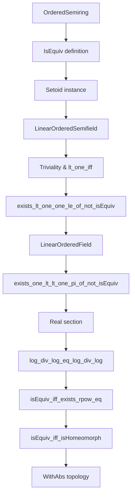
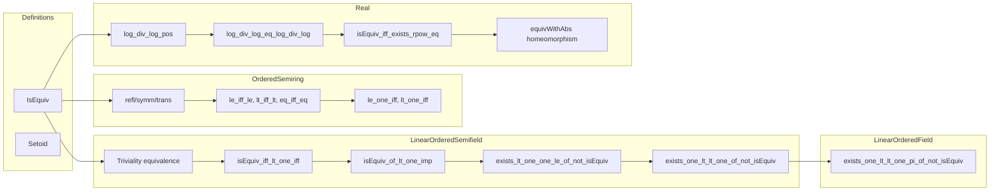

Here is the structured technical brief extracted from `Equivalence.lean`:

---

### **1. Key Definitions & Theorems**

| Name | Type / Signature | Purpose |
|------|------------------|---------|
| `IsEquiv` | `v.IsEquiv w := ∀ x y, v x ≤ v y ↔ w x ≤ w y` | Defines equivalence of absolute values via order-preserving comparison. |
| `isEquiv_iff_exists_rpow_eq` | `v.IsEquiv w ↔ ∃ c > 0, (v · ^ c) = w` | Core theorem: for real absolute values, order-equivalence ⇔ power-equivalence. |
| `isEquiv_iff_lt_one_iff` | `v.IsEquiv w ↔ ∀ x, v x < 1 ↔ w x < 1` | Equivalent condition using behavior at 1 (useful in proofs). |
| `isEquiv_of_lt_one_imp` | `(∀ x, v x < 1 → w x < 1) ∧ v.IsNontrivial ⇒ v.IsEquiv w` | Sufficient condition for equivalence when one dominates the other near 0. |
| `exists_lt_one_one_le_of_not_isEquiv` | `¬v.IsEquiv w ∧ v.IsNontrivial ⇒ ∃ a, v a < 1 ∧ 1 ≤ w a` | Witness of inequivalence: a point where one is small and the other is large. |
| `exists_one_lt_lt_one_pi_of_not_isEquiv` | For finite pairwise inequivalent nontrivial absolute values, for each `i`, ∃ `a` with `1 < v i a` and `∀ j ≠ i, v j a < 1` | Key technical lemma for constructing “divergent points” in product/topological arguments. |
| `IsEquiv.log_div_log_eq_log_div_log` | Under equivalence, `(log (v a)) / (log (w a))` is constant for `a ≠ 0, v a ≠ 1` | Shows the exponent `c` in `v^c = w` is uniquely determined by any such `a`. |
| `isEquiv_iff_isHomeomorph` | `v.IsEquiv w ↔ IsHomeomorph (WithAbs.equivWithAbs v w)` | Connects equivalence to topological equivalence of induced normed spaces. |

---

### **2. Naming Conventions**

- **Prefixes**:
  - `isEquiv_`: properties of `IsEquiv` (e.g., `isEquiv_trivial_iff_eq_trivial`, `isEquiv_of_lt_one_imp`)
  - `exists_..._of_not_isEquiv`: existence lemmas for inequivalent absolute values
  - `equivWithAbs_...`: properties of the equivalence map `WithAbs.equivWithAbs v w`
- **Suffixes**:
  - `_iff`: biconditional characterizations (`isEquiv_iff_lt_one_iff`, `isEquiv_iff_exists_rpow_eq`)
  - `_congr`: congruence lemmas (`isNontrivial_congr`)
  - `_pi_...`: lemmas for finite families (`exists_one_lt_lt_one_pi_of_not_isEquiv`)
- **Aliases**:
  - Deprecated aliases like `isEquiv_refl`, `isEquiv_symm`, `isEquiv_trans` (marked with `@[deprecated]`)

---

### **3. Tactic Stack**

Frequently used tactics:
- `aesop`: for automated reasoning with `simp`, `linarith`, `assumption`
- `simp` / `simp_rw`: simplification, especially with `map_*`, `rpow_*`, `log_*`
- `rcases` / `cases`: case analysis on `eq_or_ne`, `lt_or_gt`, `le_or_lt`
- `rw`: rewriting using lemmas like `map_mul`, `map_inv₀`, `map_pow`, `rpow_mul`
- `exact`, `refine`, `apply`: proof construction
- `convert`, `congr`: for equality proofs
- `have`, `obtain`, `choose`: intermediate lemma introduction
- `by_contra!`, `wlog!`: contradiction and well-ordering arguments
- `tendsto_*` lemmas: for filter-based convergence arguments (e.g., `tendsto_pow_atTop_nhds_zero_of_lt_one`)
- `grind`: custom tactic (likely `grind` from Mathlib’s `Tactic.Grind`)

---

### **4. Proof Logic**

- **Equivalence characterizations**:
  - Prove `IsEquiv` via `↔`-introduction: show both directions using order comparisons.
  - Use `lt_one_iff`, `le_one_iff`, `eq_one_iff` lemmas to reduce to behavior at 1.
- **Power equivalence**:
  - From `IsEquiv`, define `c := log(w a) / log(v a)` for a suitable `a`.
  - Prove constancy of `c` using `log_div_log_eq_log_div_log`.
  - Conclude `(v x)^c = w x` via `rpow_*` and `exp_log` identities.
- **Inequivalence witnesses**:
  - Use contrapositive + `isEquiv_of_lt_one_imp` to construct `a` with `v a < 1 ≤ w a`.
  - For symmetric case (`1 < v a ∧ w a < 1`), use inverses or division.
- **Finite families**:
  - Strong induction on finite index type (`Fintype ι`).
  - Construct sequences (e.g., `a^n * b`, `b / (1 + a⁻¹^n)`) and use filter convergence (`tendsto_*`) to find a common divergent point.
- **Topological consequences**:
  - Use `isEquiv_iff_exists_rpow_eq` to lift equivalence to homeomorphism of `WithAbs`-spaces.
  - Show continuity via `tendsto_pow_atTop_nhds_zero_iff_norm_lt_one`.

---

### **5. Imports**

- `Mathlib.Analysis.SpecialFunctions.Pow.Real`: real exponentiation (`rpow`, `rpow_mul`, etc.)
- `Mathlib.Analysis.Normed.Field.WithAbs`: theory of `WithAbs`, `equivWithAbs`, topology on absolute values

---

### **6. Mermaid Diagrams**

#### **Dependency Graph (High-Level)**

#### **Overview of File Structure**

---

Let me know if you'd like a formalized dependency graph (e.g., for `leanpkg` or `doc-gen`) or a summary of the theory’s role in class field theory / absolute value classification.
