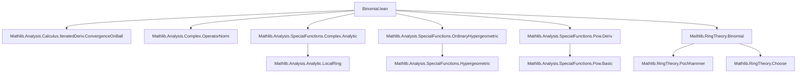
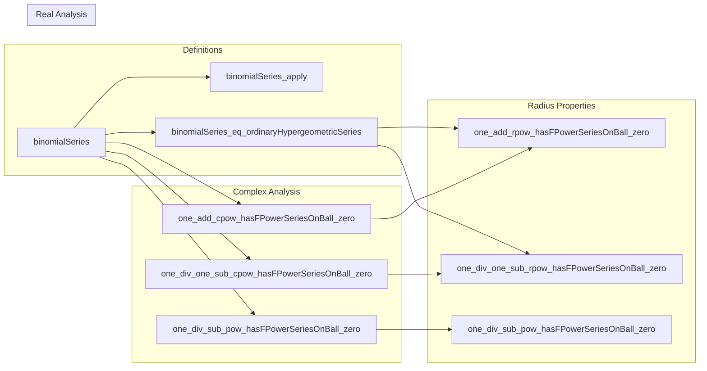

### Technical Brief: `Binomial.lean`

---

#### **1. Key Definitions & Theorems**

| Name | Type / Signature | Purpose |
|------|------------------|---------|
| `binomialSeries` | `{𝕂 : Type u} [Field 𝕂] [CharZero 𝕂] → (𝔸 : Type v) → [Ring 𝔸] [Algebra 𝕂 𝔸] → (a : 𝕂) → FormalMultilinearSeries 𝕂 𝔸 𝔸` | Defines the formal multilinear series with coefficients `Ring.choose a n`, representing the binomial expansion $(1+x)^a$. |
| `binomialSeries_apply` | `binomialSeries 𝔸 a n v = Ring.choose a n • (List.ofFn v).prod` | Explicitly describes the action of `binomialSeries` on multilinear inputs. |
| `binomialSeries_eq_ordinaryHypergeometricSeries` | `binomialSeries 𝔸 a = ordinaryHypergeometricSeries 𝔸 (-a) 1 1 ∘ (-id)` | Relates binomial series to the ordinary hypergeometric series via linear transformation. |
| `binomialSeries_radius_eq_top_of_nat` | `a : ℕ ⇒ radius = ⊤` | If $a$ is a natural number, the binomial series terminates (finite sum), hence converges everywhere. |
| `binomialSeries_radius_eq_one` | `∀ k, a ≠ k ⇒ radius = 1` | For non-natural $a$, radius of convergence is exactly 1. |
| `binomialSeries_radius_ge_one` | `1 ≤ radius` | General lower bound on radius of convergence. |
| `one_add_cpow_hasFPowerSeriesOnBall_zero` | `HasFPowerSeriesOnBall ((1 + ·)^a) (binomialSeries ℂ a) 0 1` | Shows that $(1+x)^a$ has the binomial series as its *local* power series expansion around 0 on the unit disk. |
| `one_div_one_sub_cpow_hasFPowerSeriesOnBall_zero` | `HasFPowerSeriesOnBall (1 / (1 - ·)^a) (.ofScalars ... (Ring.choose (a + n - 1) n)) 0 1` | Power series for $(1 - x)^{-a}$, related to negative binomial coefficients. |
| `one_div_sub_pow_hasFPowerSeriesOnBall_zero` | Generalization to $(z - x)^{-(a+1)}$, radius = `‖z‖ₑ`. | Enables local expansions around 0 for rational functions with pole at $z$. |
| `hasFPowerSeriesOnBall_ofScalars_mul_add_zero` | Linear function $an + b$ corresponds to combination of geometric and derivative-of-geometric series. | Used to derive closed forms for series like $\sum (an + b)z^n$. |

---

#### **2. Naming Conventions**

- **Prefixes**:
  - `binomialSeries_`: for definitions and properties of the binomial series.
  - `one_add_cpow_`, `one_div_one_sub_`, `one_div_sub_`: for expansions of elementary complex functions.
  - `hasFPowerSeriesOnBall_`, `hasFPowerSeriesAt_`: for statements about existence of power series expansions.
- **Suffixes**:
  - `_zero`: expansions centered at 0.
  - `_hasFPowerSeriesOnBall_zero`: implies convergence on a ball around 0.
  - `_hasFPowerSeriesAt_zero`: local existence at a point.
- **Other patterns**:
  - `ofScalars`: used for series defined by scalar coefficients.
  - `compContinuousLinearMap`: indicates precomposition with a continuous linear map (e.g., negation or scaling).
  - `restrictScalars`: base-field restriction (ℂ → ℝ).
  - `congr`: used when two series define same function on domain.

---

#### **3. Tactic Stack**

Frequently used tactics in proofs:

| Tactic | Role |
|--------|------|
| `simp` / `simp only` | Simplify using definitional equalities and lemmas (e.g., `binomialSeries_apply`, `Ring.choose`). |
| `rw` / `congr` | Rewrite using equalities or prove equality of series via coefficient-wise comparison. |
| `ext` | Extensionality: prove equality of functions or multilinear maps by extension. |
| `ring` / `ring_nf` | Simplify polynomial expressions in rings/fields. |
| `norm_cast` | Push real/complex numbers into ℂ or back, preserving equality. |
| `grind` | Custom tactic (likely from Mathlib’s `Grind` module) for automated simplification of arithmetic in ordered structures. |
| `aesop` | Automated reasoning for first-order logic + arithmetic. |
| `conv` | For targeted rewriting in subterms. |
| `induction` | Structural induction on natural numbers (especially in derivative computations). |
| `convert` + `using n` | Match goal up to definitional equality, with flexibility in proof search. |
| `have` / `suffices` | Introduce intermediate claims or reverse implications. |
| `exact` / `apply` | Apply known lemmas or theorems. |

---

#### **4. Proof Logic**

- **Structure of main theorems**:
  - **Radius of convergence**: Reduce to known results about hypergeometric series (`binomialSeries_eq_ordinaryHypergeometricSeries`), then apply `ordinaryHypergeometricSeries_radius_*`.
  - **Analyticity / power series representation**:
    - Prove equality of coefficients via derivative formulas (`iteratedDeriv`).
    - Use induction on $n$ to derive closed form for $n$-th derivative of $(1+x)^a$.
    - Show that the Taylor coefficients match those of `binomialSeries`.
    - Apply `AnalyticOn.hasFPowerSeriesOnSubball` or `HasFPowerSeriesOnBall.of_hasFPowerSeriesOnBall`.
  - **Real case**: Lift to complex case via `ofRealCLM`, apply complex result, then restrict back using `restrictScalars` and `reCLM.comp_hasFPowerSeriesOnBall`.
  - **Rational functions**: Use composition with affine maps (`compContinuousLinearMap`, `comp_sub`) and scaling (`const_smul`) to reduce to base cases like `1 / (1 - x)`.

- **Common proof pattern**:
  ```text
  1. Reduce to known series (e.g., hypergeometric or geometric).
  2. Prove coefficient equality (via `Ring.choose` identities, Pochhammer calculus).
  3. Use convergence radius lemmas or analytic continuation.
  4. For real case: lift → complex → apply → restrict.
  ```

---

#### **5. Imports**

| Module | Purpose |
|--------|---------|
| `Mathlib.Analysis.Calculus.IteratedDeriv.ConvergenceOnBall` | Tools for iterated derivatives and convergence on balls. |
| `Mathlib.Analysis.Complex.OperatorNorm` | Normed space structure on ℂ-linear maps. |
| `Mathlib.Analysis.SpecialFunctions.Complex.Analytic` | Analyticity and power series representation in ℂ. |
| `Mathlib.Analysis.SpecialFunctions.OrdinaryHypergeometric` | Hypergeometric series definitions and convergence. |
| `Mathlib.Analysis.SpecialFunctions.Pow.Deriv` | Derivatives of complex power functions. |
| `Mathlib.RingTheory.Binomial` | Binomial coefficients, Pochhammer symbols, and algebraic identities. |

---

#### **6. Mermaid Diagrams**

##### **Dependency Graph (Top-Level)**



##### **Overview of Theory Flow**



---

#### **7. Summary**

This file formalizes the **binomial series** in the context of normed algebras over characteristic-zero fields, with emphasis on:

- **Radius of convergence**: depends on whether $a$ is natural.
- **Analytic representation**: $(1+x)^a$ equals its binomial series on the unit disk.
- **Generalizations**: to rational functions like $(z - x)^{-k}$, via composition and scaling.
- **Real and complex cases**: unified via scalar restriction and complexification.

The proofs rely heavily on:
- Pochhammer calculus (`descPochhammer`, `ascPochhammer`),
- Hypergeometric series identification,
- Derivative formulas for complex powers (`cpow`, `rpow`),
- Normed algebra and operator norm machinery.

The file is part of a larger effort to formalize special functions and their analytic properties in Lean 4.

--- 

Let me know if you'd like a **dependency graph of `Ring.choose` identities** or a **proof sketch of `one_add_cpow_hasFPowerSeriesOnBall_zero`** in detail.
