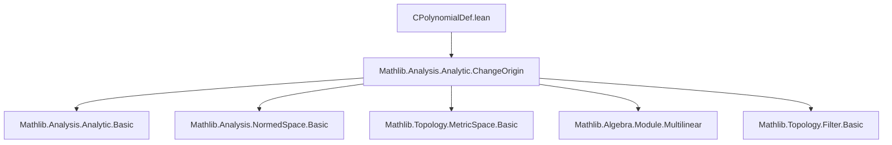
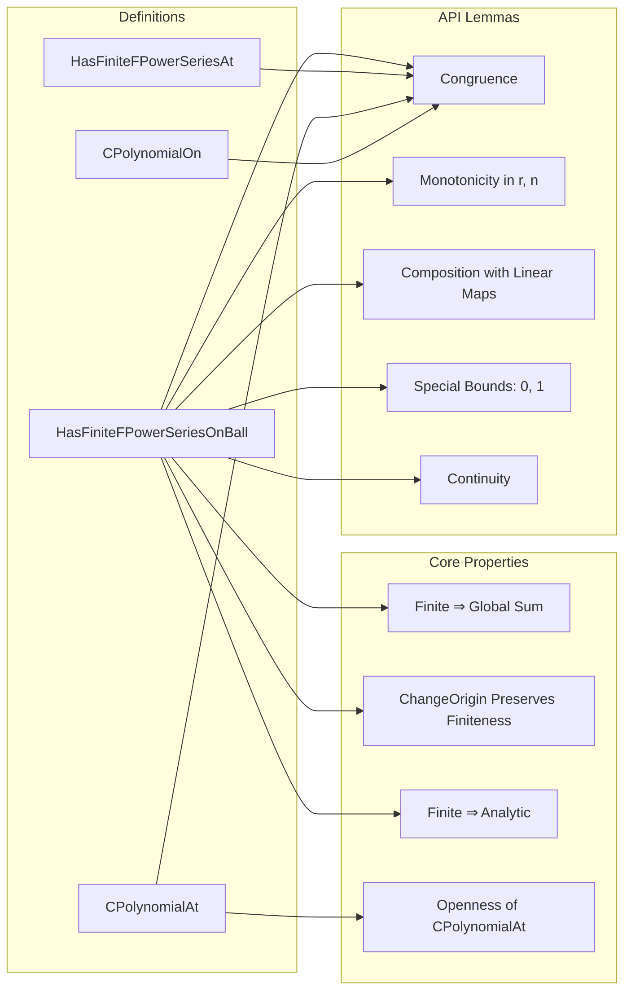

**Technical Brief: `CPolynomialDef.lean`**

---

### 1. KEY DEFINITIONS & THEOREMS

| Name | Type / Signature | Purpose |
|------|------------------|---------|
| `HasFiniteFPowerSeriesOnBall f p x n r` | `Prop` | `f` equals the sum of finite formal multilinear series `p` on `Metric.eball x r`, and `pₘ = 0` for all `m ≥ n`. Extends `HasFPowerSeriesOnBall` with finiteness condition. |
| `HasFiniteFPowerSeriesAt f p x n` | `Prop` | `f` has a finite power series expansion in *some* ball around `x`. Defined as `∃ r, HasFiniteFPowerSeriesOnBall f p x n r`. |
| `CPolynomialAt 𝕜 f x` | `Prop` | `f` is *continuously polynomial* at `x`: ∃ `p`, `n` s.t. `HasFiniteFPowerSeriesAt f p x n`. |
| `CPolynomialOn 𝕜 f s` | `Prop` | `f` is continuously polynomial at every point of `s`. |
| `changeOrigin p y k` | `ContinuousMultilinearMap 𝕜 E^[k] F` | The $k$-th coefficient of the power series of `f(x + y)` expressed around origin `y`, i.e., Taylor expansion shifted by `y`. |
| `changeOriginSeries p k m` | `ContinuousMultilinearMap 𝕜 E^[m] F` | The $m$-th coefficient in the series `p.changeOrigin y` (independent of `y` due to multilinearity). |
| `changeOrigin_finite_of_finite` | `∀ {k}, n ≤ k → p.changeOrigin y k = 0` | If `pₘ = 0` for `m ≥ n`, then so is `p.changeOrigin y`. |
| `HasFiniteFPowerSeriesOnBall.changeOrigin` | `HasFiniteFPowerSeriesOnBall f (p.changeOrigin y) (x + y) n (r - ‖y‖₊)` | If `f` has finite series `p` on `B(x, r)`, then around any `x + y ∈ B(x, r)`, `f` has finite series `p.changeOrigin y` on a smaller ball. |
| `isOpen_cpolynomialAt` | `IsOpen { x | CPolynomialAt 𝕜 f x }` | The set of points where `f` is continuously polynomial is open. |
| `HasFiniteFPowerSeriesOnBall.hasFPowerSeriesOnBall` | `HasFPowerSeriesOnBall f p x r` | A finite power series is a (usual) power series — convergence is automatic without completeness. |
| `CPolynomialAt.analyticAt` | `AnalyticAt 𝕜 f x` | Continuously polynomial ⇒ analytic. |
| `FormalMultilinearSeries.hasFiniteFPowerSeriesOnBall_of_finite` | `HasFiniteFPowerSeriesOnBall p.sum p 0 n ⊤` | The sum of a finite formal multilinear series is globally defined and has that series as its expansion at `0`. |
| `HasFiniteFPowerSeriesOnBall.eq_partialSum'` | `f y = p.partialSum m (y - x)` for `m ≥ n` | On its domain, `f` equals any partial sum beyond the truncation bound. |
| `HasFiniteFPowerSeriesOnBall.eq_zero_of_bound_zero` / `eq_const_of_bound_one` | `f y = 0` / `f y = f x` on ball | Special cases: truncation at `0` ⇒ zero function; at `1` ⇒ constant function. |

---

### 2. NAMING CONVENTIONS

- **Prefixes**:
  - `HasFiniteFPowerSeriesOnBall` / `HasFiniteFPowerSeriesAt`: predicate-style naming for existence of finite expansions.
  - `CPolynomialAt` / `CPolynomialOn`: class-style naming for global/local properties.
  - `changeOrigin`: operation renaming series origin.
  - `finite`: suffix in lemmas about truncation bounds (`changeOrigin_finite_of_finite`, `hasFiniteFPowerSeriesOnBall_of_finite`, etc.).
  - `bound_zero` / `bound_one`: suffixes for special truncation indices.

- **Suffixes**:
  - `_of_finite`: implication from finiteness of `p` to finiteness of derived object.
  - `_congr`: preservation under equality a.e. or on open sets.
  - `_mono`: monotonicity in radius or bound.
  - `_comp`: compatibility with composition (e.g., with continuous linear maps).
  - `_eval`: evaluation identities (e.g., `changeOrigin_eval_of_finite`).
  - `_sum`: identities involving `p.sum`.

- **Variable naming**:
  - `p`, `pf`, `pg`: formal multilinear series.
  - `n`, `m`: truncation bounds.
  - `r`, `r'`: radii (often in `ℝ≥0∞`).
  - `x`, `y`, `z`: points in domain `E`.

---

### 3. TACTIC STACK

Frequent tactics used in proofs:

| Tactic | Usage |
|--------|-------|
| `rw` / `simp` / `simp_rw` | Rewriting definitions (`changeOrigin`, `partialSum`, `sum`, `finite`), simplifying zero maps, finite sums. |
| `aesop` / `linarith` | Handling inequalities involving radii, norms, `≤`, `<`, `tsub`. |
| `exact` / `refine` | Constructing witnesses for existential goals (e.g., `⟨p, n, ⟨r, hf⟩⟩`). |
| `convert` / `congr` | Proving equality of functions via extensionality or congruence. |
| `apply` / `intro` / `introv` | Standard intro/apply for implications and quantifiers. |
| `have` / `suffices` / `by_cases` | Intermediate lemma introduction or case splits. |
| `ext` | Extensionality for multilinear maps / functions. |
| `rw [Finset.mem_range, not_lt]` | Standard pattern for reasoning about finite sums and truncation. |
| `tsum_eq_sum` / `hasSum_sum_of_ne_finset_zero` | Replacing infinite sums with finite ones using eventual zero. |
| `Filter.eventuallyEq_iff_exists_mem` | Working with neighborhood filters and eventual equality. |
| `metric_simp` / `enorm` lemmas | Simplifying metric expressions (`edist_eq_enorm_sub`, `mem_eball`, etc.). |

---

### 4. PROOF LOGIC

**General proof strategy**:

1. **Decompose definitions**: Unfold `HasFiniteFPowerSeriesOnBall`, `CPolynomialAt`, etc., into components: radius, convergence, truncation.
2. **Use finiteness to reduce infinite sums to finite ones**:
   - Apply `tsum_eq_sum` or `hasSum_sum_of_ne_finset_zero` using `finite` hypothesis.
   - Use `changeOrigin_finite_of_finite` to propagate truncation bounds.
3. **Change origin via `changeOrigin`**:
   - Prove `p.changeOrigin y` is finite using `changeOrigin_finite_of_finite`.
   - Show equality of sums via `changeOrigin_eval_of_finite`, often using `changeOriginIndexEquiv` and summability lemmas.
4. **Preservation under operations**:
   - For `g ∘ f`, use `ContinuousLinearMap.comp_hasFiniteFPowerSeriesOnBall`.
   - For congruence, use `eqOn` or `=ᶠ[𝓝 x]` and propagate via `congr` lemmas.
5. **Topological consequences**:
   - Openness of `CPolynomialAt` via `isOpen_cpolynomialAt` and neighborhood arguments.
   - Analyticity via `analyticAt`/`analyticOnNhd`.

**Typical flow**:
- Induction not needed (finite truncation avoids infinite recursion).
- Most proofs are direct manipulations of sums, radii, and continuity.
- Key lemmas like `changeOrigin_eval_of_finite` are proven via summability and uniqueness of series expansions.

---

### 5. IMPORTS & DEPENDENCIES

- **Primary import**:
  ```lean
  import Mathlib.Analysis.Analytic.ChangeOrigin
  ```
  This provides:
  - `FormalMultilinearSeries`, `HasFPowerSeriesOnBall`, `HasFPowerSeriesAt`
  - `changeOrigin`, `changeOriginSeries`, `changeOriginIndexEquiv`
  - Basic convergence and analyticity theory.

- **Implicit dependencies** (via `Mathlib.Analysis.Analytic.ChangeOrigin`):
  - `Mathlib.Analysis.NormedSpace.Basic`
  - `Mathlib.Analysis.Analytic.Basic`
  - `Mathlib.MeasureTheory.Integral.Bochner`
  - `Mathlib.Topology.MetricSpace.Basic`
  - `Mathlib.Algebra.Module.Multilinear`
  - `Mathlib.Topology.Filter.Basic` (for `𝓝`, `=ᶠ`, `eventually`)

- **No heavy algebraic topology or measure theory** needed here — focus is on functional-analytic properties of finite series.

---

### 6. MERMAID DIAGRAMS

#### Dependency Graph (Module-Level)



#### Overview of File Structure



#### Theoretical Context

- **Goal**: Extend analytic function theory to *finite* formal multilinear series, avoiding completeness assumptions.
- **Key insight**: Truncation ⇒ uniform convergence ⇒ no need for Banach-space completeness.
- **Applications**:
  - Polynomial functions on normed algebras.
  - Continuous multilinear maps (trivially finite series).
  - Local behavior of analytic maps (via `changeOrigin`).
- **Relation to existing theory**:
  - `CPolynomialAt` ⊆ `AnalyticAt`
  - `CPolynomialOn` ⊆ `AnalyticOn`
  - `CPolynomialAt` is *open*, enabling local-to-global arguments.

--- 

Let me know if you'd like a formalized dependency graph (e.g., for `leanpkg`), or a comparison with `Analytic.lean`.
