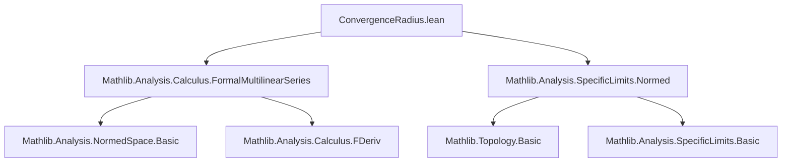
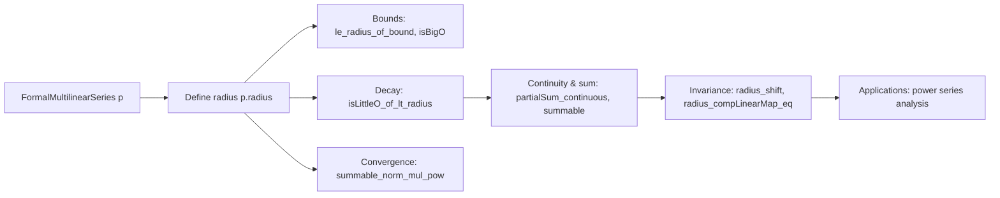

**Technical Brief: Radius of Convergence in `ConvergenceRadius.lean`**

---

### 1. **Key Definitions & Theorems**

| Name | Type / Signature | Purpose |
|------|------------------|---------|
| `radius` | `p.radius : ℝ≥0∞` | Largest $ r \in \mathbb{R}_{\ge 0}^\infty $ such that $ \|p_n\| r^n $ is bounded (subexponential growth). |
| `sum` | `p.sum x : F` | Infinite sum $ \sum' n, p_n(x^n) $, defined for $ \|x\| < p.radius $. |
| `partialSum` | `p.partialSum n x : F` | Finite partial sum $ \sum_{k < n} p_k(x^k) $. |
| `le_radius_of_bound` | `∀ n, ‖p n‖ * r^n ≤ C → r ≤ p.radius` | Lower bound on radius via uniform boundedness of $ \|p_n\| r^n $. |
| `le_radius_of_isBigO` | `‖p n‖ r^n = O(1) → r ≤ p.radius` | Refinement using asymptotic big-O. |
| `isLittleO_of_lt_radius` | `r < p.radius → ∃ a ∈ (0,1), ‖p n‖ r^n = o(a^n)` | Exponential decay of $ \|p_n\| r^n $ below radius. |
| `lt_radius_of_isBigO` | `r ≠ 0 ∧ ‖p n‖ r^n = O(a^n), -1 < a < 1 → r < p.radius` | Upper bound on radius via exponential decay. |
| `norm_mul_pow_le_mul_pow_of_lt_radius` | `r < p.radius → ∃ C > 0, ‖p n‖ r^n ≤ C a^n` | Explicit exponential bound below radius. |
| `radius_eq_top_of_summable_norm` | `(∀ r, Summable (‖p n‖ r^n)) → p.radius = ∞` | Infinite radius iff power series converges absolutely for all $ r $. |
| `radius_compContinuousLinearMap_eq` | Under isomorphism $ u $, $ (p \circ u).radius = p.radius $ | Invariance under continuous linear isomorphisms. |
| `radius_shift` / `radius_unshift` | $ \text{shift}(p).radius = p.radius $, $ \text{unshift}(p,z).radius = p.radius $ | Invariance under shift/unshift operations (used for composition with linear maps). |

---

### 2. **Naming Conventions**

- **Prefixes**:
  - `le_`: lower bounds on radius (e.g., `le_radius_of_bound`, `le_radius_of_isBigO`)
  - `norm_`, `nnnorm_`: bounds on norms (e.g., `norm_mul_pow_le_mul_pow_of_lt_radius`)
  - `isLittleO_`, `isBigO_`: asymptotic behavior (e.g., `isLittleO_of_lt_radius`)
  - `radius_`: properties of the radius itself (e.g., `radius_eq_top_of_summable_norm`, `radius_shift`)
  - `compContinuousLinearMap_`: behavior under composition with linear maps (e.g., `radius_compContinuousLinearMap_eq`)

- **Suffixes**:
  - `_of_lt_radius`, `_of_le_radius`: condition on $ r $ relative to radius.
  - `_nnnorm`, `_norm`: distinction between normed space norm $ \|\cdot\| $ and extended nonnegative real norm $ \|\cdot\|_+ $.

- **Special**:
  - `constFormalMultilinearSeries_radius`: constant series has infinite radius.
  - `zero_radius`: zero series has infinite radius.

---

### 3. **Tactic Stack**

- **Core tactics**:
  - `simp`, `rw`, `gcongr`, `linarith`, `norm_num`
  - `rcases`, `obtain`, `cases`, `exact`, `refine`
  - `fun_prop` (for continuity proofs)
  - `push_cast`, `mod_cast`, `lift` (for coercion management)
  - `tsub_add_cancel_of_le`, `div_lt_div_iff_of_pos_left`, `mul_div_cancel₀` (field arithmetic)
  - `ENNReal`/`NNReal`-specific lemmas: `le_iSup_of_le`, `lt_iSup_iff`, `ENNReal.coe_lt_coe`, `ENNReal.div_le_iff'`
  - `TFAE_exists_lt_isLittleO_pow` (equivalence of exponential decay characterizations)

- **Asymptotic reasoning**:
  - `isBigO`, `isLittleO`, `tendsto_atTop_zero`, `summable`, `Eventually`, `atTop`

---

### 4. **Proof Logic**

- **Structure**:
  - Most proofs follow a *two-step* pattern:
    1. **Bounding**: Show $ \|p_n\| r^n $ is bounded or decays exponentially using definitions of `radius`, `isBigO`, `isLittleO`.
    2. **Transfer**: Use lemmas like `le_radius_of_bound`, `lt_radius_of_isBigO`, or `radius_eq_top_of_summable_norm` to relate bounds to radius.

- **Common patterns**:
  - **Induction / case analysis** on $ n $ (e.g., `radius_shift`).
  - **Case split** on $ r = 0 $ or $ r > 0 $ (e.g., `lt_radius_of_isBigO`).
  - **Use of TFAE characterizations** of exponential decay (`TFAE_exists_lt_isLittleO_pow`) to switch between equivalent decay conditions.
  - **Continuity arguments** via `fun_prop` for `partialSum_continuous`.
  - **Summability arguments** via comparison test (`summable_geometric_of_lt_one`) for convergence proofs.

- **Key logical flow**:
  ```text
  r < p.radius
    ⇒ ∃ C, r < t, ‖p n‖ t^n ≤ C   (by def of radius)
    ⇒ ‖p n‖ r^n ≤ C (r/t)^n       (algebra)
    ⇒ exponential decay            (since r/t < 1)
    ⇒ isLittleO / summable / bounded
  ```

---

### 5. **Imports & Dependencies**

- **Core imports**:
  ```lean
  Mathlib.Analysis.Calculus.FormalMultilinearSeries
  Mathlib.Analysis.SpecificLimits.Normed
  ```

- **Key underlying theories**:
  - `FormalMultilinearSeries`: multilinear maps, composition, shift/unshift.
  - `NNReal`, `ENNReal`, `Real`: extended nonnegative reals, real analysis.
  - `Topology`, `Filter`, `Asymptotics`: big-O, little-o, convergence.
  - `NormedSpace`, `ContinuousAdd`, `ContinuousConstSMul`: functional-analytic setup.

- **Assumptions**:
  - `NontriviallyNormedField 𝕜`: ensures $ \mathbb{R} $-like behavior (e.g., geometric series).
  - `NormedAddCommGroup`, `NormedSpace`: vector space with norm and scalar multiplication.
  - `CompleteSpace F`: needed for convergence of `sum`.

---

### 6. **Mermaid Diagrams**

#### **Dependency Graph (Module-Level)**



#### **Conceptual Overview of Theory Flow**



---

### 7. **Domain-Specific AI Agent Implications**

- **Focus areas for reasoning**:
  - Automatic recognition of exponential decay patterns (`isLittleO`, `isBigO`).
  - Coercion management between `ℝ`, `ℝ≥0`, `ℝ≥0∞`, `NNReal`.
  - Use of `TFAE_exists_lt_isLittleO_pow` for equivalence-based rewriting.
  - Handling of `ENNReal` arithmetic (e.g., division by $ \infty $, comparison with $ \top $).

- **Common proof strategies to encode**:
  - “If $ r < p.radius $, then $ \|p_n\| r^n $ decays exponentially.”
  - “If $ \|p_n\| r^n $ is bounded, then $ r \le p.radius $.”
  - “Invariance under linear isomorphisms: use `radius_compContinuousLinearMap_eq`.”

- **Key lemmas for automation**:
  - `radius_eq_top_iff_summable_norm`
  - `isLittleO_of_lt_radius` ↔ `norm_mul_pow_le_mul_pow_of_lt_radius`
  - `lt_radius_of_isBigO` (for upper bounds)
  - `min_radius_le_radius_add` (for sums)

--- 

Let me know if you'd like a **proof automation strategy** or **Lean tactic documentation** for this module.
