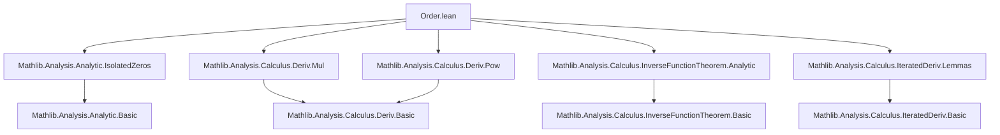

### Technical Brief: `Order.lean` — Vanishing Order of Analytic Functions

---

#### **1. Key Definitions & Theorems**

| Name | Type / Signature | Purpose |
|------|------------------|---------|
| `analyticOrderAt` | `f : 𝕜 → E → z₀ : 𝕜 → ℕ∞` | Defines the *order of vanishing* of `f` at `z₀` in the extended naturals `ℕ∞`. Returns `∞` if `f` vanishes locally, otherwise the unique `n ∈ ℕ` such that `f(z) = (z - z₀)^n • g(z)` with `g(z₀) ≠ 0`. Returns `0` if `f` is not analytic at `z₀`. |
| `analyticOrderNatAt` | `f : 𝕜 → E → z₀ : 𝕜 → ℕ` | Same as `analyticOrderAt`, but returns a natural number (`0` if order is `∞`). Defined as `.toNat`. |
| `analyticOrderAt_eq_top` | `analyticOrderAt f z₀ = ⊤ ↔ ∀ᶠ z in 𝓝 z₀, f z = 0` | Characterizes when the order is `∞`: iff `f` vanishes in a neighborhood of `z₀`. |
| `AnalyticAt.analyticOrderAt_eq_natCast` | `hf : AnalyticAt f z₀ ⇒ analyticOrderAt f z₀ = n ↔ ∃ g, AnalyticAt g z₀ ∧ g z₀ ≠ 0 ∧ f =ᶠ[𝓝 z₀] (· - z₀)^n • g` | Core characterization: finite order `n` iff `f` factors as `(z - z₀)^n • g` with `g(z₀) ≠ 0`. |
| `AnalyticAt.analyticOrderAt_ne_top` | `hf : AnalyticAt f z₀ ⇒ analyticOrderAt f z₀ ≠ ⊤ ↔ ∃ g, AnalyticAt g z₀ ∧ g z₀ ≠ 0 ∧ f =ᶠ[𝓝 z₀] (· - z₀)^{orderNat} • g` | Finite order iff `f` has such a factorization with `orderNat = analyticOrderNatAt`. |
| `analyticOrderAt_eq_zero` | `analyticOrderAt f z₀ = 0 ↔ ¬ AnalyticAt f z₀ ∨ f z₀ ≠ 0` | Order is zero iff either `f` is not analytic at `z₀`, or `f(z₀) ≠ 0`. |
| `analyticOrderAt_add_eq_left_of_lt` | `hfg : order f < order g ⇒ order (f + g) = order f` | If orders differ, sum inherits the smaller order. |
| `analyticOrderAt_mul` | `hf, hg : AnalyticAt f z₀, g z₀ ⇒ order (f * g) = order f + order g` | Multiplicativity of order under product of analytic functions. |
| `analyticOrderAt_pow` | `hf : AnalyticAt f z₀ ⇒ order (f ^ n) = n • order f` | Order scales by `n` under `n`-th power. |
| `AnalyticAt.analyticOrderAt_comp` | `hf : AnalyticAt f (g z₀), hg : AnalyticAt g z₀ ⇒ order (f ∘ g) = order f at g z₀ × order (g - g z₀) at z₀` | Chain rule for order: composition multiplies orders. |
| `AnalyticAt.analyticOrderAt_deriv_add_one` | `hf : AnalyticAt f x ⇒ order (deriv f) + 1 = order (f - f x)` | Relates order of `f - f(x)` to order of derivative. |
| `AnalyticAt.analyticOrderAt_sub_eq_one_of_deriv_ne_zero` | `hf : AnalyticAt f x, hf' : deriv f x ≠ 0 ⇒ order (f - f x) = 1` | Simple zero iff derivative nonzero. |
| `natCast_le_analyticOrderAt_iff_iteratedDeriv_eq_zero` | `hf : AnalyticAt f z₀ ⇒ n ≤ order f ↔ ∀ i < n, iteratedDeriv i f z₀ = 0` | Order ≥ `n` iff first `n` derivatives vanish at `z₀`. |
| `AnalyticAt.exists_eventuallyEq_sum_add_pow_mul` | Taylor’s theorem with analytic remainder: `f = ∑_{i < n} (z^i / i!) f^{(i)}(0) + z^n • F(z)` | Local Taylor expansion with analytic error term. |
| `AnalyticAt.analyticOrderAt_comp_of_deriv_ne_zero` | `hg : AnalyticAt g z₀, hg' : deriv g z₀ ≠ 0 ⇒ order (f ∘ g) = order f at g z₀` | Change of variable with nonzero derivative preserves order. |
| `isClopen_setOf_analyticOrderAt_eq_top` | `hf : AnalyticOnNhd f U ⇒ {u ∈ U | order f u = ⊤}` is clopen in `U` | Infinite-order locus is clopen in domain of analyticity. |
| `codiscrete_setOf_analyticOrderAt_eq_zero_or_top` | `hf : AnalyticOnNhd f U ⇒ {u ∈ U | order f u = 0 ∨ ⊤} ∈ codiscrete U` | Points of order `0` or `∞` form a codiscrete (i.e., discrete and closed) subset. |

---

#### **2. Naming Conventions**

- **Prefixes**:
  - `analyticOrderAt_...`: Main family for order-related lemmas.
  - `analyticOrderNatAt_...`: Natural-number variant.
  - `AnalyticAt.`: Lemmas assuming `AnalyticAt f z₀`.
  - `AnalyticOnNhd.`: Lemmas assuming `f` analytic on a neighborhood of a set.

- **Suffixes**:
  - `_eq_top`: Order is `∞`.
  - `_eq_zero`: Order is `0`.
  - `_ne_zero` / `_ne_top`: Complements of above.
  - `_of_lt`, `_of_ne`: Cases where orders differ.
  - `_mul`, `_pow`, `_add`, `_sub`, `_comp`: Operations on functions.
  - `__iff_iteratedDeriv_eq_zero`: Derivative characterization.
  - `_congr`, `_congr_left`: Congruence under eventual equality.

- **Special**:
  - `centeredMonomial`: `(· - z₀)^n`.
  - `id`, `neg`, `smul`, `mul`, `pow`, `deriv`, `comp`: Standard operations.

---

#### **3. Tactic Stack**

| Tactic | Frequency | Role |
|--------|-----------|------|
| `by_cases` | Very High | Split on `AnalyticAt`, `order = ⊤`, `order = 0`, `deriv ≠ 0`, etc. |
| `simp` / `simp only` | Very High | Simplify using `analyticOrderAt_eq_top`, `analyticOrderAt_eq_zero`, `hf.analyticOrderAt_eq_natCast`, etc. |
| `rw` | High | Rewrite using equivalences like `analyticOrderAt_eq_natCast`, `analyticOrderAt_mul`, etc. |
| `exact`, `refine`, `apply` | High | Construct witnesses for `∃ g, ...` in `analyticOrderAt_eq_natCast`. |
| `filter_upwards` | Medium | Handle eventual equalities in neighborhoods. |
| `aesop` | Medium | Automate logical reasoning (e.g., in `analyticOrderAt_comp`). |
| `grind` | Medium | Solve goals by repeated simplification and contradiction (e.g., `hf' : deriv f x ≠ 0` contradictions). |
| `congr` / `congr 1` | Medium | Prove equality of expressions by congruence (e.g., in `analyticOrderAt_deriv_add_one`). |
| `module` | Low | Simplify module/scalar algebra (e.g., `smul_comm`, `mul_smul`). |
| `fun_prop` | Medium | Prove analyticity/differentiability goals (e.g., `AnalyticAt`, `DifferentiableAt`). |
| `tendsto_nhds_unique_of_eventuallyEq` | Low | Uniqueness of limits under eventual equality. |
| `ENat.coe_inj`, `ENat.top_ne_coe` | Medium | Reason about `ℕ∞` equality/inequality. |

---

#### **4. Proof Logic**

- **Structure**:
  - **Case analysis** on analyticity (`AnalyticAt f z₀`), finiteness (`order ≠ ⊤`), and equality (`order = 0`, `order = n`).
  - **Existential witness construction** for factorization `f = (z - z₀)^n • g` using `hf.exists_eventuallyEq_pow_smul_nonzero_iff`.
  - **Equational reasoning** in `ℕ∞` using `ENat.coe_inj`, `ENat.coe_le_coe`, `top_mul`, etc.
  - **Filter-based arguments**: Use `eventually`, `𝓝 z₀`, `𝓝[≠] z₀`, and `EventuallyEq` to handle local behavior.
  - **Induction** on `n` for derivative-characterization lemmas (`natCast_le_analyticOrderAt_iff_iteratedDeriv_eq_zero`).
  - **Taylor expansion** via `analyticOrderAt_ne_top` + `natCast_le_analyticOrderAt` + derivative vanishing.

- **Typical Flow**:
  1. Assume `AnalyticAt f z₀` (or handle non-analytic case separately).
  2. If `order = ⊤`, use `analyticOrderAt_eq_top`.
  3. Else, extract `g` with `f =ᶠ[𝓝 z₀] (· - z₀)^n • g`, `g(z₀) ≠ 0`.
  4. Prove equivalence by showing both directions via `hf.analyticOrderAt_eq_natCast`.
  5. For sums/products/compositions: reduce to known lemmas (`add`, `mul`, `comp`) and use `min`, `+`, `*` arithmetic in `ℕ∞`.

---

#### **5. Imports**

| Module | Purpose |
|--------|---------|
| `Mathlib.Analysis.Analytic.IsolatedZeros` | Isolated zeros of analytic functions (used in codiscreteness arguments). |
| `Mathlib.Analysis.Calculus.Deriv.Mul` | Derivative rules for products. |
| `Mathlib.Analysis.Calculus.Deriv.Pow` | Derivative rules for powers. |
| `Mathlib.Analysis.Calculus.InverseFunctionTheorem.Analytic` | Analytic inverse function theorem (used in composition lemmas). |
| `Mathlib.Analysis.Calculus.IteratedDeriv.Lemmas` | Lemmas on `iteratedDeriv`, Taylor expansions, etc. |

---

#### **6. Mermaid Diagrams**

##### **Dependency Graph (Top-Level)**



##### **Overview of Theory Flow**

```mermaid
flowchart LR
  subgraph Definitions
    D1[analyticOrderAt : 𝕜 → E → 𝕜 → ℕ∞]
    D2[analyticOrderNatAt : 𝕜 → E → 𝕜 → ℕ]
  end

  subgraph Core Characterizations
    C1[analyticOrderAt_eq_top]
    C2[AnalyticAt.analyticOrderAt_eq_natCast]
    C3[natCast_le_analyticOrderAt_iff_iteratedDeriv_eq_zero]
  end

  subgraph Algebraic Properties
    A1[analyticOrderAt_add_eq_left_of_lt]
    A2[analyticOrderAt_mul]
    A3[analyticOrderAt_pow]
    A4[analyticOrderAt_comp]
  end

  subgraph Analytic Tools
    T1[Taylor's theorem (exists_eventuallyEq_sum_add_pow_mul)]
    T2[AnalyticOrderAt_deriv_add_one]
    T3[AnalyticOrderAt_sub_eq_one_of_deriv_ne_zero]
  end

  subgraph Topological Structure
    T4[isClopen_setOf_analyticOrderAt_eq_top]
    T5[codiscrete_setOf_analyticOrderAt_eq_zero_or_top]
  end

  D1 --> C1
  D1 --> C2
  D1 --> C3
  D1 --> A1
  D1 --> A2
  D1 --> A3
  D1 --> A4
  D1 --> T1
  D1 --> T2
  D1 --> T3
  D1 --> T4
  D1 --> T5

  C2 --> A2
  C2 --> A3
  C2 --> A4
  C3 --> T1
  T2 --> T3
```

---

#### **7. Domain-Specific AI Agent Implications**

- **Key Concepts to Encode**:
  - `analyticOrderAt`, `analyticOrderNatAt`, `ℕ∞`, `AnalyticAt`, `AnalyticOnNhd`, `iteratedDeriv`, `eventuallyEq`, `codiscrete`.
  - Operations: `+`, `*`, `^`, `deriv`, `comp`, `smul`.
  - Local behavior: neighborhoods, filters, `𝓝 z₀`, `𝓝[≠] z₀`.

- **Common Proof Patterns**:
  - `by_cases hf : AnalyticAt f z₀` → split on analyticity.
  - `rw [hf.analyticOrderAt_eq_natCast]` → extract factorization.
  - `filter_upwards [h]` → handle eventual equalities.
  - `ENat.coe_inj` / `top_ne_coe` → reason about `ℕ∞`.

- **Simplifier Setup**:
  - Add `analyticOrderAt_eq_top`, `analyticOrderAt_eq_zero`, `hf.analyticOrderAt_eq_natCast`, `analyticOrderAt_mul`, `analyticOrderAt_pow`, `analyticOrderAt_comp` to `@[simp]`.

- **Automation Strategy**:
  - Use `aesop` for logical combinations of `order = 0`, `order ≠ 0`, `order = ⊤`.
  - Use `grind` for contradictions involving `deriv ≠ 0` and `order = 0`.
  - Use `fun_prop` to discharge analyticity/differentiability side-conditions.

--- 

Let me know if you'd like a formalized tactic automation script or a theory graph for downstream model training.
