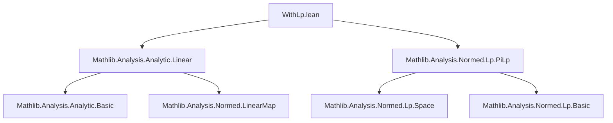

**Technical Brief: `WithLp.lean`**

---

### 1. **Key Definitions & Theorems**

| Name | Type | Purpose |
|------|------|---------|
| `ofLp` | `WithLp p (E × F) → E × F` | Inclusion map from the `p`-normed product space `WithLp p (E × F)` into the Cartesian product `E × F`. |
| `toLp` | `E × F → WithLp p (E × F)` | Inverse of `ofLp`, embedding the product space into the `p`-normed version. |
| `prodContinuousLinearEquiv` | `ContinuousLinearEquiv (WithLp p (E × F)) (E × F) 𝕜` | The canonical continuous linear equivalence between `WithLp p (E × F)` and `E × F`. |
| `analyticOn_ofLp` | `AnalyticOn 𝕜 ofLp s` | States that `ofLp` is analytic on any subset `s` of its domain. |
| `analyticOn_toLp` | `AnalyticOn 𝕜 (toLp p) s` | States that `toLp` is analytic on any subset `s` of its domain. |
| `PiLp.ofLp`, `PiLp.toLp` | Analogous to `WithLp` versions, but for dependent products `PiLp p E`. | Generalization of `ofLp`/`toLp` to dependent function spaces with `p`-norms. |
| `continuousLinearEquiv` | `ContinuousLinearEquiv (PiLp p E) (Π i, E i) 𝕜` | Canonical continuous linear equivalence for `PiLp`. |

---

### 2. **Naming Conventions**

- **Prefixes**:
  - `ofLp`: “from” `Lp` structure — the inclusion/embedding *from* the `p`-normed space.
  - `toLp`: “to” `Lp` structure — the embedding *into* the `p`-normed space.
- **Suffixes**:
  - `analyticOn_*`: asserts analyticity of the corresponding map on a set.
- **Module/namespace**:
  - `WithLp`, `PiLp`: reflect the type constructors used in `Mathlib` for `L^p`-type constructions.

---

### 3. **Tactic Stack**

- **`analyticOn`** is proven via:
  - `prodContinuousLinearEquiv p 𝕜 E F`.`analyticOn s`
  - `.symm.analyticOn s`
- **No explicit tactics** appear in the proofs (they are delegated to library lemmas like `ContinuousLinearEquiv.analyticOn` and `ContinuousLinearEquiv.symm_analyticOn`).
- Implicit reliance on:
  - `analyticOn_of_continuousLinearMap`
  - `ContinuousLinearEquiv.analyticOn`
  - `ContinuousLinearEquiv.symm_analyticOn`

No manual tactic invocation (e.g., `simp`, `ring`, `aesop`) is visible in the snippet.

---

### 4. **Proof Logic**

- **Structure**: Immediate from known equivalences.
- **Pattern**:
  1. Identify a canonical `ContinuousLinearEquiv` between the `Lp`-structured space and the underlying product space.
  2. Use the fact that continuous linear equivalences (and their inverses) are analytic.
  3. Apply `analyticOn` lemma for continuous linear maps.

No induction, case analysis, or manual estimation is needed — the proofs are *one-liners* derived from library support.

---

### 5. **Imports**

| Import | Role |
|--------|------|
| `Mathlib.Analysis.Analytic.Linear` | Provides `analyticOn` lemmas for linear maps and equivalences. |
| `Mathlib.Analysis.Normed.Lp.PiLp` | Defines `PiLp`, `WithLp`, `ofLp`, `toLp`, and the equivalences `prodContinuousLinearEquiv`, `continuousLinearEquiv`. |

---

### 8. **Mermaid Diagrams**

#### **Dependency Graph (Module Level)**



#### **Overview of Theory Flow**

```mermaid
flowchart LR
  subgraph Lp_Structures
    PiLp[PiLp p E]
    WithLp[WithLp p (E × F)]
  end

  subgraph Underlying_Spaces
    Pi[Π i, E i]
    Prod[E × F]
  end

  subgraph Equivalences
    CE[continuousLinearEquiv]
    PCE[prodContinuousLinearEquiv]
  end

  subgraph Analyticity
    Analytic[AnalyticOn 𝕜]
  end

  PiLp -- ofLp/toLp --> Pi
  WithLp -- ofLp/toLp --> Prod
  CE -- analyticOn_ofLp / analyticOn_toLp --> Analytic
  PCE -- analyticOn_ofLp / analyticOn_toLp --> Analytic
```

---

### Summary

This file establishes that the canonical maps between `L^p`-structured product spaces (`WithLp`, `PiLp`) and their underlying product spaces are analytic. The proofs are immediate consequences of the analyticity of continuous linear equivalences, leveraging `Mathlib`’s robust theory of analytic functions on normed spaces.
