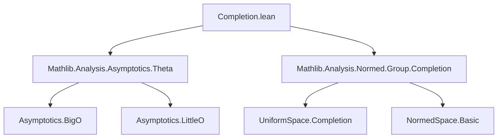

**Technical Brief: Completion.lean**

---

### 1. KEY DEFINITIONS & THEOREMS

| Name | Type / Statement | Purpose |
|------|------------------|---------|
| `isBigO_completion_left` | `(fun x ↦ g x : α → F̂) =O[l] f ↔ g =O[l] f` | Relates big-O asymptotics of `g` into the completion `F̂` vs. original space `F`, with `f` in a normed space `E`. |
| `isBigO_completion_right` | `f =O[l] (fun x ↦ g x : α → F̂) ↔ f =O[l] g` | Same as above but with `g` embedded into the completion on the right-hand side of `=O`. |
| `isTheta_completion_left` | `(fun x ↦ g x : α → F̂) =Θ[l] f ↔ g =Θ[l] f` | Equivalence of Θ-asymptotics when `g` is coerced into the completion on the left. |
| `isTheta_completion_right` | `f =Θ[l] (fun x ↦ g x : α → F̂) ↔ f =Θ[l] g` | Equivalence of Θ-asymptotics when `g` is coerced into the completion on the right. |
| `isLittleO_completion_left` | `(fun x ↦ g x : α → F̂) =o[l] f ↔ g =o[l] f` | Equivalence of little-o asymptotics when `g` is coerced into the completion on the left. |
| `isLittleO_completion_right` | `f =o[l] (fun x ↦ g x : α → F̂) ↔ f =o[l] g` | Equivalence of little-o asymptotics when `g` is coerced into the completion on the right. |

All lemmas rely on the canonical coercion `↑ : F → F̂` (denoted `g x : F̂`) and the fact that the norm on `F̂` extends that on `F`, i.e., `‖g x‖ = ‖g x‖` under coercion (`norm_coe`).

---

### 2. NAMING CONVENTIONS

- **Prefix `isBigO_`, `isTheta_`, `isLittleO_`**: Standard naming for asymptotic relations in `Mathlib.Analysis.Asymptotics`.
- **Suffix `_completion_left` / `_completion_right`**: Indicates whether the coercion into the completion appears on the left or right argument of the asymptotic relation.
- **`norm_cast` attribute**: Used to enable `norm_cast`-style simplification (i.e., pushing norms through coercions).
- **`[norm_cast]` tag**: Indicates that the lemma can be used by the `norm_cast` tactic to simplify norms of coerced terms.

---

### 3. TACTIC STACK

- `simp only [...]`: Heavy use of `simp` with explicit `only` to avoid unfolding unnecessary definitions.
- `norm_cast`: Implicitly via `norm_cast` attribute; may be used by the `norm_cast` tactic in downstream proofs.
- `and_congr`: Used in `isTheta_*` lemmas to split Θ into two big-O statements and apply congruence.

No heavy automation (e.g., `aesop`, `linarith`, `ring`) is used—proofs are purely definitional.

---

### 4. PROOF LOGIC

- **Strategy**: Each lemma reduces the asymptotic relation involving the completion `F̂` to the original space `F`, using the fact that the norm is preserved under the canonical embedding `F → F̂`.
- **Key step**: `norm_coe` lemma: `‖(c : F)‖ = ‖(c : F̂)‖`, which allows simplification of `norm (g x)` in the definition of big-O/little-O/Θ.
- **Structure**:
  - For `=O`: unfold definition (`isBigO_iff`), apply `norm_coe`, simplify.
  - For `=Θ`: use `and_congr` on two `=O` lemmas.
  - For `=o`: unfold (`isLittleO_iff`), apply `norm_coe`, simplify.

No induction or case analysis is needed—proofs are purely equational.

---

### 5. IMPORTS

- `Mathlib.Analysis.Asymptotics.Theta`: Provides definitions and basic lemmas for Θ, o, O asymptotics.
- `Mathlib.Analysis.Normed.Group.Completion`: Provides:
  - `UniformSpace.Completion` type constructor (`̂`)
  - Canonical coercion `↑ : F → F̂`
  - `norm_coe` lemma: `‖(x : F̂)‖ = ‖x‖`
  - `SeminormedAddCommGroup` instance on `F̂`

---

### 6. DEPENDENCY & THEORY OVERVIEW

#### Mermaid Diagram: Theory Dependencies



#### Mermaid Diagram: File Overview

```mermaid
flowchart LR
  subgraph Input
    α [Type α]
    E [Normed space]
    F [Seminormed additive comm group]
    f [α → E]
    g [α → F]
    l [Filter α]
  end

  subgraph Coercion
    F̂[F̂ = completion of F]
    ĝ[(x ↦ g x : α → F̂)]
  end

  subgraph Asymptotics
    O[=O[l]]
    Θ[=Θ[l]]
    o[=o[l]]
  end

  Input --> Coercion
  Coercion --> Asymptotics
  Asymptotics --> Equiv[Equivalences: ĝ ~ g in all asymptotics]
```

---

### 7. DOMAIN & SCOPE

- **Domain**: Asymptotic analysis in functional analysis, especially in contexts where one works with completions (e.g., Banach space completions, $L^p$ spaces, Sobolev spaces).
- **Scope**: This file ensures that asymptotic relations are *stable under completion*, i.e., embedding into a larger complete space does not change big-O / little-o / Θ behavior.
- **Use case**: Enables reasoning about asymptotics in complete spaces (e.g., proving convergence in $L^p$ by passing to the completion of simple functions).

---

### 8. NOTES

- The file assumes `F` is only *seminormed*, not necessarily normed—this is important for generality (e.g., $L^p$ spaces with $0 < p < 1$).
- The coercion `↑ : F → F̂` is implicit (via `norm_cast` infrastructure), and the lemmas use `norm_cast` attributes to support automatic simplification.
- No new definitions are introduced—only lemmas about existing asymptotic notation.

--- 

*End of Technical Brief.*
