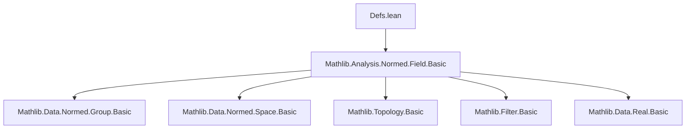
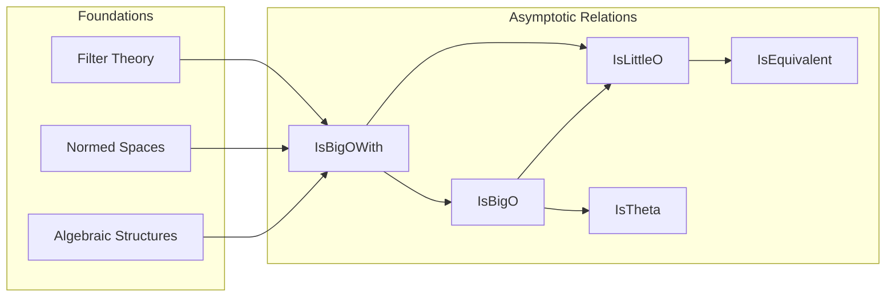

Here is the **technical metadata** extracted from the provided `Defs.lean` file, formatted as a structured technical brief:

---

## 🔹 KEY DEFINITIONS & THEOREMS

| Name | Type / Signature | Purpose |
|------|------------------|---------|
| `IsBigOWith c l f g` | `Prop` | “Eventually, `‖f‖ ≤ c * ‖g‖` along filter `l`” — a refined version of big-O used internally. |
| `IsBigO l f g` (notation: `f =O[l] g`) | `Prop` | “`f` is big-O of `g` along `l`”: ∃c, `IsBigOWith c l f g`. |
| `IsTheta l f g` (notation: `f =Θ[l] g`) | `Prop` | “`f` and `g` are asymptotically equivalent up to constants”: `f =O[l] g ∧ g =O[l] f`. |
| `IsLittleO l f g` (notation: `f =o[l] g`) | `Prop` | “`f` is little-o of `g` along `l`”: ∀c > 0, `IsBigOWith c l f g`. |
| `IsEquivalent l u v` (notation: `u ~[l] v`) | `Prop` | “`u - v = o(v)` along `l`”: asymptotic equivalence. |
| `isBigOWith_iff` | `↔` | Characterization of `IsBigOWith` via filter neighborhoods. |
| `isBigO_iff` | `↔` | `f =O[l] g ↔ ∃c, ∀ᶠ x in l, ‖f x‖ ≤ c * ‖g x‖`. |
| `isLittleO_iff` | `↔` | `f =o[l] g ↔ ∀c > 0, ∀ᶠ x in l, ‖f x‖ ≤ c * ‖g x‖`. |
| `isLittleO_iff_nat_mul_le` | `↔` | `f =o[l] g ↔ ∀n : ℕ, ∀ᶠ x in l, n * ‖f x‖ ≤ ‖g x‖`. |
| `isBigO_iff_eventually_isBigOWith` | `↔` | `f =O[l] g ↔ ∀ᶠ c in atTop, IsBigOWith c l f g`. |
| `isBigO_with_congr`, `isLittleO_congr`, etc. | `↔` | Congruence lemmas: asymptotic relations are stable under eventual equality. |
| `IsBigO.trans`, `IsLittleO.trans`, etc. | `→` | Transitivity of big-O / little-o relations. |
| `isBigOWith.comp_tendsto`, `isLittleO.comp_tendsto` | `→` | Pullback along functions with `Tendsto`. |
| `isBigO_map`, `isLittleO_map` | `↔` | Equivalence between big-O/little-o on mapped filters and precompositions. |
| `isBigOWith_insert`, `isLittleO_insert` | `↔` | Local behavior at a point added to a set (within topology). |
| `isBigOWith_norm_right`, `isBigOWith_abs_right`, etc. | `↔` | Simplification lemmas: norms/abs on right/left argument can be removed. |
| `isLittleO_irrefl`, `IsBigO.not_isLittleO`, etc. | `¬` | Irreflexivity of little-o and incompatibility of big-O and little-o for same pair (under non-vanishing). |

---

## 🔹 NAMING CONVENTIONS

- **Prefixes**:
  - `isBigOWith_`, `isBigO_`, `isLittleO_`, `isTheta_`: predicate-specific.
  - `of_`, `bound`, `def`, `eventuallyLE`: forward direction of equivalence or elimination rule.
  - `congr`, `trans`, `mono`, `comp_tendsto`, `insert`, `map`: structural property.
  - `norm`, `abs`, `neg`: simplification for specific operations.

- **Suffixes**:
  - `_iff`: equivalence (↔) lemma.
  - `_left`, `_right`: argument position (e.g., `norm_left`, `abs_right`).
  - `_eventually`, `_eventuallyLE`: filter-based characterizations.
  - `_with`, `_without`: sometimes used for variants (e.g., `isBigOWith` vs `isBigO`).

- **Notation**:
  - `=O[l]`, `=Θ[l]`, `=o[l]`, `~[l]`: infix operators with filter parameter `l`.

---

## 🔹 TACTIC STACK

Frequently used tactics in proofs:

| Tactic | Usage |
|--------|-------|
| `simp only [...]` | Simplify using definitional equivalences (`isBigOWith_def`, `isLittleO_def`, etc.). |
| `filter_upwards [...]` | Prove statements about `∀ᶠ x in l`, often with `Filter.Eventually.and_frequently`, `mono`, `trans`. |
| `gcongr` | Handle inequalities involving multiplication by nonnegative scalars. |
| `rwa [...]` | Rewrite and apply assumption (e.g., `inv_mul_le_iff₀`). |
| `exact`, `refine`, `apply` | Construct proofs using lemmas and hypotheses. |
| `cases`, `obtain`, `rcases` | Extract witnesses from existential quantifiers (e.g., `⟨c, hc⟩`). |
| `rw [*, *]` | Rewrite using multiple equivalences (e.g., `isBigO_iff`, `isBigOWith_def`). |
| ` positivity` | Prove positivity of expressions (e.g., `0 < max c 1`). |
| `simp_rw [...]` | Simplify with rewrite rules (used in `insert` lemmas). |

---

## 🔹 PROOF LOGIC

Typical proof structure:

1. **Unfold definitions** using `isBigO_iff`, `isLittleO_iff`, `isBigOWith_iff`.
2. **Reduce to filter statements** (`∀ᶠ x in l, ...`) via `filter_upwards`.
3. **Apply algebraic inequalities** (e.g., `mul_assoc`, `inv_mul_le_iff₀`, `div_pos`).
4. **Use transitivity** (`trans`, `mono`, `le_trans`) to chain bounds.
5. **Leverage congruence** (`congr`, `congr'`) to replace functions up to eventual equality.
6. **Handle edge cases**:
   - Subsingleton types → trivial little-o.
   - Bot filter → trivial big-O/little-o.
   - Non-vanishing → irreflexivity of little-o.
7. **Use filter operations**:
   - `mono` for filter refinement (`l ≤ l'`).
   - `comp_tendsto`, `map` for change of variables.
   - `sup` for combining filters.

---

## 🔹 IMPORTS

- `Mathlib.Analysis.Normed.Field.Basic`: Provides foundational normed field structure, needed for:
  - `Norm`, `SeminormedAddCommGroup`, `NormedAddCommGroup`, `NormedRing`, `NormedDivisionRing`.
  - `NormMulClass`, `norm_nonneg`, `norm_zero`, `norm_ne_zero_iff`, etc.

> This module assumes a rich algebraic-topological setting: types with norms, additive groups, ring structures, and filter theory.

---

## 🔹 DEPENDENCY & THEORY OVERVIEW

### 📊 Mermaid Diagrams

#### **Dependency Graph (Top-Level)**

#### **Conceptual Theory Flow**

#### **Module Scope**

- **Domain**: Asymptotic analysis in dependent type theory (Lean).
- **Scope**: General filter-based Landau notation for functions into normed types.
- **Key abstraction**: Avoid explicit norm mention in user-facing lemmas (`=O[l]`, `=o[l]`) while using `IsBigOWith` internally for modular proofs.

---

Let me know if you'd like a **proof automation strategy** or **Lean tactic documentation** for this module.
