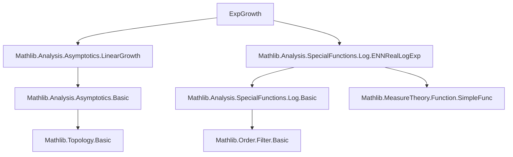
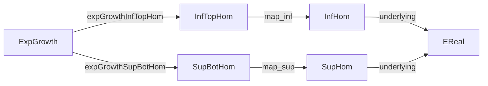

### Technical Brief: Exponential Growth in Lean 4 (`ExpGrowth.lean`)

---

#### **1. Key Definitions & Theorems**

| Name | Type | Purpose |
|------|------|---------|
| `expGrowthInf` | `(u : ℕ → ℝ≥0∞) → EReal` | Lower exponential growth: `liminf (log (u n) / n)` |
| `expGrowthSup` | `(u : ℕ → ℝ≥0∞) → EReal` | Upper exponential growth: `limsup (log (u n) / n)` |
| `expGrowthInfTopHom` | `InfTopHom (ℕ → ℝ≥0∞) EReal` | `expGrowthInf` as a homomorphism preserving finite infima and top |
| `expGrowthSupBotHom` | `SupBotHom (ℕ → ℝ≥0∞) EReal` | `expGrowthSup` as a homomorphism preserving finite suprema and bottom |
| `expGrowthInf_le_iff` | `↔` characterisation | `expGrowthInf u ≤ a ↔ ∀ b > a, ∃ᶠ n, u n ≤ exp (b * n)` |
| `le_expGrowthInf_iff` | `↔` characterisation | `a ≤ expGrowthInf u ↔ ∀ b < a, ∀ᶠ n, exp (b * n) ≤ u n` |
| `expGrowthSup_le_iff` | `↔` characterisation | `expGrowthSup u ≤ a ↔ ∀ b > a, ∀ᶠ n, u n ≤ exp (b * n)` |
| `le_expGrowthSup_iff` | `↔` characterisation | `a ≤ expGrowthSup u ↔ ∀ b < a, ∃ᶠ n, exp (b * n) ≤ u n` |
| `expGrowthInf_mul_le`, `expGrowthInf_mul_le'` | Inequalities | Bounds for `expGrowthInf (u * v)` in terms of `expGrowthInf u`, `expGrowthSup v` |
| `expGrowthSup_mul_le` | Inequality | `expGrowthSup (u * v) ≤ expGrowthSup u + expGrowthSup v` |
| `expGrowthInf_inv`, `expGrowthSup_inv` | Identities | `expGrowthInf u⁻¹ = -expGrowthSup u`, etc. |
| `expGrowthInf_pow`, `expGrowthSup_pow` | Identities | For `u n = b^n`, both equal `log b` |
| `expGrowthInf_exp`, `expGrowthSup_exp` | Identities | For `u n = exp(a * n)`, both equal `a` |
| `expGrowthInf_inf`, `expGrowthSup_sup` | Identities | `expGrowthInf (u ⊓ v) = expGrowthInf u ⊓ expGrowthInf v`, etc. |
| `expGrowthSup_add` | Identity | `expGrowthSup (u + v) = expGrowthSup u ⊔ expGrowthSup v` |
| `expGrowthSup_sum` | Identity | Extends `expGrowthSup_add` to finite sums |
| `expGrowthInf_comp`, `expGrowthSup_comp` | Identities | Chain rule under monotonicity and asymptotic linear growth of index sequence |

---

#### **2. Naming Conventions**

- **Prefixes**:
  - `expGrowthInf_`, `expGrowthSup_`: main definitions and lemmas for lower/upper exponential growth.
  - `le_`, `expGrowth_`, `eventually_`, `frequently_`: indicate direction or mode of convergence.
  - `mul_`, `inv_`, `add_`, `comp_`, `inf_`, `sup_`: indicate algebraic or functional operation.
- **Suffixes**:
  - `_le`, `_le_iff`, `_iff`: inequality or equivalence characterisation.
  - `_eventually`, `_frequently`: usage of filter-based convergence.
  - `_top`, `_bot`: special cases involving `⊤` or `⊥`.
  - `_hom`: homomorphism structures (`InfTopHom`, `SupBotHom`).
  - `_mono`, `_nonneg`: monotonicity/nonnegativity properties.

---

#### **3. Tactic Stack**

- **Core tactics**:
  - `rfl`, `congr`, `ext`, `refine`, `rw`, `simp`, `apply`, `exact`
- **Filter & convergence**:
  - `eventually_congr`, `frequently_congr`, `liminf_congr`, `limsup_congr`
  - `eventually_atTop`, `frequently_atTop`
- **Algebraic simplification**:
  - `ring`, `gcongr`, `linarith`, `norm_cast`
- **Order & monotonicity**:
  - `monotone_div_right_of_nonneg`, `log_monotone`, `logOrderIso.le_iff_le`
- **Homomorphism reasoning**:
  - `map_finset_inf`, `map_finset_sup`, `Finset.induction_on`
- **EReal/ENNReal-specific**:
  - `EReal.div_eq_iff`, `log_exp`, `log_inv`, `log_pow`, `zero_lt_one.trans_le`

---

#### **4. Proof Logic**

- **Structure**:
  - Definitions are built on `liminf`/`limsup` of `log(u n)/n`.
  - Most proofs follow a pattern:
    1. Rewrite using `expGrowthInf_def`/`expGrowthSup_def` to `linearGrowthInf`/`linearGrowthSup`.
    2. Apply known lemmas for `liminf`/`limsup` (e.g., `liminf_le_limsup`, `liminf_add_le`, `limsup_max`).
    3. Use `eventually_congr`/`frequently_congr` to reduce to algebraic inequalities.
    4. Translate inequalities via `logOrderIso.le_iff_le` and `log_exp`/`log_inv`.
    5. For homomorphism properties, use `InfTopHom`/`SupBotHom` interface and finite induction.
- **Common proof patterns**:
  - **Equivalence proofs**: `le_antisymm` with two directions via `le_iff`/`expGrowthInf_le_iff` lemmas.
  - **Homomorphism proofs**: Show `map_inf'`/`map_sup'` via `liminf_min`/`limsup_max`, then use `Finset.induction_on`.
  - **Chain rule**: Reduce to `linearGrowthInf_comp`/`linearGrowthSup_comp` lemmas after verifying monotonicity of `log ∘ u`.

---

#### **5. Imports & Dependencies**

- **Core libraries**:
  - `Mathlib.Analysis.Asymptotics.LinearGrowth`: Provides `linearGrowthInf`, `linearGrowthSup`, and their properties.
  - `Mathlib.Analysis.SpecialFunctions.Log.ENNRealLogExp`: Provides `log` on `ℝ≥0∞`, `exp`, and order isomorphism lemmas (`logOrderIso`).
- **Other used modules**:
  - `Filter`, `Function`, `Topology`, `EReal`, `ENNReal`: For filter convergence, order theory, extended reals.
  - `Pi`, `MulOpposite`, `Tropical`: For pointwise operations and algebraic structures.

---

#### **6. Mermaid Diagrams**

##### **Dependency Graph (Module Scope)**



##### **Overview of Theory Flow**

```mermaid
flowchart LR
  A[Sequences u : ℕ → ℝ≥0∞] --> B[log(u n)/n]
  B --> C[liminf / limsup]
  C --> D[expGrowthInf / expGrowthSup]
  D --> E[Algebraic properties: +, *, inv]
  D --> F[Order properties: ≤, ⊓, ⊔]
  D --> G[Composition: u ∘ v]
  D --> H[Homomorphism structures]
  H --> I[InfTopHom / SupBotHom]
  I --> J[Finite inf/sup preservation]
```

##### **Homomorphism Embedding**



---

This file formalizes exponential growth in a robust, order-theoretic and asymptotic framework, enabling precise reasoning about growth rates in analysis and combinatorics.
