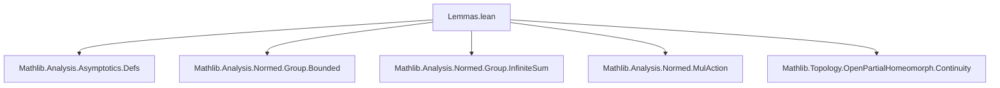
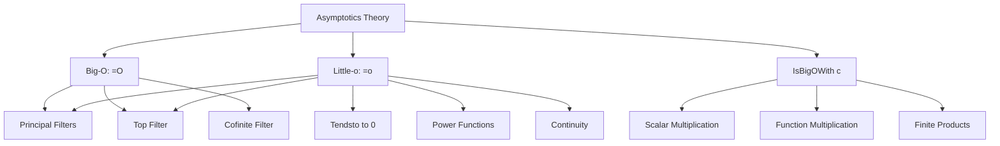

Here's a structured technical brief based on the provided `Lemmas.lean` file:

---

## **1. Key Definitions & Theorems**

| Name | Type / Signature | Purpose |
|------|------------------|---------|
| `isBigOWith` | `IsBigOWith c l f g` | Bounded-by-constant multiple: $ \|f(x)\| \le c \cdot \|g(x)\| $ eventually w.r.t. filter `l`. |
| `isBigO` | `f =O[l] g` | Big-O asymptotic: $ f = O(g) $ along filter `l`. |
| `isLittleO` | `f =o[l] g` | Little-o asymptotic: $ f = o(g) $ along filter `l`. |
| `isBigOWith_principal` | `IsBigOWith c (𝓟 s) f g ↔ ∀ x ∈ s, ‖f x‖ ≤ c * ‖g x‖` | Characterizes big-O with respect to a principal filter (set restriction). |
| `isLittleO_principal` | `f =o[𝓟 s] g ↔ ∀ x ∈ s, f x = 0` | Little-o on a set means function vanishes on that set. |
| `isBigO_one_iff` | `f =O[l] 1 ↔ IsBoundedUnder (· ≤ ·) l (norm ∘ f)` | Big-O against constant 1 iff norm is bounded under filter. |
| `isLittleO_one_iff` | `f =o[l] 1 ↔ Tendsto f l (𝓝 0)` | Little-o against 1 iff function tends to 0. |
| `isLittleO_one_left_iff` | `1 =o[l] f ↔ Tendsto (‖f‖) l atTop` | Constant 1 is little-o of `f` iff `f` grows unboundedly. |
| `isBigO_const_smul_left` | `(c • f) =O[l] g ↔ f =O[l] g` (for `c ≠ 0`) | Nonzero scalar multiplication doesn’t affect big-O. |
| `isLittleO_const_smul_left` | `(c • f) =o[l] g ↔ f =o[l] g` (for `c ≠ 0`) | Same for little-o. |
| `isBigO.smul` | `k₁ =O[l] k₂ → f =O[l] g → (k₁ • f) =O[l] (k₂ • g)` | Multiplication of big-Os. |
| `isLittleO.smul` | `k₁ =o[l] k₂ → f =o[l] g → (k₁ • f) =o[l] (k₂ • g)` | Multiplication of little-os. |
| `isBigO_iff_exists_eq_mul` | `f =O[l] g ↔ ∃ φ, (∀ᶠ x in l, ‖φ x‖ ≤ c) ∧ f =ᶠ[l] φ * g` | Equivalent formulation via multiplication by bounded function. |
| `isLittleO_iff_exists_eq_mul` | `f =o[l] g ↔ ∃ φ, Tendsto φ l (𝓝 0) ∧ f =ᶠ[l] φ * g` | Little-o iff multiplication by function vanishing at filter. |
| `isLittleO_iff_tendsto` | `f =o[l] g ↔ Tendsto (f / g) l (𝓝 0)` (under divisibility condition) | Classical asymptotic equivalence: $ f/g \to 0 $. |
| `continuousAt_iff_isLittleO` | `ContinuousAt f x ↔ (y ↦ f y - f x) =o[𝓝 x] 1` | Continuity at a point iff difference is little-o of 1. |
| `isBigO.of_pow` | If $ f^n = O(g^n) $ and $ n ≠ 0 $, then $ f = O(g) $ | Taking roots preserves big-O. |
| `isLittleO_pow_pow` | $ x^n = o(x^m) $ at 0 if $ m < n $ | Monomials of higher degree vanish faster near 0. |
| `isBigO.eq_zero_of_norm_pow` | If $ f = O(\|x - x₀\|^n) $ and $ n ≠ 0 $, then $ f(x₀) = 0 $ | Function vanishes at point if bounded by vanishing power. |
| `isBigO_cofinite_iff` | $ f = O(g) $ cofinitely iff $ \exists C, \forall x, \|f x\| \le C \|g x\| $ | Global big-O over cofinite filter. |
| `isBigO_pi` | $ f = O(g) $ for product functions iff componentwise. | Big-O commutes with finite products. |

---

## **2. Naming Conventions**

- **Prefixes**:
  - `isBigOWith_`: properties of `IsBigOWith`.
  - `isBigO_`: properties of `=O`.
  - `isLittleO_`: properties of `=o`.
  - `const_`: constants (e.g., `const_smul`, `const_mul`).
  - `smul_`: scalar multiplication.
  - `mul_`: multiplication of functions.
  - `pow_`: powers of functions.
  - `tendsto_`: convergence-related lemmas.
  - `nhds_`: neighborhood filters.
  - `principal_`: principal filters.
  - `top_`: top filter (everything eventually).
  - `one_`: constant 1 function.
  - `id_`: identity function.

- **Suffixes**:
  - `_left`, `_right`: for left/right multiplication or action.
  - `__iff`: equivalence characterizations.
  - `_congr`: congruence lemmas.
  - `_trans`: transitivity lemmas.
  - `_comp`: composition lemmas.
  - `_eventually`: lemmas involving `eventually`.
  - `_nhdsWithin`: lemmas for restricted neighborhoods.

---

## **3. Tactic Stack**

Frequently used tactics in proofs:

| Tactic | Usage |
|--------|-------|
| `simp` / `simp_rw` | Simplification with definitional equalities and lemmas. |
| `rw` | Rewriting using equivalences or equalities. |
| `exact` / `assumption` | Closing goals directly. |
| `apply` | Applying lemmas or theorems. |
| `filter_upwards` | For filter-based goals (e.g., `eventually` statements). |
| `congr'` | Congruence for equality almost everywhere. |
| `gcongr` | Generalized congruence for inequalities. |
| `convert` | Matching goals up to definitional equality. |
| `rcases` / `cases` | Case analysis on existentials or sums. |
| `obtain` | Extracting intermediate results. |
| `have` / `suffices` | Introducing intermediate claims. |
| `refine` | Partial proof construction. |
| `intro` / `introv` | Introducing variables/hypotheses. |
| `exact?` / `aesop` | Automated solving (used sparingly). |
| `norm_num` | Normalizing numeric expressions. |
| `ring` / `linarith` | Algebraic simplification and linear arithmetic. |
| `tauto` / `aesop` | Logical reasoning. |

---

## **4. Proof Logic**

- **Structure**:
  - Most proofs follow a pattern of:
    1. Unfolding definitions (`isBigO_def`, `isLittleO_def`, `IsBigOWith_def`).
    2. Simplifying using `simp` with lemmas like `eventually_principal`, `tendsto_def`, etc.
    3. Applying known inequalities (e.g., `norm_mul_le`, `norm_smul_le`, `norm_div`).
    4. Using `filter_upwards` to handle filter-based quantifiers.
    5. Using `congr'` or `rw` to rewrite almost-everywhere equalities.
    6. Leveraging `eventually_congr`, `eventually_and`, `eventually_or` for logical structure.

- **Common proof patterns**:
  - **Equivalence proofs**: Split into `→` and `←`, often using `isBigO_iff`, `isLittleO_iff`, or `tendsto_iff`.
  - **Transitivity**: Chain big-O/little-o via `trans`, `trans_isBigO`, `trans_isLittleO`.
  - **Multiplication**: Use `mul`, `smul`, or `listProd`/`finsetProd` lemmas.
  - **Division**: Use `tendsto_div_nhds_zero`, `div_le_iff₀`, `norm_div`.
  - **Power lemmas**: Use `pow_le_pow_right₀`, `pow_add`, `pow_one`.
  - **Continuity ↔ little-o**: Use `continuousAt_iff_isLittleO`.

---

## **5. Imports**

The module depends on:

- `Mathlib.Analysis.Asymptotics.Defs`: Core definitions of asymptotics.
- `Mathlib.Analysis.Normed.Group.Bounded`: Boundedness in normed groups.
- `Mathlib.Analysis.Normed.Group.InfiniteSum`: Infinite sums in normed groups.
- `Mathlib.Analysis.Normed.MulAction`: Scalar multiplication and norm interactions.
- `Mathlib.Topology.OpenPartialHomeomorph.Continuity`: Continuity and topology.

These imports indicate the module is part of a larger formalization of asymptotic analysis in normed spaces, with emphasis on filters, continuity, and multiplicative actions.

---

## **6. Mermaid Diagrams**

### **Dependency Graph (Module-Level)**

### **Theory Overview (Asymptotics Module)**

---

Let me know if you'd like a formal dependency graph of theorems or a proof-outline tree for a specific lemma.
