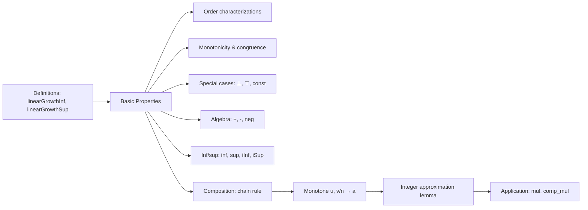

### Technical Brief: `LinearGrowth.lean`

---

#### **1. Key Definitions & Theorems**

| Name | Type | Purpose |
|------|------|---------|
| `linearGrowthInf` | `(u : ℕ → R) → R` | Lower linear growth rate: `liminf (u n / n)` as `n → ∞` |
| `linearGrowthSup` | `(u : ℕ → R) → R` | Upper linear growth rate: `limsup (u n / n)` as `n → ∞` |
| `linearGrowthInfTopHom` | `InfTopHom (ℕ → EReal) EReal` | `linearGrowthInf` as a homomorphism preserving finite infima and top |
| `linearGrowthSupBotHom` | `SupBotHom (ℕ → EReal) EReal` | `linearGrowthSup` as a homomorphism preserving finite suprema and bottom |
| `linearGrowthInf_le_iff` | `↔` | Characterization: `linearGrowthInf u ≤ a` iff eventually `u n ≤ b * n` for all `b > a` |
| `le_linearGrowthInf_iff` | `↔` | Dual: `a ≤ linearGrowthInf u` iff eventually `a * n ≤ u n` for all `a < b` |
| `linearGrowthSup_le_iff` / `le_linearGrowthSup_iff` | `↔` | Analogous characterizations for `limsup` |
| `linearGrowthInf_add_le` / `le_linearGrowthInf_add` | `≤` | Sub/additivity bounds for `+` (with non-degeneracy conditions) |
| `linearGrowthInf_neg` | `=` | `linearGrowthInf (-u) = -linearGrowthSup u` |
| `linearGrowthInf_inf` / `linearGrowthSup_sup` | `=` | Distributivity over pointwise `inf`/`sup` (i.e., `min`/`max`) |
| `linearGrowthInf_biInf` / `linearGrowthSup_biSup` | `=` | Preservation of *finite* infima/suprema under `linearGrowthInf`/`linearGrowthSup` |
| `Monotone.linearGrowthInf_comp` / `Monotone.linearGrowthSup_comp` | `=` | Chain rule: if `v/n → a`, then `linearGrowthInf (u ∘ v) = a * linearGrowthInf u` (for monotone `u`) |
| `tendsto_atTop_of_linearGrowthInf_pos` | `→` | If `0 < linearGrowthInf u`, then `u n → ∞` |

---

#### **2. Naming Conventions**

- **Prefixes**:
  - `linearGrowthInf_`, `linearGrowthSup_`: core definitions and properties.
  - `le_`, `_le`: ordering lemmas (`≤`).
  - `eventually_`, `frequently_`: filter-based lemmas.
  - `biInf`, `biSup`, `iInf`, `iSup`: finite/dependent inf/sup.
  - `comp`: composition with another sequence.
  - `const`, `bot`, `top`: special cases (constant, bottom, top sequences).
  - `mul`, `div`, `add`, `neg`: algebraic operations.

- **Suffixes**:
  - `_congr`: congruence under eventual equality.
  - `_monotone`: monotonicity.
  - `_eventually_monotone`: monotonicity in filter sense.
  - `_of_eventually_le`, `_of_frequently_le`: implications from filter-based bounds.
  - `_of_pos`, `_ne_top`, `_ne_bot`: side conditions on non-degeneracy.

- **Homomorphism names**:
  - `linearGrowthInfTopHom`, `linearGrowthSupBotHom`: indicate preservation of `Inf`/`Sup` and top/bottom.

---

#### **3. Tactic Stack**

| Tactic | Frequency | Role |
|--------|-----------|------|
| `rw` | Very High | Rewriting definitions, lemmas, algebraic identities |
| `refine` / `exact` | High | Constructing proofs step-by-step |
| `gcongr` | High | Handling inequalities under multiplication/division |
| `filter_upwards` | Medium | Managing filter-based arguments (eventually/frequently) |
| `simp` / `simp only` | Medium | Simplifying using known lemmas (e.g., `linearGrowthInf_bot`) |
| `apply` / `intro` | Medium | Standard proof steps |
| `cases` / `rcases` | Medium | Case analysis on `EReal` elements (`⊥`, `⊤`, real) |
| `eventually_atTop.2`, `frequently_atTop.2` | Medium | Constructing filter membership |
| `le_antisymm` | Medium | Proving equality via double inequality |
| `tendsto_nhds_of_eventually_eq` | Low | Proving convergence via eventual equality |
| `isBoundedDefault` | Low | Automatic boundedness proofs for liminf/limsup applicability |

---

#### **4. Proof Logic**

- **Structure**:
  - **Definitions**: via `liminf`/`limsup` of `u n / n`.
  - **Basic properties**: congruence, monotonicity, ordering characterizations using filter lemmas (`liminf_le_iff'`, `le_limsup_iff'`, etc.).
  - **Special cases**: constant, zero, top, bottom sequences — often via `liminf_eq`/`limsup_eq` of convergent sequences.
  - **Algebra**: sub/additivity, negation, inf/sup — often via `liminf_add_le`, `limsup_add_le`, and `liminf_min`, `limsup_max`.
  - **Composition**: chain rule for monotone `u` and `v` with `v n / n → a` — uses:
    - `eventually_atTop_exists_nat_between` (to approximate reals by naturals),
    - `frequently`/`eventually` manipulations,
    - `mul_le_of_forall_lt`, `le_mul_of_forall_lt`, and positivity arguments.
  - **Homomorphism properties**: via `map_finset_inf/sup`, `Finset.inf_eq_iInf`, etc.

- **Common proof pattern**:
  1. Reduce to real-valued case via coercion (`EReal.coe_*` lemmas).
  2. Use `eventually_atTop.2`/`frequently_atTop.2` to construct witnesses.
  3. Apply `gcongr` or `div_le_iff_*`/`le_div_iff_*` to manipulate inequalities.
  4. Use `le_antisymm` to prove equalities.
  5. For chain rule: sandwich argument using `a < b < c`, and integer approximations.

---

#### **5. Imports & Dependencies**

- **Core imports**:
  ```lean
  Mathlib.Analysis.SpecificLimits.Basic
  ```
  - Provides `liminf`, `limsup`, `tendsto`, `atTop`, `nhds`, etc.

- **Typeclass assumptions**:
  - `[ConditionallyCompleteLattice R]`: needed for `liminf`/`limsup` to exist.
  - `[Div R]`, `[NatCast R]`: for division by `n` and coercion from `ℕ`.

- **Key external lemmas used**:
  - `liminf_le_limsup`, `liminf_congr`, `limsup_congr`
  - `liminf_add_le`, `limsup_add_le`
  - `liminf_min`, `limsup_max`
  - `tendsto_const_div_atTop_nhds_zero_nat`
  - `EReal.coe_lt_coe_iff`, `EReal.coe_nonneg`, etc.

---

#### **6. Mermaid Diagrams**

##### **Dependency Graph (Module Scope)**

```mermaid
graph TD
  A[Mathlib.Analysis.SpecificLimits.Basic] --> B[LinearGrowth]
  B --> C[liminf/limsup theory]
  B --> D[EReal arithmetic]
  B --> E[Filter theory (atTop, frequently/eventually)]
  B --> F[ConditionallyCompleteLattice & Div/NatCast]
  B --> G[InfTopHom/SupBotHom homomorphisms]
  C --> H[liminf_le_iff', le_limsup_iff', etc.]
  D --> I[bot/top, coercion lemmas]
  E --> J[eventually_atTop, frequently_atTop]
```

##### **Overview of Theory Flow**



---

#### **7. Summary**

This file formalizes the *linear growth rate* of sequences over `EReal`, using `liminf` and `limsup` of `u n / n`. It establishes:

- **Foundational properties**: ordering, monotonicity, algebraic behavior.
- **Homomorphism structure**: `linearGrowthInf` as `InfTopHom`, `linearGrowthSup` as `SupBotHom`.
- **Chain rule**: under monotonicity and convergence of `v n / n`, growth rates scale multiplicatively.
- **Applications**: to subsequences (`u (m * n)`), composition, and positivity/tendsto implications.

The proofs rely heavily on `EReal` arithmetic, filter techniques (`frequently`/`eventually`), and careful handling of degenerate cases (`⊥`, `⊤`). The structure is modular and reusable for future generalizations (e.g., to `ENNReal`).
