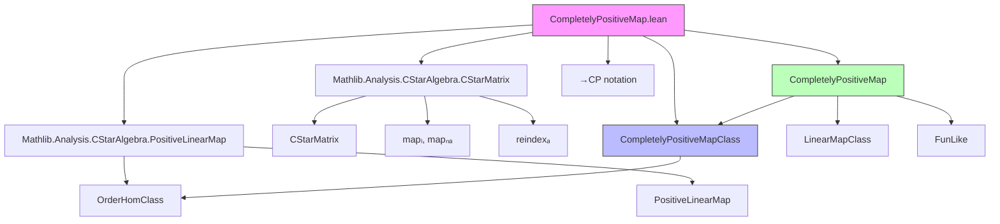

**Technical Brief: `CompletelyPositiveMap.lean`**

---

### 1. KEY DEFINITIONS & THEOREMS

| Name | Type / Structure | Purpose |
|------|------------------|---------|
| `CompletelyPositiveMap` | `structure` | Represents a concrete completely positive (CP) map: a linear map `φ : A₁ →ₗ[ℂ] A₂` such that for all `k : ℕ`, the induced map on `k × k` matrices preserves positivity. |
| `CompletelyPositiveMapClass` | `class` | A typeclass abstracting the *order-theoretic* property of CP maps (i.e., positivity on matrix amplifications), without assuming linearity internally. Designed for use with `LinearMapClass`. |
| `→CP` | `notation` | Scoped notation for `CompletelyPositiveMap A₁ A₂` under `CStarAlgebra`. |
| `map_cstarMatrix_nonneg'` | `axiom` (in both `CompletelyPositiveMap` and `CompletelyPositiveMapClass`) | Core CP condition: positivity is preserved under `CStarMatrix.map` (entrywise application) for matrices over `Fin k`. |
| `map_cstarMatrix_nonneg` | `lemma` | Extension of the CP condition to matrices indexed by *any* finite type `n`, via reindexing. |
| `OrderHomClass.of_map_cstarMatrix_nonneg` | `lemma` | Shows that any family of maps satisfying the CP matrix condition is automatically *order-preserving* (i.e., positive maps). |
| `instCompletelyPositiveMapClass` | `instance` | Proves that non-unital star algebra homomorphisms are completely positive. |

---

### 2. NAMING CONVENTIONS

- **Prefixes**:
  - `map_cstarMatrix_`: Pertains to preservation of positivity under matrix amplification.
  - `inst_`: For typeclass instances (e.g., `instCompletelyPositiveMapClass`).
  - `coe`: For coercion-related lemmas/instances (e.g., `instCoeToCompletelyPositiveMap`).
- **Suffixes**:
  - `'` (prime): Often denotes a *primitive* or *core* version of a property (e.g., `map_cstarMatrix_nonneg'` vs `map_cstarMatrix_nonneg`).
  - `Class`: Denotes typeclasses abstracting a property (e.g., `CompletelyPositiveMapClass`, `LinearMapClass`, `OrderHomClass`).
- **Notation**:
  - `→CP`: Binary infix notation for CP maps, scoped under `CStarAlgebra`.

---

### 3. TACTIC STACK

Frequently used tactics in this file:

| Tactic | Role |
|--------|------|
| `simp` / `simp only` | Simplify using definitional equalities and lemmas (e.g., `mapₗ`, `reindexₐ`, `coe_coe`). |
| `rw` | Rewrite using equalities (especially `← hrw`, `← mapₗ_reindexₐ`). |
| `exact` / `assumption` | Close goals directly using hypotheses or lemmas. |
| `change` | Adjust the goal to match a known lemma (e.g., `change 0 ≤ (mapₙₐ (φ : A₁ →⋆ₙₐ[ℂ] A₂)) M`). |
| `cases` | Destructure structures (e.g., `cases f`, `cases g`) to prove extensionality. |
| `congr` | Prove equality of structures by congruence. |
| `apply` / `intro` | Standard intro/apply for structured proofs (e.g., in `OrderHomClass.of_map_cstarMatrix_nonneg`). |
| `ring` / `aesop` | *Not present* — this file is mostly algebraic/proof-relevant, not computational. |

---

### 4. PROOF LOGIC

The logical flow follows a **modular order-algebra separation** strategy:

1. **Define** the concrete notion (`CompletelyPositiveMap`) as a structure extending `LinearMap`, with a positivity-on-matrices condition.
2. **Abstract** the order-theoretic content into a typeclass (`CompletelyPositiveMapClass`) to decouple linearity and order.
3. **Show** that the class implies `OrderHomClass`, i.e., CP ⇒ positive (via 1×1 matrices).
4. **Lift** the CP condition from `Fin k`-indexed matrices to arbitrary finite types using `reindexₐ` and `mapₗ_reindexₐ`.
5. **Prove** a key instance: non-unital star algebra homomorphisms are CP, using `map_nonneg` for `mapₙₐ`.

Induction is *not* used — the proofs rely on **reindexing** and **functoriality** of matrix maps.

---

### 5. IMPORTS

| Import | Purpose |
|--------|---------|
| `Mathlib.Analysis.CStarAlgebra.PositiveLinearMap` | Provides `PositiveLinearMap`, `OrderHomClass`, and positivity machinery. |
| `Mathlib.Analysis.CStarAlgebra.CStarMatrix` | Provides `CStarMatrix`, `mapₗ`, `mapₙₐ`, `reindexₐ`, and matrix positivity. |

These imports define the ambient categorical and order-theoretic context for CP maps.

---

### 6. DEPENDENCY & OVERVIEW DIAGRAM

**Overview**:

- The module defines *completely positive maps* in the context of *non-unital C*-algebras* with compatible order and star structure.
- It separates the *algebraic* (linearity) and *order-theoretic* (positivity on matrices) aspects via `CompletelyPositiveMapClass` + `LinearMapClass`.
- It proves that non-unital star algebra homomorphisms are CP — a foundational result for quantum information theory and operator algebras.

---

### 7. THEORY SCOPE

- **Domain**: Operator algebras / quantum information theory.
- **Scope**: Foundations of completely positive maps in Lean’s `Mathlib` ecosystem.
- **Future extensions**: Likely to be extended with:
  - Unital CP maps (`→CP₁`)
  - Completely bounded maps
  - Stinespring dilation
  - Choi’s theorem (via `CStarMatrix.equivFin`)  
  - Monoidal structure (tensor product of CP maps)

--- 

Let me know if you'd like a formalized summary in `lean` comment style or a dependency graph for related files (e.g., `CPMap`, `CompletelyPositive`, etc.).
