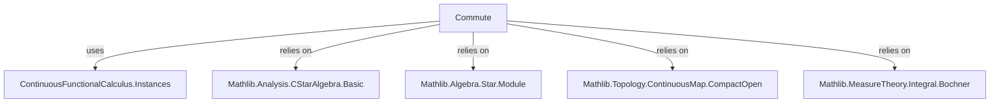
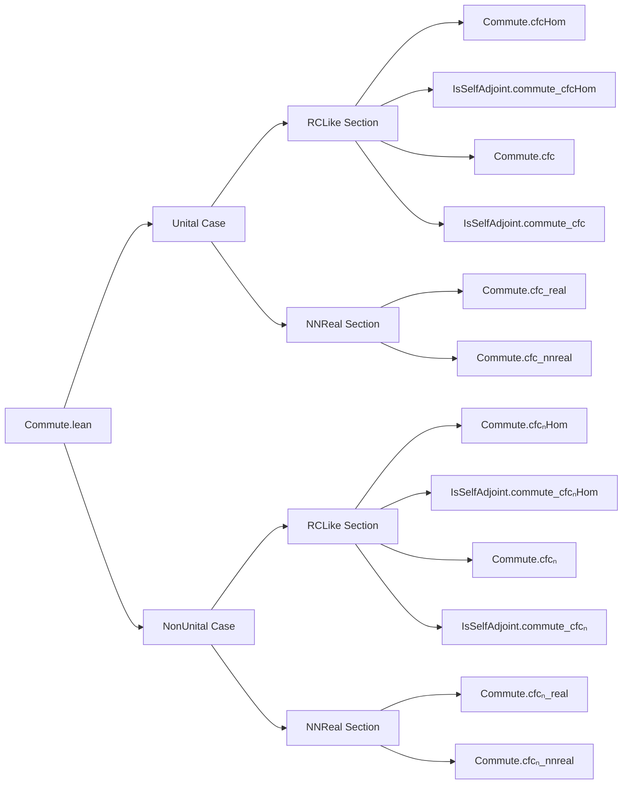

### Technical Brief: `Commute.lean`

---

#### **1. Key Definitions & Theorems**

| Name | Type / Signature | Purpose |
|------|------------------|---------|
| `cfcHom` | `cfcHom (ha : p a) (f : C(spectrum 𝕜 a, 𝕜)) : A` | Continuous functional calculus homomorphism for unital case (maps continuous functions on spectrum to algebra elements). |
| `cfcₙHom` | `cfcₙHom (ha : p a) (f : C(quasispectrum 𝕜 a, 𝕜)₀) : A` | Non-unital version of continuous functional calculus homomorphism. |
| `cfc` | `cfc (f : 𝕜 → 𝕜) (a : A) : A` | Unital continuous functional calculus applied to `a`, extended via `cfcHom`. |
| `cfcₙ` | `cfcₙ (f : 𝕜 → 𝕜) (a : A) : A` | Non-unital continuous functional calculus applied to `a`. |
| `Commute a b` | `a * b = b * a` | Standard commutativity predicate. |
| `IsSelfAdjoint a` | `star a = a` | Self-adjointness predicate. |

##### Main Theorems

| Name | Type | Purpose |
|------|------|---------|
| `Commute.cfcHom` | `p a → Commute a b → Commute (star a) b → Commute (cfcHom ha f) b` | If `b` commutes with `a` and `star a`, then `b` commutes with `cfcHom f a`. |
| `IsSelfAdjoint.commute_cfcHom` | `p a → IsSelfAdjoint a → Commute a b → Commute (cfcHom ha f) b` | Specialization when `a` is self-adjoint: only need `Commute a b`. |
| `Commute.cfc` | `Commute a b → Commute (star a) b → Commute (cfc f a) b` | Unital `cfc` version of `cfcHom`. |
| `IsSelfAdjoint.commute_cfc` | `IsSelfAdjoint a → Commute a b → Commute (cfc f a) b` | Self-adjoint specialization for `cfc`. |
| `Commute.cfc_real` | `Commute a b → Commute (cfc f a) b` | For `𝕜 = ℝ`, no need to check `Commute (star a) b`. |
| `Commute.cfc_nnreal` | `Commute a b → Commute (cfc f a) b` | For `𝕜 = ℝ≥0`, same simplification. |
| `Commute.cfcₙHom`, `IsSelfAdjoint.commute_cfcₙHom`, `Commute.cfcₙ`, `IsSelfAdjoint.commute_cfcₙ`, `Commute.cfcₙ_real`, `Commute.cfcₙ_nnreal` | Analogous to above but for non-unital `cfcₙ`. |

---

#### **2. Naming Conventions**

- **Prefixes**:
  - `cfc` / `cfcₙ`: Continuous functional calculus (unital / non-unital).
  - `cfcHom` / `cfcₙHom`: Homomorphic versions (explicit algebra homomorphisms).
  - `commute_` / `Commute.`: Commutativity lemmas (typeclass instance style).
- **Suffixes**:
  - `_real`, `_nnreal`: Specializations for base rings `ℝ` and `ℝ≥0`.
  - `_hom`: Homomorphic versions (e.g., `cfcHom`, `cfcₙHom`).
- **Case markers**:
  - `induction_on_of_compact`: Structural induction on `C(X)` or `C₀(X)` using standard generators (`const`, `id`, `star_id`, `add`, `mul`, `frequently`).
  - `cases`-style lemmas: `cfc_cases`, `cfcₙ_cases` — used to reduce to homomorphic case.

---

#### **3. Tactic Stack**

Frequent tactics used in proofs:

| Tactic | Usage |
|--------|-------|
| `induction f using ...` | Structural induction on `f : C(X)` or `C₀(X)` using `induction_on_of_compact`. |
| `rw [...]` | Rewriting using definitions like `cfcHom_id`, `map_star`, `map_add`, `map_mul`, `cfc_apply`, etc. |
| `conv => ...` | Focused rewriting (e.g., `enter [1, 2]`, `equals ... => rfl`). |
| `rwa [...]` | Rewrite + assumption (e.g., `rwa [cfcHom_id ha]`). |
| `simp [...]` | Simplification using `cfc_apply_of_not_predicate`, `cfc_nnreal_eq_real`, etc. |
| `by_cases ha : 0 ≤ a` | Case analysis on positivity (for `ℝ≥0`-based simplifications). |
| `exact ...` / `apply ...` | Direct proof steps (e.g., `exact Algebra.commute_algebraMap_left ...`). |
| `fun_prop`, `T2Space`, `isClosed_eq` | Typeclass reasoning for closure properties and topology. |
| `mem_closure_of_frequently_of_tendsto` | Topological argument for density/closure in functional calculus. |

---

#### **4. Proof Logic**

- **Core strategy**: Induction on `f` in `C(spectrum a)` or `C₀(quasispectrum a)` using standard generators:
  - Constants → use `AlgHomClass.commutes` and `Algebra.commute_algebraMap_left`.
  - Identity function → use `cfcHom_id`.
  - Star of identity → use `map_star` + `cfcHom_id`.
  - Addition/multiplication → use `map_add`/`map_mul` + induction hypotheses.
  - Dense subset (`frequently`) → use continuity of `cfcHom` and closure arguments.

- **Self-adjoint simplification**:
  - If `a` is self-adjoint, then `star a = a`, so `Commute (star a) b` follows from `Commute a b`.
  - Used via `ha'.star_eq.symm ▸ hb`.

- **Real / nonnegative real simplifications**:
  - In `ℝ` or `ℝ≥0`, `star = id`, so `Commute (star a) b` is redundant.
  - For `ℝ≥0`, further use `cfc_nnreal_eq_real` or `cfcₙ_nnreal_eq_real` to reduce to real case.
  - For non-positive `a`, `cfc f a = 0` (by definition), so trivially commutes.

- **Non-unital case**:
  - Mirrors unital case but uses `cfcₙHom`, `cfcₙ`, and `quasispectrum`.
  - Uses `ContinuousMapZero.induction_on_of_compact` for induction.

---

#### **5. Imports**

```lean
import Mathlib.Analysis.CStarAlgebra.ContinuousFunctionalCalculus.Instances
```

- **Scope**: This module builds on the *instances* of continuous functional calculus (CFC) in `Mathlib`.
- **Dependencies**:
  - `RCLike`, `StarRing`, `StarAlgebra`, `TopologicalSpace`, `ContinuousFunctionalCalculus`, `IsTopologicalRing`, `T2Space`.
  - For non-unital case: `NonUnitalRing`, `NonUnitalStarAlgebra`, `NonUnitalContinuousFunctionalCalculus`.
  - For `ℝ≥0` case: `PartialOrder`, `NonnegSpectrumClass`, `StarOrderedRing`.

---

#### **6. Mermaid Diagrams**

##### **Dependency Graph (Module-Level)**



##### **Overview of File Structure**



##### **Proof Strategy Flow (Unital, RCLike)**

```mermaid
flowchart TD
  Start[Given: p a, Commute a b, Commute (star a) b] --> Induction[Induct on f ∈ C(spec a)]
  Induction -->|const r| Const[Use algebraMap commutes]
  Induction -->|id| Id[Use cfcHom_id]
  Induction -->|star_id| Star[Use map_star + cfcHom_id]
  Induction -->|add/mul| Rec[Apply IH + map properties]
  Induction -->|frequently| Closure[Use continuity + closure argument]
  Rec --> End[Commute (cfcHom f a) b]
  Closure --> End
```

---

#### **7. Summary**

This file formalizes a foundational property of the continuous functional calculus: **commutation is preserved under functional calculus**. It provides both general and specialized versions (for self-adjoint elements, real/nnreal scalars, unital/non-unital algebras), with proofs built on structural induction and topological closure arguments. The design prioritizes *efficiency* (avoiding heavy typeclass machinery like topological star algebras) and *usability* (convenient special cases via `grind ←` attributes).
