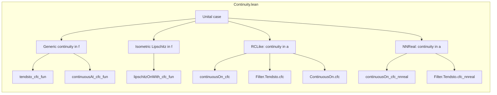

**Technical Brief: Continuity of the Continuous Functional Calculus in Lean 4**

---

### 1. KEY DEFINITIONS & THEOREMS

| Name | Type / Signature | Purpose |
|------|------------------|---------|
| `cfc` | `cfc : (𝕜 → 𝕜) → A → A` | The *continuous functional calculus* map, defined for functions continuous on the spectrum of `a : A`. Uses junk value when continuity fails. |
| `cfcHom` | `cfcHom : {a : A // p a} → C(spectrum 𝕜 a, 𝕜) → A` | The *homomorphic* version of the functional calculus, defined only on elements satisfying predicate `p` and continuous functions on the spectrum. |
| `cfcHomSuperset` | `cfcHomSuperset : p a → spectrum 𝕜 a ⊆ s → C(s, 𝕜) → A` | Extends `cfcHom` to functions defined on a larger compact superset `s` of the spectrum. |
| `tendsto_cfc_fun` | `TendstoUniformlyOn F f l (spectrum R a) → (∀ᶠ x in l, ContinuousOn (F x) (spectrum R a)) → Tendsto (fun x ↦ cfc (F x) a) l (𝓝 (cfc f a))` | Continuity of `cfc` in the *function variable* under uniform convergence on the spectrum. |
| `Filter.Tendsto.cfc` | Under `RCLike 𝕜`, with `s` compact, `Tendsto a l (𝓝 a₀)` and spectra eventually in `s`, implies `Tendsto (fun x ↦ cfc f (a x)) l (𝓝 (cfc f a₀))` | Continuity of `cfc` in the *algebra variable* `a`, for fixed `f`. |
| `lipschitzOnWith_cfc_fun` | `LipschitzOnWith 1 (fun f ↦ cfc (toFun {spectrum R a} f) a) {f | ContinuousOn (toFun {spectrum R a} f) (spectrum R a)}` | The map `f ↦ cfc f a` is 1-Lipschitz (hence uniformly continuous) on functions continuous on `spectrum R a`. |
| `continuousOn_cfc` | `IsCompact s → ContinuousOn f s → ContinuousOn (cfc f) {a | p a ∧ spectrum 𝕜 a ⊆ s}` | For fixed `f`, `cfc f` is continuous on the set of `a` with spectrum in `s` and satisfying `p`. |
| `continuousOn_cfc_setProd` | Joint continuity of `cfc` on `{f | ContinuousOn f s} × {a | p a ∧ spectrum 𝕜 a ⊆ s}` with function space topology = uniform convergence on `s`. | Main joint continuity result. |
| `continuousOn_cfc_nnreal`, `cfc_nnreal_*` | Analogues of above for `ℝ≥0`-valued functional calculus (nonnegative elements). | Covers the positive cone case (e.g., for square roots). |

---

### 2. NAMING CONVENTIONS

- **Predicate-based qualifiers**:
  - `p a`: predicate ensuring `a` lies in domain of functional calculus (e.g., `IsSelfAdjoint`, or `0 ≤ a`).
  - `spectrum R a`: spectrum of `a` over scalar ring `R`.
- **Function-space variants**:
  - `toFun {s} f`: coercion from uniform limit space `R →ᵤ[{s}] R` to function `R → R`.
  - `ofFun {s} f`: inverse coercion (function → uniform limit).
- **Continuity modifiers**:
  - `continuousAt`, `continuousWithinAt`, `continuousOn`, `Continuous` — standard topology qualifiers.
  - `Tendsto.cfc`, `ContinuousAt.cfc`, etc.: *instance methods* for `Filter.Tendsto`, `ContinuousAt`, etc.
- **Scalar-specific sections**:
  - `RCLike 𝕜`: for complex or real scalars (complete, normed, etc.).
  - `NNReal`: for nonnegative reals (`ℝ≥0`), with extra assumptions (`0 ≤ a`, `NonnegSpectrumClass`, etc.).
- **Suffixes**:
  - `_fun`: continuity in function argument.
  - `_left`: continuity in algebra argument (when variable is `a : X → A`).
  - `_nnreal`: nonnegative scalar variant.
  - `_setProd`: joint continuity in `(f, a)`.

---

### 3. TACTIC STACK

| Tactic | Usage |
|--------|-------|
| `aesop` | Automated reasoning for simple goals (e.g., set membership, inequalities). |
| `simp` / `simp only` | Simplification with definitional equalities, especially for `cfc_apply`, `map_star`, etc. |
| `rw` | Rewriting using lemmas like `cfc_apply`, `isometry_cfcHom.edist_eq`, `continuousOn_iff_continuous_restrict`. |
| `induction f using ContinuousMap.induction_on_of_compact` | Structural induction on `C(s, 𝕜)` for proving continuity of `cfcHomSuperset`. |
| `fun_prop` | Propagates continuity through algebraic operations (add, mul, star). |
| `filter_upwards` | Handles filter-based arguments (e.g., eventually conditions). |
| `convert` + `congr!` | Proving equality of continuous functions via congruence. |
| `have h₁ := ...; have h₂ := ...; simpa using h₁.comp h₂ ...` | Chaining Lipschitz/continuous maps. |
| `cfc_cont_tac`, `cfc_tac` | Custom tactics (likely user-defined) to discharge continuity/predicate goals automatically. |

---

### 4. PROOF LOGIC

The proofs follow a layered strategy:

1. **Function-variable continuity**:
   - Reduce to continuity of `cfcHom` (via `cfc_apply`).
   - Use `isometry_cfcHom` to get Lipschitz (hence continuous) behavior.
   - Apply uniform convergence lemmas (`tendsto_uniformly_on_of_tendsto_uniformly_on`, `continuousOn.cfc_fun`).

2. **Algebra-variable continuity**:
   - Prove continuity of `cfcHomSuperset` in `a` using:
     - Induction on `C(s, 𝕜)` (via `induction_on_of_compact`).
     - Density of polynomials / star-polynomials.
     - Uniform approximation (`continuous_of_uniform_approx_of_continuous`).
   - Use `continuousOn_cfc` to lift to sets `{a | p a ∧ spectrum ⊆ s}`.

3. **Joint continuity**:
   - Combine Lipschitz-in-`f` and continuous-in-`a` via:
     - `continuousOn_prod_of_continuousOn_lipschitzOnWith`.
   - Or use `continuousWithinAt.tendsto.comp` with `continuousOn_cfc`.

4. **Nonnegative case**:
   - Reduce to real case via `cfc_nnreal_eq_real`.
   - Use `toNNReal`/`ofReal` continuity and image arguments.

5. **Filter-based lemmas**:
   - Use `tendsto_nhdsWithin_iff`, `tendsto_comap'_iff`, and `tendsto_const_nhds`.
   - Handle edge cases (`p a` fails) via `cfc_apply_of_not_predicate`.

---

### 5. IMPORTS

| Module | Role |
|--------|------|
| `Mathlib.Analysis.CStarAlgebra.ContinuousFunctionalCalculus.Isometric` | Core definitions: `ContinuousFunctionalCalculus`, `IsometricContinuousFunctionalCalculus`, `cfcHom`, `cfc`. |
| `Mathlib.Topology.MetricSpace.UniformConvergence` | Uniform convergence on sets, `TendstoUniformlyOn`, `UniformOnFun`. |
| `Mathlib.Topology.UniformSpace.CompactConvergence` | Topology of uniform convergence on compact sets, `nhdsSet`, `upperHemicontinuous_spectrum`. |

---

### 6. DEPENDENCY & THEORY OVERVIEW

#### Mermaid Diagram: Theory Dependencies

```mermaid
graph TD
  A[ContinuousFunctionalCalculus] --> B[Isometric CFC]
  B --> C[Continuity of cfcHom]
  C --> D[Continuity in f (tendsto_cfc_fun)]
  C --> E[Continuity in a (continuous_cfcHomSuperset_left)]
  D --> F[Joint continuity (continuousOn_cfc_setProd)]
  E --> F
  G[Nonnegative Elements] --> H[NNReal CFC]
  H --> I[NNReal continuity lemmas]
  F --> J[Applications: functional calculus calculus, spectral theory]
```

#### Mermaid Diagram: File Structure Overview



---

### 7. SCOPING & SCOPE LIMITATIONS

- **Scalar rings**: Works for `RCLike 𝕜` (ℂ, ℝ) and `ℝ≥0`.
- **Algebras**: Unital and non-unital (via `p` predicate).
- **Function spaces**: Uniform convergence on compact sets (`uniformity_basis_dist_le`).
- **Assumptions**:
  - `IsometricContinuousFunctionalCalculus` required for Lipschitz/joint continuity.
  - `CompleteSpace A` needed for `cfc_of_mem_nhdsSet` variants (via `upperHemicontinuous_spectrum`).
  - `NonnegSpectrumClass`, `StarOrderedRing`, etc., for `ℝ≥0` case.

---

### 8. SUMMARY

This file establishes *quantitative* and *qualitative* continuity properties of the continuous functional calculus in both variables. It leverages:
- **Isometry** for Lipschitz bounds,
- **Uniform approximation** for algebra-variable continuity,
- **Filter-based reasoning** for flexible convergence statements,
- **Case analysis** over scalar types (`RCLike` vs `ℝ≥0`).

The results are foundational for perturbation theory, functional calculus in Banach/C*-algebras, and applications like the spectral theorem or functional calculus for self-adjoint/unital elements.
