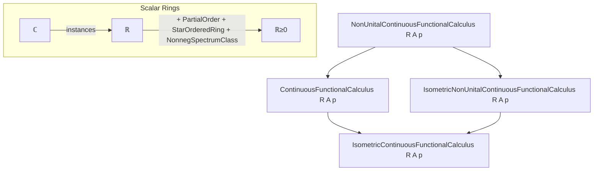
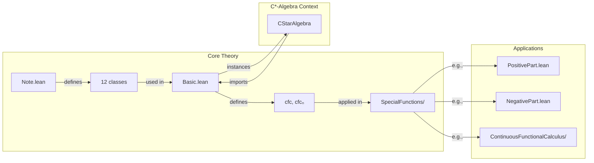
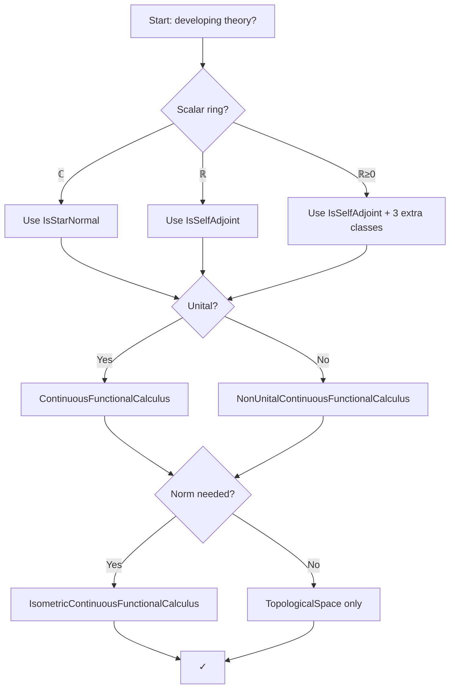

**Technical Metadata Brief: `Note.lean`**

---

### 1. **Key Definitions & Theorems**

| Name | Type / Purpose |
|------|----------------|
| `NonUnitalContinuousFunctionalCalculus R A p` | Class encoding the continuous functional calculus for non-unital algebras over scalar ring `R`, for predicates `p : A → Prop` (e.g., `IsSelfAdjoint`, `IsStarNormal`, `0 ≤ ·`). |
| `ContinuousFunctionalCalculus R A p` | Unital variant of the above. |
| `IsometricNonUnitalContinuousFunctionalCalculus R A p` | Extends `NonUnitalContinuousFunctionalCalculus` with isometry condition (norm-preserving). |
| `IsometricContinuousFunctionalCalculus R A p` | Unital + isometric variant. |
| `cfc f a` | Continuous functional calculus application: $f(a)$, where `f : C(spectrum a)` and `a : A`. |
| `cfcₙ f a` | Non-unital version of `cfc`, used when algebra lacks unit. |
| `cfc_comp` | Lemma stating compatibility of `cfc` with composition: $cfc(g \circ f)(a) = cfc(g)(cfc(f)(a))$, under conditions. |
| `cfc_tac`, `cfc_cont_tac`, `cfc_zero_tac` | Tactics used in `autoParam`s to discharge proof obligations: spectrum membership, continuity, and basepoint preservation (`f(0) = 0`). |

---

### 2. **Naming Conventions**

- **Class names**:  
  - Prefixes: `NonUnital`, `Isometric`, `ContinuousFunctionalCalculus`  
  - Suffixes: none beyond class name; predicate `p` is part of type parameters.
- **Function names**:  
  - `cfc`, `cfcₙ` — core functional calculus operators  
  - `cfc_comp`, `cfc_zero`, etc. — lemmas involving `cfc`
- **Predicate naming**:  
  - `IsSelfAdjoint`, `IsStarNormal`, `0 ≤ ·` — standard algebraic/positional predicates on elements.

---

### 3. **Tactic Stack**

Frequently used tactics in proofs involving this module:

- `cfc_tac`, `cfc_cont_tac`, `cfc_zero_tac` — custom tactics for `autoParam` arguments  
- `aesop`, `simp`, `simp_rw`, `ring`, `norm_num`, `linarith` — standard for algebraic simplification  
- `apply_fun`, `congr`, `ext`, `funext` — for extensionality and function equality  
- `have`, `set`, `rcases`, `cases` — for local assumptions and decomposition  
- `exact`, `assumption`, `trivial`, `yes` — for trivial goals  
- `apply_fun` + `continuous_on.comp` — for continuity arguments in functional calculus

---

### 4. **Proof Logic**

- **Pattern**:  
  - General theory is developed in *maximum generality* (non-unital, real scalars, no norm), then specialized as needed.  
  - Induction is rare; most proofs are *algebraic* or *topological*, relying on:
    - Universal properties of `C(X)` and functional calculus
    - Uniqueness of continuous extensions (via `UniqueHom` instances)
    - Compatibility with algebra operations (linearity, multiplicativity, *-preservation)
  - When proving lemmas like `cfc f a = b`, one typically:
    1. Reduce to polynomial approximations (Weierstrass / Stone–Weierstrass)
    2. Use continuity of `cfc` (or isometry if available)
    3. Apply `cfc_comp` or algebraic identities (e.g., `cfc (f + g) = cfc f + cfc g`)
- **Case splits** often occur on:
  - Unital vs non-unital (via `cfc` vs `cfcₙ`)
  - Scalar ring (`ℂ`, `ℝ`, `ℝ≥0`)
  - Presence of norm (isometric vs topological)

---

### 5. **Imports**

Primary dependencies defining scope:

- `Mathlib.Init`
- `Mathlib.Tactic.Basic`
- `Mathlib.Analysis.CStarAlgebra.ContinuousFunctionalCalculus.Basic` (for full C*-algebra instances)
- Implicitly:  
  - `Mathlib.Algebra.Star.Module`  
  - `Mathlib.Analysis.Normed.Algebra.Basic`  
  - `Mathlib.Topology.ContinuousFunction.Basic`  
  - `Mathlib.MeasureTheory.Integration.SimpleFunc` (for spectral theory)  
  - `Mathlib.Algebra.Order.Nonneg` (for `ℝ≥0`-based functional calculus)

---

### 8. **Mermaid Diagrams**

#### **Dependency Graph (Class Hierarchy)**

#### **Overview of File Structure & Theory**

#### **Usage Guidance Flowchart**

--- 

This file serves as a **design note** and **development guide**, not a formal theory file. It codifies best practices for using and extending the continuous functional calculus in Mathlib, especially regarding class selection, tactic usage, and file placement.
