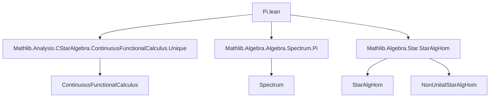
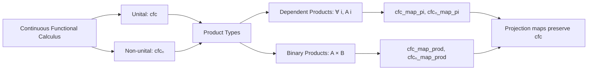

### Technical Brief: Continuous Functional Calculus on Product Types (`Pi.lean`)

---

#### **1. Key Definitions & Theorems**

| Name | Type | Purpose |
|------|------|---------|
| `cfcₙ_map_pi` | `cfcₙ f a = fun i => cfcₙ f (a i)` | Non-unital continuous functional calculus commutes with dependent product evaluation: applying `cfcₙ` pointwise yields the same as evaluating at each index. |
| `cfcₙ_map_prod` | `cfcₙ f (a, b) = (cfcₙ f a, cfcₙ f b)` | Non-unital version for binary products: functional calculus distributes over product structure. |
| `cfc_map_pi` | `cfc f a = fun i => cfc f (a i)` | Unital counterpart of `cfcₙ_map_pi`, for unital continuous functional calculus. |
| `cfc_map_prod` | `cfc f (a, b) = (cfc f a, cfc f b)` | Unital counterpart of `cfcₙ_map_prod`. |

All four lemmas assert that the continuous functional calculus respects product structures (dependent or binary), via evaluation maps (`Pi.evalStarAlgHom`, `StarAlgHom.fst/snd`, etc.).

---

#### **2. Naming Conventions**

- **Prefixes**:
  - `cfc`: *continuous functional calculus* (unital).
  - `cfcₙ`: *non-unital continuous functional calculus*.
- **Suffixes**:
  - `_map_pi`: for dependent products (`∀ i, A i`).
  - `_map_prod`: for binary products (`A × B`).
- **Helper variables**:
  - `hf`, `ha`, `hb`, `hab`, `ha'`: standard hypotheses for continuity, applicability, and domain conditions.
  - `φ`: used for algebra homomorphisms (evaluations or projections).

---

#### **3. Tactic Stack**

Frequent tactics used in proofs:

| Tactic | Role |
|--------|------|
| `cfc_cont_tac` | Automatically discharges continuity assumptions on `f` over spectra/quasispectra. |
| `cfc_tac` | Automatically verifies applicability conditions (e.g., `p a`, `q i (a i)`). |
| `ext` | Extensionality to prove equality of functions or pairs. |
| `rwa [Pi.spectrum_eq]`, `rwa [Prod.spectrum_eq]` | Rewrite spectra of products using known identities. |
| `let φ := ...` + `φ.map_cfc`/`φ.map_cfcₙ` | Apply known lemmas about algebra homomorphisms preserving functional calculus. |
| `simp only [...]` | Simplify using definitions (e.g., `cfcₙ_apply_of_not_map_zero`, `Pi.zero_def`). |
| `by_cases hf₀ : f 0 = 0` | Split on whether `f` preserves zero (critical for distinguishing unital vs non-unital cases). |
| `Subsingleton.elim _ _` | Handle empty index set case (trivial when `ι` is empty). |

---

#### **4. Proof Logic**

The proofs follow a **structured case analysis** based on:

1. **Index set emptiness** (`isEmpty_or_nonempty ι`) in `cfcₙ_map_pi`.
2. **Zero preservation** (`f 0 = 0`) in non-unital versions (`cfcₙ_map_*`).
3. **Projection homomorphisms**:
   - For `pi`: use `Pi.evalStarAlgHom` / `Pi.evalNonUnitalStarAlgHom`.
   - For `prod`: use `StarAlgHom.fst/snd` / `NonUnitalStarAlgHom.fst/snd`.
4. **Application of `map_cfc`/`map_cfcₙ` lemmas**, which require:
   - Continuity of `f` on the appropriate spectrum/quasispectrum.
   - Applicability conditions (`p a`, `q i (a i)`, etc.).
   - Continuity of the projection maps (e.g., `continuous_apply`, `continuous_fst`).

**Typical proof flow** (e.g., `cfc_map_prod`):
- Extend to equality via `ext`.
- For each component (`fst`, `snd`), apply the projection homomorphism’s `map_cfc` lemma.
- Use `rwa [Prod.spectrum_eq]` to rewrite the spectrum of the pair.
- Apply continuity of projection (`continuous_fst`, `continuous_snd`).
- Conclude via `ha`, `hb`, `hab`.

---

#### **5. Imports & Dependencies**

| Import | Purpose |
|--------|---------|
| `Mathlib.Analysis.CStarAlgebra.ContinuousFunctionalCalculus.Unique` | Uniqueness of continuous functional calculus (used implicitly via `ContinuousMap.UniqueHom`). |
| `Mathlib.Algebra.Algebra.Spectrum.Pi` | Spectrum identities for dependent products (`Pi.spectrum_eq`). |
| `Mathlib.Algebra.Star.StarAlgHom` | Definitions and properties of star algebra homomorphisms (`StarAlgHom.fst`, `evalStarAlgHom`, etc.). |

These imports provide:
- The *theoretical foundation* for functional calculus (uniqueness, continuity).
- *Spectral calculus* for products (spectra of tuples/products).
- *Algebraic structure* of homomorphisms preserving star and algebra operations.

---

#### **6. Mermaid Diagrams**

##### **Dependency Graph (Module-Level)**



##### **Overview of Theoretical Flow**



##### **Proof Strategy Flow (e.g., `cfc_map_prod`)**

```mermaid
flowchart TD
  Start[Goal: cfc f (a,b) = (cfc f a, cfc f b)] --> Ext[ext]
  Ext --> Fst[ fst component ]
  Ext --> Snd[ snd component ]
  Fst --> ProjFst[let φ := StarAlgHom.fst]
  Snd --> ProjSnd[let φ := StarAlgHom.snd]
  ProjFst --> ApplyFst[φ.map_cfc ...]
  ProjSnd --> ApplySnd[φ.map_cfc ...]
  ApplyFst --> concl
  ApplySnd --> concl
```

---

#### **7. Summary**

This file formalizes the *compatibility of continuous functional calculus with product structures*, both dependent and binary, in both unital and non-unital settings. It leverages:
- **Spectral identities** for products (`Pi.spectrum_eq`, `Prod.spectrum_eq`).
- **Homomorphism preservation properties** (`map_cfc`, `map_cfcₙ`).
- **Tactic automation** (`cfc_cont_tac`, `cfc_tac`) to discharge routine hypotheses.

The results are foundational for extending functional calculus to operator algebras over product spaces, such as in quantum mechanics or spectral theory over families of operators.

--- 

Let me know if you'd like a formalization checklist or a plan for extending this to infinite products with topology.
