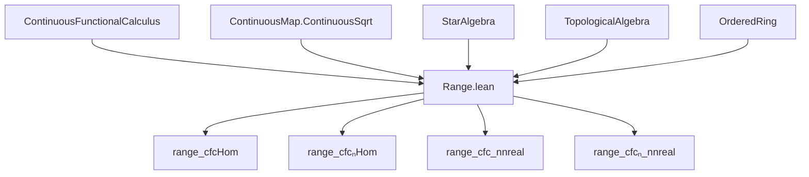
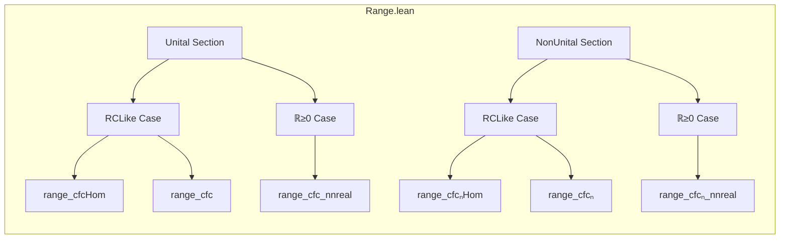

### Technical Brief: `Range.lean`

---

#### **1. Key Definitions & Theorems**

| Name | Type / Signature | Purpose |
|------|------------------|---------|
| `cfcHom` | `cfcHom (ha : p a) : C(spectrum 𝕜 a, 𝕜) →ₙ* A` | Unital *-algebra homomorphism from continuous functions on spectrum to algebra `A`, part of continuous functional calculus (CFC). |
| `cfc` | `cfc (R := 𝕜) : (spectrum 𝕜 a → 𝕜) → A` | Application of CFC to a function and element `a`. Often used for `cfc f a`. |
| `cfcₙHom` | `cfcₙHom (ha : p a) : C₀(quasispectrum 𝕜 a, 𝕜) →ₙ* A` | Non-unital *-homomorphism from vanishing-at-infinity functions on quasispectrum to `A`. |
| `cfcₙ` | `cfcₙ (R := 𝕜) : (quasispectrum 𝕜 a → 𝕜) → A` | Non-unital CFC application. |
| `elemental 𝕜 a` | `StarAlgebra.elemental 𝕜 a` or `NonUnitalStarAlgebra.elemental 𝕜 a` | The *-subalgebra (or non-unital *-subalgebra) of `A` generated by `a` and the scalar unit (or not). |
| `range_cfcHom` | `range (cfcHom ha) = elemental 𝕜 a` | Main theorem: the range of the unital CFC homomorphism is exactly the elemental algebra generated by `a`. |
| `range_cfcₙHom` | `range (cfcₙHom ha) = elemental 𝕜 a` | Analogous for non-unital case. |
| `range_cfc` | `Set.range (cfc · a) = elemental 𝕜 a` | Immediate corollary of `range_cfcHom`. |
| `range_cfcₙ` | `Set.range (cfcₙ · a) = elemental 𝕜 a` | Non-unital analog. |
| `range_cfc_nnreal` | `Set.range (cfc (R := ℝ≥0) · a) = {x | x ∈ elemental ℝ a ∧ 0 ≤ x}` | Over `ℝ≥0`, range of CFC consists of nonnegative elements in the real elemental algebra. |
| `range_cfcₙ_nnreal` | `Set.range (cfcₙ (R := ℝ≥0) · a) = {x | x ∈ elemental ℝ a ∧ 0 ≤ x}` | Non-unital version of above. |
| `cfcHom_apply_mem_elemental`, `cfcₙHom_apply_mem_elemental` | `cfcHom ha f ∈ elemental 𝕜 a` | Membership of CFC outputs in elemental algebra. |
| `cfc_apply_mem_elemental`, `cfcₙ_apply_mem_elemental` | `cfc f a ∈ elemental 𝕜 a` | Simplified membership for arbitrary functions (via case analysis). |

---

#### **2. Naming Conventions**

- **Prefixes**:
  - `cfc` / `cfcₙ`: Continuous functional calculus (unital / non-unital).
  - `cfcHom` / `cfcₙHom`: Homomorphic version of CFC.
  - `elemental`: Refers to the generated algebra.
  - `range_`: Statements about the range of maps.
  - `is_`, `mem_`, `apply_mem_`: Membership or property preservation lemmas.

- **Suffixes**:
  - `_nnreal`: For scalar semiring `ℝ≥0`.
  - `_real`: For scalar field `ℝ`.
  - `_Hom`: For homomorphism versions.
  - `_apply_mem_`: For membership after application.

- **Scopes**:
  - `scoped CStarAlgebra`, `scoped NNReal`, `scoped ContinuousMapZero`, etc., used to disambiguate overloads.

---

#### **3. Tactic Stack**

Frequently used tactics in proofs:

| Tactic | Role |
|--------|------|
| `rw` | Rewriting using equalities (e.g., `range_cfcHom`, `map_adjoin`, `elemental`). |
| `congr` | Congruence closure to reduce goals to subgoals about equal components. |
| `simpa` | Simplify using assumptions and discharge goals. |
| `exact` / `refine` | Construct proofs term-by-term or with holes. |
| `ext` | Extensionality for set equality. |
| `convert` / `apply` | Match goals to known lemmas. |
| `cases` / `obtain` | Case analysis on disjunctions or existential hypotheses. |
| `simp only [...]` | Fine-grained simplification with explicit lemmas. |
| ` positivity` | For proving nonnegativity of expressions. |
| `rwa` | Rewrite + assumption. |
| `set_like.setOf_mem_eq`, `Set.image_preimage_eq_inter_range`, etc. | Set-theoretic rewrites. |

---

#### **4. Proof Logic**

- **Structure**:
  - Proofs are organized in two main sections: **Unital** and **NonUnital**, each further split by scalar type (`RCLike` vs `ℝ≥0`).
  - For `RCLike` scalars:
    - Use algebraic identities (`map_adjoin`, `elemental`, `topologicalClosure_map`) to relate image of `cfcHom` to generated algebra.
    - Key step: Show `cfcHom_id` implies the image generates the whole elemental algebra.
    - Use `isClosedMap` and `continuous` properties to justify closure arguments.
  - For `ℝ≥0` scalars:
    - First relate `cfc (ℝ≥0)` to `cfc (ℝ)` via `range_cfc_nnreal_eq_image_cfc_real`.
    - Then use positivity lemmas (`cfc_nonneg`, `cfc_nonneg_iff`) to restrict to nonnegative elements.
    - Handle edge cases (discontinuity, non-self-adjointness, nonzero-at-zero) via case analysis (`em` + `obtain`).
- **Induction**: Not used directly; instead, structural reasoning via algebraic generation and topological closure dominates.

---

#### **5. Imports**

| Import | Purpose |
|--------|---------|
| `Mathlib.Analysis.CStarAlgebra.ContinuousFunctionalCalculus.Instances` | Core definitions and instances for CFC (e.g., `ContinuousFunctionalCalculus`, `cfcHom`, `cfc`). |
| `Mathlib.Topology.ContinuousMap.ContinuousSqrt` | Ensures continuity of square root on nonnegative reals — used implicitly in positivity arguments. |

Additional imports (via `open scoped` and `variable` assumptions):
- `StarAlgebra`, `NonUnitalStarAlgebra`
- `TopologicalSpace`, `IsTopologicalRing`, `ContinuousStar`, `StarModule`
- `NonnegSpectrumClass`, `StarOrderedRing`, `PartialOrder`

---

#### **6. Mermaid Diagrams**

##### **Dependency Graph (High-Level)**

##### **Overview of File Structure**

---

#### **7. Theory Context**

This file sits in the **continuous functional calculus** pipeline of `Mathlib`, specifically after the construction of `cfcHom` and `cfcₙHom`, and before applications like spectral radius formulas or positivity preservation. It bridges:

- **Algebraic structure** (`elemental` = smallest *-subalgebra containing `a`)
- **Topological structure** (`continuous` functions on spectrum/quasispectrum)
- **Order structure** (nonnegative elements, `StarOrderedRing`)

It is foundational for:
- Proving that CFC is *surjective* onto the elemental algebra.
- Defining functional calculus for nonnegative functions and linking to positivity.
- Preparing for later results like the Gelfand–Neumark theorem or spectral measures.

--- 

Let me know if you'd like a formalized dependency graph (e.g., in `.lean` format) or a proof sketch for any specific theorem.
