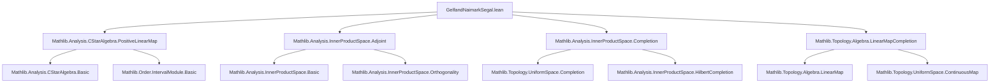

### Technical Brief: GNS Construction in Lean 4 (`GelfandNaimarkSegal.lean`)

---

#### **1. Key Definitions & Theorems**

| Name | Type / Signature | Purpose |
|------|------------------|---------|
| `PreGNS f` | `Type u` (type synonym of `A`) | Pre-Hilbert space underlying the GNS construction; equipped with a semi-inner product induced by `f`. |
| `preGNSpreInnerProdSpace f` | `PreInnerProductSpace.Core ℂ (PreGNS f)` | Defines the semi-inner product: $\langle a, b \rangle = f(\star(a) \cdot b)$, where $a,b$ are viewed in `A` via `ofPreGNS`. |
| `GNS f` | `Type u` (`UniformSpace.Completion (PreGNS f)`) | Hilbert space completion of `PreGNS f`. |
| `leftMulMapPreGNS f a` | `PreGNS f →L[ℂ] PreGNS f` | Continuous linear map on `PreGNS f` induced by left multiplication by `a ∈ A`. |
| `gnsNonUnitalStarAlgHom f` | `A →⋆ₙₐ[ℂ] (GNS f →L[ℂ] GNS f)` | Non-unital ⋆-homomorphism from `A` to bounded operators on `GNS f`. |
| `gnsStarAlgHom f` | `A →⋆ₐ[ℂ] (GNS f →L[ℂ] GNS f)` | Unital ⋆-homomorphism (when `A` is unital), extending `gnsNonUnitalStarAlgHom`. |
| `preGNS_inner_def` | `⟪a, b⟫ = f(star(ofPreGNS a) * ofPreGNS b)` | Explicit formula for inner product on `PreGNS`. |
| `preGNS_norm_sq` | `‖a‖² = f(star(ofPreGNS a) * ofPreGNS a)` | Norm squared in `PreGNS` via `f`. |
| `gnsNonUnitalStarAlgHom_apply_coe` | `gnsNonUnitalStarAlgHom a b = leftMulMapPreGNS a b` | Compatibility of `gnsNonUnitalStarAlgHom` with pre-completion action. |

---

#### **2. Naming Conventions**

- **Prefixes**:
  - `preGNS_`: Relates to the pre-Hilbert space structure (e.g., `preGNS_inner_def`, `preGNS_norm_def`).
  - `leftMulMapPreGNS`: Left multiplication map on `PreGNS`.
  - `gns(NonUnital)StarAlgHom`: GNS representation maps.
- **Suffixes**:
  - `_def`: Definition lemmas (e.g., `preGNS_inner_def`).
  - `_coe`: Behavior on embedded elements (e.g., `gnsNonUnitalStarAlgHom_apply_coe`).
- **Type synonyms**:
  - `PreGNS`, `GNS`: Named after the construction.
- **Morphisms**:
  - `toPreGNS`, `ofPreGNS`: Linear equivalences between `A` and `PreGNS`.
  - `mkContinuous`: Used to upgrade bilinear/linear maps to continuous ones.

---

#### **3. Tactic Stack**

| Tactic | Usage |
|--------|-------|
| `induction ... using Completion.induction_on` | Standard for proving properties on `GNS` (completion), reducing to dense embedding. |
| `simp` / `simp only [...]` | Simplifying definitions, especially inner products, norms, and maps. |
| `rw [← ...]` | Rewriting using equivalences (e.g., `ofPreGNS_toPreGNS`). |
| `apply isClosed_eq <;> fun_prop` | Proving equality of continuous maps on completion by closedness of diagonal. |
| `have : ... := ...; calc` | Chain of inequalities for norm estimates (e.g., in `leftMulMapPreGNS`). |
| `rwa [re_nonneg_iff_nonneg ...]` | Manipulating real parts and positivity. |
| `ext` | Extensionality for functions/morphisms. |
| `fun_prop` | Propagation of functoriality in continuous maps. |

---

#### **4. Proof Logic**

- **Inductive structure on completion**: Most proofs about `gnsNonUnitalStarAlgHom` and its properties use induction on `GNS` elements via `Completion.induction_on`, reducing to the dense subspace `PreGNS`.
- **Norm estimates**: For continuity of `leftMulMapPreGNS`, a key inequality is proven using:
  $$
  \star(x) \cdot \star(a) \cdot (a \cdot x) \leq \|a\|^2 \cdot \star(x) \cdot x
  $$
  derived from the C*-identity and left conjugation.
- **⋆-homomorphism verification**:
  - Multiplication: `map_mul'` uses `leftMulMapPreGNS_mul_eq_comp` and continuity.
  - Star: `map_star'` uses `eq_adjoint_iff` and verification on dense elements.
- **Unital case**: `gnsStarAlgHom` extends `gnsNonUnitalStarAlgHom` and verifies `map_one'` via density and continuity.

---

#### **5. Imports & Dependencies**

| Module | Role |
|--------|------|
| `Mathlib.Analysis.CStarAlgebra.PositiveLinearMap` | Core definitions of positive linear maps, C*-algebra structure. |
| `Mathlib.Analysis.InnerProductSpace.Adjoint` | Adjoint operators, used in `map_star'`. |
| `Mathlib.Analysis.InnerProductSpace.Completion` | Completion of pre-inner product spaces to Hilbert spaces. |
| `Mathlib.Topology.Algebra.LinearMapCompletion` | Extension of continuous linear maps to completions. |

---

#### **8. Mermaid Diagrams**

##### **Dependency Graph (Module-Level)**



##### **Overview of GNS Construction Flow**

```mermaid
flowchart LR
  A[Positive Linear Functional f : A →ₚ[ℂ] ℂ] --> B[PreGNS f := A]
  B --> C[preGNSpreInnerProdSpace: inner a b = f(star a * b)]
  C --> D[Pre-Hilbert Space structure on PreGNS f]
  D --> E[GNS f := Completion PreGNS f]
  E --> F[Left multiplication maps leftMulMapPreGNS a]
  F --> G[Continuous extension to GNS]
  G --> H[gnsNonUnitalStarAlgHom : A →⋆ₙₐ B(GNS f)]
  H --> I[gnsStarAlgHom (if A unital)]
  
  style A fill:#f9f,stroke:#333
  style E fill:#bbf,stroke:#333
  style H fill:#9f9,stroke:#333
```

---

#### **6. TODO & Future Work**

- **Cyclic vector construction**: Explicitly define a unit vector $\zeta \in \text{GNS}(f)$ such that:
  $$
  a \mapsto \langle \pi(a) \zeta, \zeta \rangle
  $$
  is a state on $A$, for both unital and non-unital cases.

- **Cyclic representation theorem**: Formalize that $(\pi, \mathcal{H}, \zeta)$ is cyclic (i.e., $\pi(A)\zeta$ is dense).

- **Uniqueness up to unitary equivalence**: Formalize the GNS uniqueness theorem.

---

This file formalizes the foundational step of the GNS construction in Lean 4, leveraging existing infrastructure for C*-algebras, inner product spaces, and completions. The naming and structure follow Mathlib conventions closely, with heavy use of type classes and continuity arguments.
