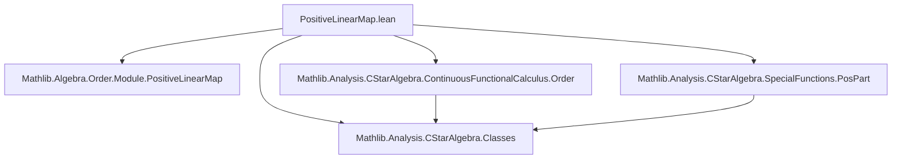
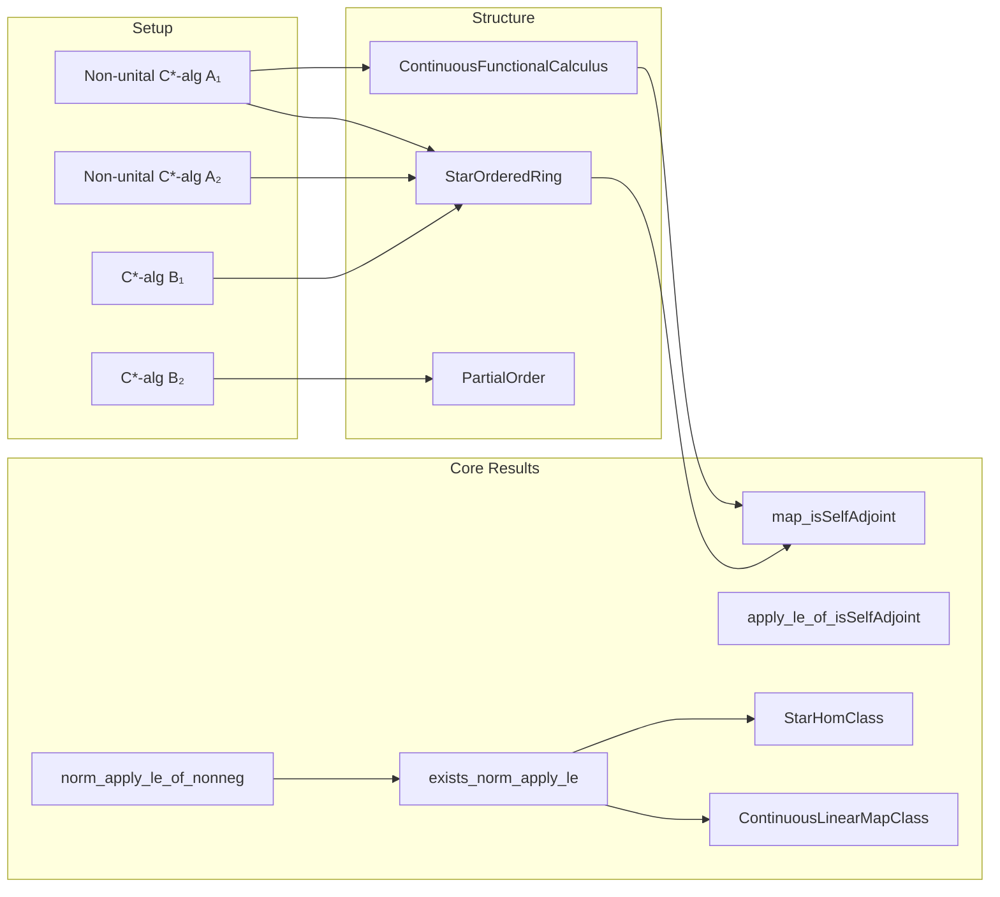

**Technical Brief: `PositiveLinearMap.lean` (Lean 4)**  
*Domain: Operator Algebras — Positive Linear Maps on Non-unital C\*-algebras*

---

### 1. **Key Definitions & Theorems**

| Name | Type / Signature | Purpose |
|------|------------------|---------|
| `PositiveLinearMap` | `A₁ →ₚ[ℂ] A₂` | Notation for *positive* ℂ-linear maps between *-ordered ℂ-algebras (e.g., C\*-algebras). |
| `map_isSelfAdjoint` | `f : A₁ →ₚ[ℂ] A₂ → IsSelfAdjoint a → IsSelfAdjoint (f a)` | Positive linear maps preserve self-adjointness via functional calculus (`CFC.posPart_sub_negPart`). |
| `apply_le_of_isSelfAdjoint` | `f : B₁ →ₚ[ℂ] B₂ → IsSelfAdjoint x → f x ≤ f (‖x‖)` | For self-adjoint `x`, `f(x)` is bounded above by `f` applied to the scalar norm. |
| `norm_apply_le_of_nonneg` | `0 ≤ x → ‖f x‖ ≤ ‖f 1‖ * ‖x‖` | Norm bound for positive elements under unital positive maps (used in boundedness proof). |
| `exists_norm_apply_le` | `∃ C : ℝ≥0, ∀ a, ‖f a‖ ≤ C * ‖a‖` | **Main theorem**: Every positive linear map between non-unital C\*-algebras is bounded (hence continuous). |
| `instance ContinuousLinearMapClass` | `LinearMapClass → OrderHomClass → ContinuousLinearMapClass` | Derives continuity of positive maps from boundedness. |
| `instance StarHomClass` | `LinearMapClass → OrderHomClass → StarHomClass` | Shows positive linear maps preserve the \*-operation (via decomposition into 4 positive elements). |

---

### 2. **Naming Conventions**

- **Prefixes**:
  - `map_`: Properties of how `f` acts on structure (e.g., `map_isSelfAdjoint`, `map_nonneg`).
  - `norm_`: Norm estimates (`norm_apply_le_of_nonneg`).
  - `apply_`: Inequalities involving `f(x)` (`apply_le_of_isSelfAdjoint`).
- **Suffixes**:
  - `_le`: Upper bound inequalities.
  - `_of_`: Conditions on inputs (`_of_nonneg`, `_of_isSelfAdjoint`).
- **Type parameters**: `A₁`, `A₂`, `B₁`, `B₂` — generic C\*-algebras; `B`-prefixed ones often assumed unital (e.g., `CStarAlgebra B₁`).

---

### 3. **Tactic Stack**

| Tactic | Usage |
|--------|-------|
| `cfc_tac` | Functional calculus reasoning (e.g., `map_isSelfAdjoint`). |
| `gcongr` | Goal-congruence for inequalities (used repeatedly in `apply_le_of_isSelfAdjoint`, `norm_apply_le_of_nonneg`). |
| `simp only`, `simp` | Simplification with local hypotheses and algebraic rewrites. |
| `rw`, `conv_lhs => rw [...]` | Rewriting using definitions (e.g., `CStarAlgebra.exists_sum_four_nonneg`). |
| `apply norm_sum_le`, `sum_le_sum` | Bounding sums via triangle inequality and termwise bounds. |
| `by_contra!` | Proof by contradiction (used in `exists_norm_apply_le`). |
| `choose`, `obtain ⟨...⟩` | Dependent choice and destructuring existential quantifiers. |
| `tendsto_pow_atTop_atTop_of_one_lt` | Asymptotic analysis (to get large `n` where norm < `2^n`). |
| ` positivity` | Automatic positivity proofs (e.g., `by positivity`). |

---

### 4. **Proof Logic**

The core proof of `exists_norm_apply_le` follows this structure:

1. **Reduction to positive elements**:  
   Use `CStarAlgebra.exists_sum_four_nonneg` to reduce to bounding `f` on positive elements (since any element is sum of 4 positive ones).

2. **Contrapositive assumption**:  
   Assume no uniform bound on positive elements of norm ≤ 1.

3. **Constructing a counterexample sequence**:  
   For each `n`, pick `xₙ ≥ 0`, `‖xₙ‖ = 1`, with `‖f(xₙ)‖ ≥ 4ⁿ`.

4. **Convergence argument**:  
   Consider `x := ∑ₙ 2⁻ⁿ • xₙ`. Show convergence via `Summable.of_norm` (geometric decay).

5. **Contradiction**:  
   - By continuity (or pointwise convergence), `‖f(x)‖ < 2ⁿ` for some `n`.  
   - But positivity gives `f(x) ≥ f(2⁻ⁿ • xₙ)`, so `‖f(x)‖ ≥ ‖f(2⁻ⁿ • xₙ)‖ ≥ 2ⁿ` — contradiction.

6. **Consequences**:  
   - Boundedness ⇒ continuity (`ContinuousLinearMapClass`).  
   - Star-preservation via decomposition into 4 self-adjoint positive parts.

---

### 5. **Imports & Dependencies**

| Module | Role |
|--------|------|
| `Mathlib.Algebra.Order.Module.PositiveLinearMap` | Base theory of positive linear maps over ordered modules. |
| `Mathlib.Analysis.CStarAlgebra.Classes` | C\*-algebra axioms, `NonUnitalCStarAlgebra`, `StarOrderedRing`. |
| `Mathlib.Analysis.CStarAlgebra.ContinuousFunctionalCalculus.Order` | Functional calculus for self-adjoint elements and order structure (`CFC.posPart_sub_negPart`). |
| `Mathlib.Analysis.CStarAlgebra.SpecialFunctions.PosPart` | `posPart`, `negPart`, and decomposition of self-adjoint elements. |

---

### 6. **Mermaid Diagrams**

#### **Dependency Graph (Module-Level)**

#### **Overview of Theoretical Flow**

---

### 7. **Summary**

This file establishes foundational properties of *positive* linear maps between non-unital C\*-algebras, culminating in the classical result that such maps are automatically bounded (hence continuous). The proof leverages:
- Functional calculus to handle self-adjoint elements,
- Order-theoretic decomposition (via `posPart`/`negPart`),
- A clever summability argument to derive boundedness by contradiction.

It also shows that positive linear maps are automatically \*-homomorphisms (not just linear), a key fact used in later developments (e.g., Stinespring, Choi-Effros, or noncommutative topology).
