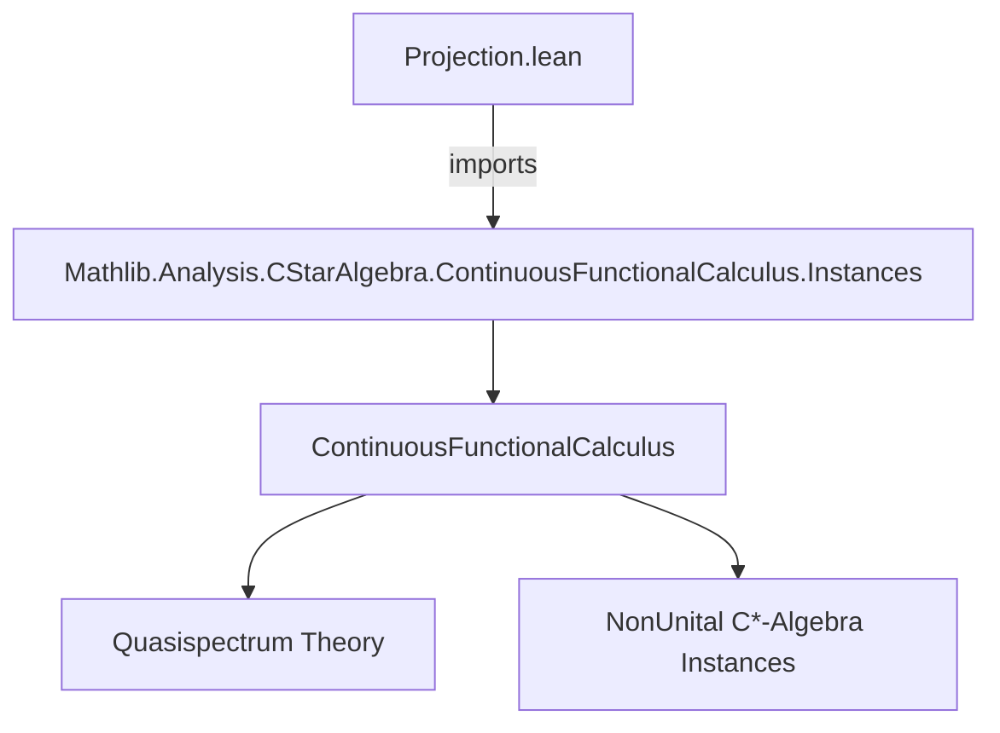

**Technical Brief: `Projection.lean`**

---

### 1. **Key Definitions & Theorems**

| Name | Type / Signature | Purpose |
|------|------------------|---------|
| `IsIdempotentElem` | `p : A → Prop` | Predicate for idempotent elements: $ p^2 = p $. |
| `IsSelfAdjoint` | `p : A → Prop` | Predicate for self-adjoint elements: $ p^* = p $. |
| `IsStarNormal` | `p : A → Prop` | Predicate for normal elements in a *-ring: $ p^* p = p p^* $. |
| `IsStarProjection` | `p : A → Prop` | Predicate for *-projections: $ p $ is idempotent and self-adjoint. |
| `isStarProjection_iff_isIdempotentElem_and_isStarNormal` | `IsStarProjection p ↔ IsIdempotentElem p ∧ IsStarNormal p` | Main theorem: In a non-unital C*-algebra, *-projections are exactly the idempotent *normal* elements (self-adjointness follows from idempotency + normality). |
| `IsIdempotentElem.isSelfAdjoint_iff_isStarNormal` | `IsIdempotentElem p → (IsSelfAdjoint p ↔ IsStarNormal p)` | Key lemma: For idempotents, self-adjointness ⇔ normality. |

---

### 2. **Naming Conventions**

- **Predicates**: `isSelfAdjoint`, `isStarNormal`, `isStarProjection`, `IsIdempotentElem` — use PascalCase and descriptive suffixes (`_selfAdjoint`, `_normal`, `_projection`, `_idempotentElem`).
- **Theorems**: `is_…_iff_…` pattern for biconditionals; `…_iff_…` for equivalences derived from prior equivalences (`eq ▸`).
- **Variables**: `{A : Type*}` with typeclass constraints — standard Lean style for structured objects.

---

### 3. **Tactic Stack**

- `simp only [...]` — used with precise simplifier lemmas.
- `intro`, `rcases`, `simp`, `exact` — minimal, high-precision tactic usage.
- `and_congr_right_iff.eq` — used to rewrite biconditionals via congruence.
- `eq ▸` — transport along equality (used twice in the main theorem proof).
- `Set.mem_singleton_iff.mp` — extracts witness from singleton membership.

No heavy automation (e.g., `aesop`, `ring`, `linarith`) — proof is mostly algebraic and logical.

---

### 4. **Proof Logic**

- **Lemma**: For idempotent $ p $, self-adjointness ⇔ normality.
  - Uses `isSelfAdjoint_iff_isStarNormal_and_quasispectrumRestricts` (from `ContinuousFunctionalCalculus`).
  - Reduces to showing quasispectrum of idempotent lies in $\{0,1\}$ (via `hp.quasispectrum_subset`).
  - Cases on whether $ x = 0 $ or $ x = 1 $, then simplifies.

- **Main Theorem**: $ p $ is a *-projection ⇔ $ p $ is idempotent and normal.
  - Starts from `isStarProjection_iff p`, which likely defines *-projection as idempotent + self-adjoint.
  - Applies `and_congr_right_iff` to replace `IsSelfAdjoint p` with `IsStarNormal p` using the lemma.
  - Concludes via `eq ▸` to rewrite using the equivalence.

**Flow**:  
`idempotent + self-adjoint` ⇔ `idempotent + normal`  
via *equivalence of self-adjointness and normality for idempotents*.

---

### 5. **Imports**

- `Mathlib.Analysis.CStarAlgebra.ContinuousFunctionalCalculus.Instances`  
  → Provides:
  - `NonUnitalContinuousFunctionalCalculus`
  - `IsStarNormal`
  - `isSelfAdjoint_iff_isStarNormal_and_quasispectrumRestricts`
  - Quasispectrum machinery (`QuasispectrumRestricts`, `quasispectrum_subset`)

This file sits in the *continuous functional calculus* branch of `Mathlib`, specifically for *non-unital* C*-algebras.

---

### 6. **Mermaid Diagrams**

#### Dependency Graph (Module-Level)



#### Theoretical Overview (Conceptual Flow)

```mermaid
flowchart LR
  A[Non-unital C*-algebra A] --> B[Continuous functional calculus]
  B --> C[Quasispectrum of elements]
  C --> D[Idempotent elements: σ(p) ⊆ {0,1}]
  D --> E[For idempotents: self-adjoint ⇔ normal]
  E --> F[IsStarProjection ⇔ idempotent ∧ normal]
```

---

### 7. **Summary**

This module establishes a foundational equivalence in non-unital C*-algebras:  
> **A *-projection is exactly an idempotent that is normal** —  
> self-adjointness becomes redundant for idempotents once normality is assumed.

The proof leverages quasispectral properties and the functional calculus framework, avoiding unitization by working directly in the non-unital setting.

--- 

Let me know if you'd like the corresponding diagram for the `ContinuousFunctionalCalculus.Instances` hierarchy or a formalization roadmap for projections in C*-algebras.
