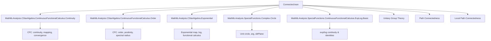

Here is the **technical metadata extraction** for the Lean 4 file `Connected.lean`, structured as requested:

---

### **1. KEY DEFINITIONS & THEOREMS**

| Name | Type / Signature | Purpose |
|------|------------------|---------|
| `Unitary.argSelfAdjoint` | `unitary A → selfAdjoint A` | Extracts the selfadjoint "argument" of a unitary via continuous functional calculus (principal branch of `arg`), defined when spectrum avoids `-1`. Returns `0` otherwise. |
| `selfAdjoint.expUnitary` | `selfAdjoint A → unitary A` | Exponential map: `x ↦ exp(I • x)` (i.e., `expUnitary x = cfc (exp ∘ I • ·) x`). |
| `selfAdjoint.expUnitaryPathToOne` | `Path 1 (expUnitary x)` | Path from identity to `expUnitary x` via `t ↦ expUnitary (t • x)`. |
| `Unitary.path` | `u v : unitary A → ‖v - u‖ < 2 → Path u v` | Path between unitaries within distance < 2, constructed via conjugation and `expUnitaryPathToOne`. |
| `Unitary.openPartialHomeomorph` | `OpenPartialHomeomorph (unitary A) (selfAdjoint A)` | Partial homeomorphism between `ball 1 2 ⊆ unitary A` and `ball 0 π ⊆ selfAdjoint A`, with maps `argSelfAdjoint` and `expUnitary`. |
| `Unitary.isPathConnected_ball` | `δ < 2 → IsPathConnected (ball u δ)` | Any ball of radius < 2 in `unitary A` is path connected. |
| `Unitary.instLocPathConnectedSpace` | `LocPathConnectedSpace (unitary A)` | The unitary group is locally path connected. |
| `Unitary.mem_pathComponentOne_iff` | `u ∈ pathComponent 1 ↔ ∃ l : List (selfAdjoint A), (l.map expUnitary).prod = u` | Characterizes the path component of identity as finite products of exponential unitaries. |
| `selfAdjoint.norm_sq_expUnitary_sub_one` | `‖expUnitary x - 1‖² = 2(1 - cos ‖x‖)` | Norm identity linking exponential unitary deviation from identity and cosine of norm. |
| `Unitary.norm_argSelfAdjoint` | `‖argSelfAdjoint u‖ = arccos(1 - ‖u - 1‖² / 2)` | Norm of argument equals arccos of quadratic expression in `‖u - 1‖`. |
| `Unitary.two_mul_one_sub_le_norm_sub_one_sq` | `2(1 - z.re) ≤ ‖u - 1‖²` for `z ∈ spectrum u` | Spectral lower bound for `‖u - 1‖²`. |
| `Unitary.norm_sub_one_lt_two_iff` | `‖u - 1‖ < 2 ↔ -1 ∉ spectrum u` | Spectral condition equivalent to being within distance < 2 of identity. |
| `Unitary.spectrum_subset_slitPlane_iff_norm_lt_two` | `spectrum u ⊆ slitPlane ↔ ‖u - 1‖ < 2` | Spectrum avoids branch cut iff close to identity. |

---

### **2. NAMING CONVENTIONS**

- **Prefixes**:
  - `argSelfAdjoint`, `expUnitary`, `norm_`, `joined`, `path`, `isPathConnected`, `mem_pathComponentOne_iff`, `openPartialHomeomorph`, `instLocPathConnectedSpace`.
- **Suffixes**:
  - `_selfAdjoint`, `_unitary`, `_le_pi`, `_iff`, `_sub_one`, `_sub`, `_sq`, `_path`, `_iff`.
- **Pattern**:
  - `Unitary.*` for unitary-group-level constructions.
  - `selfAdjoint.*` for selfadjoint-element-level constructions.
  - `norm_*` for norm identities.
  - `*_iff` for equivalence lemmas.
  - `*_sub_one` for expressions involving `u - 1`.

---

### **3. TACTIC STACK**

Frequently used tactics in proofs:
- `simp` / `simp only` / `simp_rw`
- `rw` (especially with `cfc_*`, `expUnitary_coe`, `argSelfAdjoint_coe`)
- `norm_num`
- `gcongr`, `linarith`, ` positivity`
- `convert`, `ext`, `congr`
- `fun_prop` (for continuity proofs)
- `aesop` (in safety lemmas)
- `nontriviality A`
- `obtain ⟨...⟩`, `cases ... with | inl | inr`
- `exact`, `refine`, `apply`

---

### **4. PROOF LOGIC**

- **Spectral analysis first**: Many proofs start by analyzing the spectrum of unitaries (e.g., using `spectrum.subset_circle`, `norm_sub_one_lt_two_iff`, `spectrum_subset_slitPlane_iff_norm_lt_two`).
- **Continuous functional calculus (CFC)** is central: used to define `arg`, `log`, `exp(I • x)` via `cfc`.
- **Norm identities** are derived via:
  - `norm_sub_one_sq_eq` (relating `‖u - 1‖²` to spectrum of real part),
  - `norm_sq_expUnitary_sub_one` (via spectral mapping and cosine monotonicity),
  - `two_mul_one_sub_cos_norm_argSelfAdjoint`.
- **Path constructions**:
  - Reduce to case near identity via translation (`u * ·` or `· * v`).
  - Use `t ↦ expUnitary(t • x)` for local paths.
- **Homeomorphism arguments**:
  - Show mutual inverses (`expUnitary_argSelfAdjoint`, `argSelfAdjoint_expUnitary`) on appropriate domains.
  - Use continuity + open/closed image to get homeomorphism.
- **Induction** used in `mem_pathComponentOne_iff` (on list length).

---

### **5. IMPORTS**

Primary dependencies (define scope):
```lean
Mathlib.Analysis.CStarAlgebra.ContinuousFunctionalCalculus.Continuity
Mathlib.Analysis.CStarAlgebra.ContinuousFunctionalCalculus.Order
Mathlib.Analysis.CStarAlgebra.Exponential
Mathlib.Analysis.SpecialFunctions.Complex.Circle
Mathlib.Analysis.SpecialFunctions.ContinuousFunctionalCalculus.ExpLog.Basic
```
→ These provide:
- CFC machinery (`cfc`, `continuousOn_cfc`, `cfc_map_spectrum`, etc.),
- Spectrum properties (`spectrum.isCompact`, `spectrum.norm_eq_one_of_unitary`),
- Exponential/logarithm theory in C*-algebras,
- Geometry of the complex unit circle (`Circle`, `arg`, `slitPlane`).

---

### **6. MERMAID DIAGRAMS**

#### **Dependency Graph (High-Level Theory)**



#### **Overview of File Structure**

```mermaid
flowchart LR
  S[Spectral Preliminaries] --> T[Spectrum ⊆ slitPlane ⇔ dist(u,1) < 2]
  T --> U[Define argSelfAdjoint via CFC]
  U --> V[Norm identities: ‖u−1‖² = 2(1−cos‖x‖)]
  V --> W[Partial homeomorphism: ball(1,2) ↔ ball(0,π)]
  W --> X[Local paths: t ↦ exp(t•x)]
  X --> Y[Global paths: u ↔ v if ‖u−v‖ < 2]
  Y --> Z[Locally path connected]
  Z --> AA[Path component of 1 = finite products of expUnitary]
```

---

Let me know if you'd like a **dependency graph of definitions** (e.g., `argSelfAdjoint` → `cfc_arg` → `continuousOn_arg`) or a **proof dependency tree** for `isPathConnected_ball`.
