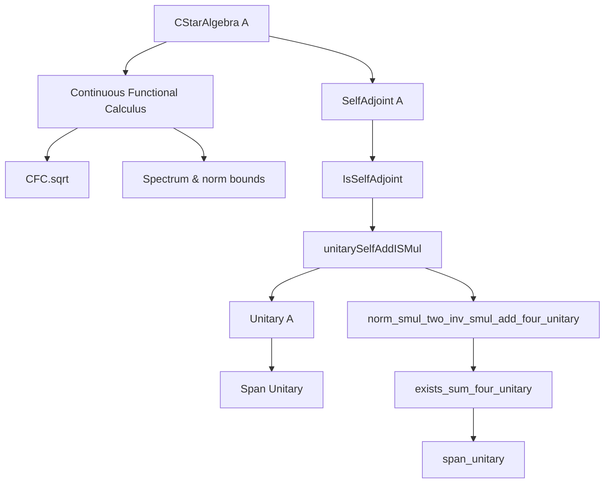

**Technical Brief: `Span.lean` — Unitary Spanning in Unital C\*-Algebras**

---

### 1. KEY DEFINITIONS & THEOREMS

| Name | Type / Signature | Purpose |
|------|------------------|---------|
| `IsSelfAdjoint.self_add_I_smul_cfcSqrt_sub_sq_mem_unitary` | `∀ {a : A}, IsSelfAdjoint a → ‖a‖ ≤ 1 → a + I • CFC.sqrt (1 - a ^ 2) ∈ unitary A` | Constructs a unitary from a selfadjoint contraction via continuous functional calculus. Core technical lemma. |
| `selfAdjoint.unitarySelfAddISMul` | `∀ (a : selfAdjoint A) (ha_norm : ‖a‖ ≤ 1), unitary A` | Noncomputable definition packaging the above construction as a unitary element. |
| `selfAdjoint.star_coe_unitarySelfAddISMul` | `star (unitarySelfAddISMul a ha_norm) = a - I • CFC.sqrt (1 - a ^ 2)` | Describes the star-conjugate (inverse) of the constructed unitary. |
| `selfAdjoint.realPart_unitarySelfAddISMul` | `ℜ (unitarySelfAddISMul a ha_norm) = a` | Shows the real part recovers the original selfadjoint element. |
| `CStarAlgebra.norm_smul_two_inv_smul_add_four_unitary` | `x ≠ 0 → x = ‖x‖ • 2⁻¹ • (u₁ + star u₁ + I • (u₂ + star u₂))` | Decomposes any nonzero `x` into a combination of *two* unitaries and their stars, scaled by `‖x‖/2`. |
| `CStarAlgebra.exists_sum_four_unitary` | `∃ (u : Fin 4 → unitary A), ∃ (c : Fin 4 → ℂ), x = ∑ i, c i • u i ∧ ∀ i, ‖c i‖ ≤ ‖x‖ / 2` | Main structural theorem: every element is a linear combination of **four** unitaries with coefficients bounded by `‖x‖/2`. |
| `CStarAlgebra.span_unitary` | `span ℂ (unitary A) = ⊤` | Consequence: the unitary elements span the entire algebra as a complex vector space. |

---

### 2. NAMING CONVENTIONS

- **Prefixes**:
  - `selfAdjoint.`: Definitions/lemmas about selfadjoint elements, often using the `selfAdjoint A` type.
  - `unitarySelfAddISMul`: Composite name reflecting construction: *selfadjoint* + *I • sqrt(1 − a²)*.
  - `norm_smul_two_inv_smul_add_four_unitary`: Descriptive name encoding the exact coefficients (`2⁻¹`) and number of unitaries involved.
- **Suffixes**:
  - `_mem_unitary`: membership in `unitary A`.
  - `_unitary`: returning or characterizing a unitary element.
  - `_realPart`, `_star`: specify which component (real part, star) is being computed.

---

### 3. TACTIC STACK

Frequent tactics used in proofs:
- `simp` / `simp only`: simplification using definitional equalities and lemmas (e.g., `realPart_unitarySelfAddISMul`).
- `rw`: rewriting using equalities (especially `cfc_` lemmas, `star`, `norm_smul`).
- `extract_lets`: extracts `let`-bound variables from a hypothesis.
- `conv_lhs`: for localized left-hand-side rewriting.
- `module`: solves module-linear algebra goals (e.g., verifying linear combinations).
- `fin_cases`: case analysis on `Fin n` indices.
- `cfc_tac`: custom tactic for continuous functional calculus simplifications (used in `nonneg` proof).
- `all_goals`: applies same tactic to all goals.

---

### 4. PROOF LOGIC

**High-level proof strategy**:

1. **Reduction to nonzero case**: Trivial for `x = 0` (use `![1, -1, 1, -1]`).
2. **Normalization**: Scale `x` to norm ≤ 1 via `‖x‖⁻¹ • x`.
3. **Decompose into real & imaginary parts**:
   - Let `a = ℜ(‖x‖⁻¹ • x)`, `b = ℑ(‖x‖⁻¹ • x)` — both selfadjoint and contractive.
   - Apply `unitarySelfAddISMul` to get unitaries `u₁`, `u₂`.
4. **Reconstruct `x`**:
   - Use identities: `a = ℜ u₁ = (u₁ + star u₁)/2`, `b = ℑ u₂ = (u₂ - star u₂)/(2I)`.
   - Combine to express `‖x‖⁻¹ • x = 2⁻¹ (u₁ + star u₁ + I (u₂ + star u₂))`.
   - Multiply both sides by `‖x‖` to get the decomposition.
5. **Spanning result**:
   - From the 4-term decomposition, each term is a scalar multiple of a unitary.
   - Conclude via `sum_mem` and `subset_span`.

Induction is *not* used; the argument is direct and constructive (modulo `noncomputable def`).

---

### 5. IMPORTS

| Import | Role |
|--------|------|
| `Mathlib.Analysis.CStarAlgebra.ContinuousFunctionalCalculus.Order` | Provides spectral theory, functional calculus for ordered *-algebras, `CFC.sqrt`, spectrum lemmas. |
| `Mathlib.Analysis.CStarAlgebra.ContinuousFunctionalCalculus.Unitary` | Unitary characterization via functional calculus (e.g., `cfc_unitary_iff`). |
| `Mathlib.Analysis.Normed.Module.Normalize` | Tools for normalization (`norm_smul_normalize`), used in reconstruction step. |

---

### 6. MERMAID DIAGRAMS

#### Dependency Graph (Key Components)



#### Overview of File Structure

```mermaid
flowchart LR
  subgraph Setup
    A[Variable {A : Type*} [CStarAlgebra A]]
    B[Ordered context: [PartialOrder A] [StarOrderedRing A]]
  end

  subgraph Core Construction
    C[IsSelfAdjoint → unitary via a + I√(1−a²)]
    D[unitarySelfAddISMul def]
    E[Real part / star lemmas]
  end

  subgraph Decomposition
    F[norm_smul_two_inv_smul_add_four_unitary]
    G[exists_sum_four_unitary]
  end

  subgraph Consequence
    H[span_unitary]
  end

  A --> B
  B --> C
  C --> D
  D --> E
  E --> F
  F --> G
  G --> H
```

---

### 7. THEORY CONTEXT

This file sits in the **structure theory of C\*-algebras**, specifically proving a classical result: *the linear span of unitaries is dense (in fact, equal) in any unital C\*-algebra*. It builds on:

- Spectral theory (via `CFC` and spectrum lemmas),
- Functional calculus for selfadjoint elements,
- Interaction between the star operation, real/imaginary parts, and unitaries.

The result is foundational for:
- Proving the **Gelfand–Naimark theorem**,
- Defining traces and states (since unitaries generate the algebra),
- Studying K-theory (where unitaries play a central role).

---

Let me know if you'd like a formalized version of this brief in Lean or a dependency graph for the entire `Mathlib.Analysis.CStarAlgebra` hierarchy.
