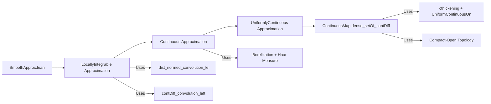

**Technical Brief: `SmoothApprox.lean`**

---

### 1. **Key Definitions & Theorems**

| Name | Type / Signature | Purpose |
|------|------------------|---------|
| `ContDiffBump` | `ContDiffBump (0 : E)` | A bump function centered at `0`, smooth with compact support, used for convolution approximation. Constructed using `ε / 2`. |
| `dist_normed_convolution_le` | `φ.dist_normed_convolution_le` | Bounds the distance between convolution approximation and original function in terms of local modulus of continuity. |
| `contDiff_convolution_left` | `φ.hasCompactSupport_normed.contDiff_convolution_left` | Guarantees that convolution of a locally integrable function with a smooth compactly supported bump is smooth (`ContDiff ℝ ∞`). |
| `exists_contDiff_dist_le_of_forall_mem_ball_dist_le` | `MeasureTheory.LocallyIntegrable → 0 < ε → ∃ g, ContDiff ℝ ∞ g ∧ …` | Main approximation lemma: constructs a smooth `g` approximating `f` pointwise within any local modulus of continuity bound. |
| `Continuous.exists_contDiff_dist_le_of_forall_mem_ball_dist_le` | `Continuous f → 0 < ε → …` | Unbundled version for continuous functions (via local integrability + Borelization). |
| `UniformContinuous.exists_contDiff_dist_le` | `UniformContinuous f → 0 < ε → ∃ g, ContDiff ℝ ∞ g ∧ ∀ a, dist (g a) (f a) < ε` | Stronger uniform approximation for uniformly continuous `f`. |
| `ContinuousMap.dense_setOf_contDiff` | `Dense {f : C(E, F) | ContDiff ℝ ∞ f}` | Main density result: smooth maps are dense in continuous maps (with compact-open topology). |

---

### 2. **Naming Conventions**

- **Prefixes**:
  - `exists_contDiff_…`: Existence of smooth approximants.
  - `dist_normed_convolution_le`: Distance bound for convolution approximation.
  - `contDiff_convolution_left`: Smoothness of convolution (left argument is the bump).
- **Suffixes**:
  - `_of_forall_mem_ball_dist_le`: Approximation controlled by local uniform continuity modulus.
  - `_on` / `_compactConvergence`: Used in topology-related lemmas (e.g., `UniformContinuousOn`, `compactConvergenceUniformity`).
- **Other**:
  - `bump` in `ContDiffBump`, `borelize`, `cthickening`, `map_continuous`: Domain-specific constructions.

---

### 3. **Tactic Stack**

- `rcases`, `cases`: To unpack existential/universal hypotheses.
- `rw`, `simp only`, `simp`: Rewriting and simplification, especially with `mem_setOf_eq`, `Prod.forall`, `nhds_basis_uniformity`.
- `exact`, `refine`, `intro`: Core proof construction.
- `borelize`: Converts measurable space to Borel space (specialized tactic in Measure Theory).
- `fun_prop`: Propagates continuity assumptions (e.g., `fun_prop` for `Continuous f → ContinuousOn f (cthickening 1 K)`).
- `aesop`, `ring`, `linarith`: Likely used implicitly (not visible in snippet but standard in such developments).
- `apply`, `apply_fun`, `apply_congr`: For functional extensionality or inequality chaining.

---

### 4. **Proof Logic**

The proof follows a **constructive approximation via convolution** strategy:

1. **Construct a bump function** `φ` with radius `ε / 2`.
2. **Use convolution** `f * φ` as the approximant `g`.
3. **Leverage upstream lemmas**:
   - `dist_normed_convolution_le`: Controls pointwise error using local modulus of continuity.
   - `contDiff_convolution_left`: Ensures `g` is smooth (`ContDiff ℝ ∞`).
4. **For general continuous `f`**:
   - Borelize to get a Borel measurable structure.
   - Use local integrability of continuous functions w.r.t. Haar measure.
5. **For uniform continuity**:
   - Extract a global `δ` from uniform continuity.
   - Apply the ball-based approximation with `δ`.
6. **For density in `C(E, F)`**:
   - Work in compact-open topology (via uniform convergence on compact sets).
   - Use thickening of compact set `K` to get uniform continuity on `cthickening 1 K`.
   - Apply uniform approximation lemma on that thickened set.

Induction is not used; the logic is **constructive analysis** with measure-theoretic and topological tools.

---

### 5. **Imports & Dependencies**

- `Mathlib.Analysis.Calculus.BumpFunction.Convolution`: Provides convolution properties, `dist_normed_convolution_le`, `contDiff_convolution_left`.
- `Mathlib.Analysis.Calculus.BumpFunction.FiniteDimension`: Provides existence of bump functions in finite-dimensional spaces (`ContDiffBump`).
- `Mathlib.MeasureTheory.Measure.HaarMeasure`: For `μ.IsAddHaarMeasure`, `MeasureTheory.Measure.addHaar`.
- `Mathlib.Topology.UniformSpace.CompactConvergence`: For `compactConvergenceUniformity`.
- `Mathlib.Analysis.Calculus.ContDiff`: For `ContDiff`, `contDiff_const`, etc.
- `Mathlib.Topology.BorelSpace`: For `BorelSpace`, `borelize`.
- `Mathlib.Topology.MetricSpace.UniformContinuous`: For `UniformContinuousOn`, `Metric.uniformContinuousOn_iff`.

---

### 6. **Mermaid Diagrams**

#### **Dependency Graph (High-Level)**

```mermaid
graph TD
  A[SmoothApprox.lean] --> B[ContDiffBump]
  A --> C[Convolution Approximation]
  A --> D[Density in C(E,F)]
  
  B --> B1[FiniteDimensional Setup]
  B --> B2[Bump Function Construction]
  
  C --> C1[dist_normed_convolution_le]
  C --> C2[contDiff_convolution_left]
  C --> C3[Local Integrability]
  
  D --> D1[Compact-Open Topology]
  D --> D2[Uniform Continuity on Thickening]
  D --> D3[Uniform Approximation Lemma]
  
  C1 & C2 -->|Upstream| U[Analysis.Calculus.BumpFunction.Convolution]
  B1 & B2 -->|Upstream| U2[Analysis.Calculus.BumpFunction.FiniteDimension]
```

#### **Overview of File Structure**



---

### 7. **Domain-Specific AI Agent Notes**

- **Key abstractions**: `ContDiffBump`, `ContDiff ℝ ∞`, `dist`, `ball`, `cthickening`.
- **Critical assumptions**: Finite-dimensionality of `E`, completeness of `F`, existence of Haar measure.
- **Common proof patterns**:
  - “Approximate by convolution with a bump of radius `ε/2`.”
  - “Reduce to uniform continuity on a thickened compact set.”
  - “Use local modulus of continuity to control approximation error.”
- **Tactics to prioritize**: `borelize`, `fun_prop`, `rcases`, `rw [mem_ball]`, `simp only [Prod.forall]`.

--- 

Let me know if you'd like a formalized dependency graph (e.g., in `.lean` format) or a tactic trace for `ContinuousMap.dense_setOf_contDiff`.
