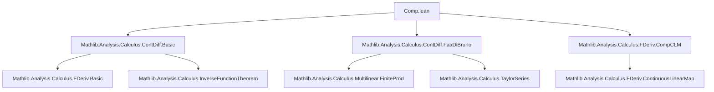
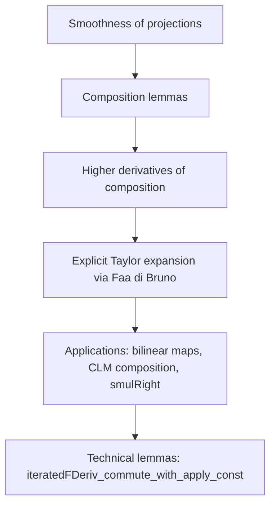

Here is the structured technical metadata extracted from the provided Lean 4 file `Comp.lean`:

---

### **1. Key Definitions & Theorems**

| Name | Type / Signature | Purpose |
|------|------------------|---------|
| `ContDiffWithinAt.comp` | `ContDiffWithinAt 𝕜 n g t (f x) → ContDiffWithinAt 𝕜 n f s x → MapsTo f s t → ContDiffWithinAt 𝕜 n (g ∘ f) s x` | Composition of `Cⁿ` functions *within domains*, at a point. |
| `ContDiffOn.comp` | `ContDiffOn 𝕜 n g t → ContDiffOn 𝕜 n f s → MapsTo f s t → ContDiffOn 𝕜 n (g ∘ f) s` | Composition of `Cⁿ` functions *on domains*. |
| `ContDiff.comp` | `ContDiff 𝕜 n g → ContDiff 𝕜 n f → ContDiff 𝕜 n (g ∘ f)` | Composition of globally `Cⁿ` functions. |
| `ContDiff.comp₂` | `ContDiff 𝕜 n g → ContDiff 𝕜 n f₁ → ContDiff 𝕜 n f₂ → ContDiff 𝕜 n (λ x, g (f₁ x, f₂ x))` | Composition with a binary argument (pairing). |
| `ContDiff.comp₃` | `ContDiff 𝕜 n g → ContDiff 𝕜 n f₁ → ContDiff 𝕜 n f₂ → ContDiff 𝕜 n f₃ → ContDiff 𝕜 n (λ x, g (f₁ x, f₂ x, f₃ x))` | Ternary composition. |
| `iteratedFDerivWithin_comp` | Under `UniqueDiffOn` assumptions, gives explicit formula for `iteratedFDerivWithin i (g ∘ f) s x` via `taylorComp`. | Explicit formula for higher derivatives of composition (via Taylor series). |
| `iteratedFDeriv_comp` | Special case of above for `iteratedFDeriv` (global version). | Same as above, but without domain restrictions. |
| `contDiff_fst`, `contDiff_snd` | `ContDiff 𝕜 n Prod.fst`, `ContDiff 𝕜 n Prod.snd` | Projections are smooth. |
| `ContDiff.clm_comp` | `ContDiff 𝕜 n g → ContDiff 𝕜 n f → ContDiff 𝕜 n (λ x, g x ∘ f x)` | Composition of continuous linear maps (as functions) is smooth. |
| `ContDiff.clm_apply` | `ContDiff 𝕜 n f → ContDiff 𝕜 n g → ContDiff 𝕜 n (λ x, f x (g x))` | Application of a `CLM`-valued function to a vector-valued function is smooth. |
| `ContDiff.smulRight` | `ContDiff 𝕜 n f → ContDiff 𝕜 n g → ContDiff 𝕜 n (λ x, f x .smulRight g x)` | Right scalar multiplication in dual spaces is smooth. |
| `iteratedFDerivWithin_clm_apply_const_apply` | Commutation of `iteratedFDerivWithin` with application to a constant vector. | Technical lemma for differentiating `y ↦ (c y) u`. |

---

### **2. Naming Conventions**

- **Prefixes**:
  - `contDiff_`: basic smoothness facts (e.g., projections).
  - `ContDiff._`: properties of bundled `ContDiff` functions (e.g., `.fst`, `.snd`, `.comp`, `.comp₂`, `.clm_apply`).
  - `ContDiffWithinAt._`, `ContDiffAt._`, `ContDiffOn._`: domain-specific variants.
  - `iteratedFDerivWithin_`, `iteratedFDeriv_`: higher derivative formulas.
  - `clm_`, `smulRight`: bilinear/linear operations.

- **Suffixes**:
  - `_comp`: composition lemmas.
  - `_of_eq`, `_of_mem_nhdsWithin_image`, `_of_preimage_mem_nhdsWithin`: variants with weakened hypotheses.
  - `_inter`: composition over intersections.
  - `_contDiffOn`, `_contDiffWithinAt`, `_contDiffAt`: mixed smoothness classes.

- **Notation**:
  - `E [×n]→L[𝕜] F`: space of continuous multilinear maps.
  - `∞`, `ω`: notation for `⊤ : WithTop ℕ∞`.

---

### **3. Tactic Stack**

Frequently used tactics in proofs:

| Tactic | Role |
|--------|------|
| `match n with` | Induction on `n : WithTop ℕ∞`, especially handling `ω` separately. |
| `rcases / obtain` | Extracting Taylor series data from `ContDiffWithinAt`/`ContDiffAt`. |
| `refine ⟨…, ?_, …⟩` | Constructing existence proofs with holes to fill later. |
| `simp only`, `simp_rw` | Simplifying using definitional equalities and rewrite rules. |
| `apply`, `exact`, `intro`, `rw` | Standard proof scripting. |
| `filter_upwards` | Filtering filters in neighborhood arguments. |
| `grw` (goal-directed rewrite) | Used in `hasFDerivWithinAt_nhds` to manipulate inequalities like `m + 1 ≤ n`. |
| `inter_mem`, `self_mem_nhdsWithin`, `mem_nhdsWithin_insert` | Neighborhood calculus in `nhdsWithin`. |
| `analyticOn_taylorComp`, `taylorComp` | Taylor series composition (used in `ω`-case). |
| `hasFDerivWithinAt.comp`, `hasFDerivAt_prodMk_right` | Derivative chain rules. |

---

### **4. Proof Logic**

- **Inductive structure**: Proofs for finite `n` proceed by induction on `n`, while the `ω` case uses *analytic* Taylor series expansions.
- **Taylor series approach**: Instead of inducting on derivative formulas, the proof leverages the **Faa di Bruno formula** (via `taylorComp`) to express the Taylor series of `g ∘ f` in terms of those of `g` and `f`.
- **Neighborhood & uniqueness arguments**: Many lemmas require `UniqueDiffOn` to ensure uniqueness of derivatives within sets.
- **Domain handling**: Proofs distinguish between:
  - `ContDiffWithinAt` (point-in-domain),
  - `ContDiffOn` (global-on-domain),
  - `ContDiff` (global),
  and provide variants for each.
- **Bundled vs unbundled**: The API distinguishes between unbundled functions (`f : E → F`) and bundled linear maps (`F →L[𝕜] G`), with separate lemmas for each.

---

### **5. Imports**

| Module | Purpose |
|--------|---------|
| `Mathlib.Analysis.Calculus.ContDiff.Basic` | Core definitions: `ContDiff`, `ContDiffAt`, `ContDiffWithinAt`, `iteratedFDeriv`, etc. |
| `Mathlib.Analysis.Calculus.ContDiff.FaaDiBruno` | Formal statement and properties of the Faa di Bruno formula (used for `taylorComp`). |
| `Mathlib.Analysis.Calculus.FDeriv.CompCLM` | Chain rule for `fderiv` with continuous linear maps. |

---

### **6. Theory Overview & Dependency Diagram**

#### **Mermaid Diagram: Module Dependencies**

#### **Mermaid Diagram: Theory Flow**

#### **Core Theory Summary**

- **Goal**: Prove closure of `Cⁿ` functions under composition, with explicit control over higher derivatives.
- **Method**: Use Faa di Bruno’s formula to construct Taylor expansions of compositions, avoiding inductive derivative chasing.
- **Scope**: Works uniformly for:
  - Global (`ContDiff`),
  - Domain-restricted (`ContDiffOn`, `ContDiffWithinAt`),
  - Pointwise (`ContDiffAt`),
  - With parameters (`uncurry f`, `g(x)` inside `f(x, ·)`).
- **Key insight**: Smoothness of bilinear operations (`comp`, `apply`, `smulRight`) reduces general composition to basic operations.

---

Let me know if you'd like a formalized dependency graph in `leanpkg` format or a summary of the Faa di Bruno API used here.
