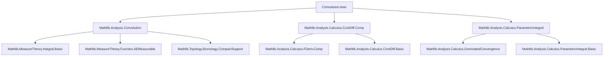
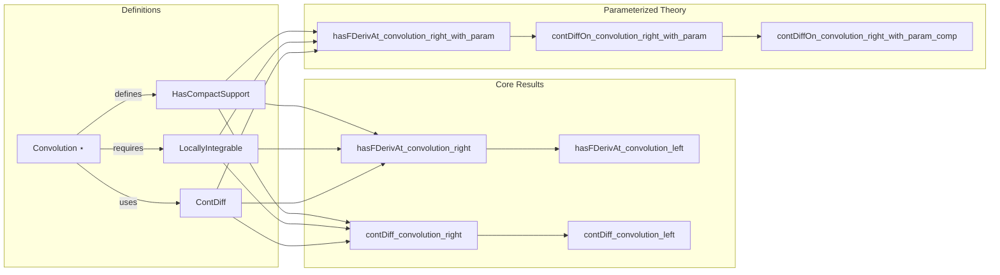

Here is the structured technical brief for the `Convolution.lean` file:

---

### **1. KEY DEFINITIONS & THEOREMS**

| Name | Type / Signature | Purpose |
|------|------------------|---------|
| `convolution` | `f ⋆[L, μ] g` | Generalized convolution of functions `f : G → E`, `g : G → E'` w.r.t. a bilinear map `L : E →L[𝕜] E' →L[𝕜] F` and measure `μ` |
| `HasCompactSupport` | `g : G → E'` has compact support | Ensures integrals defining convolution are well-behaved and support is bounded |
| `LocallyIntegrable` | `f : G → E` is locally integrable | Ensures integrability over compact sets (needed for convolution existence) |
| `ContDiff` / `ContDiffOn` | `g` is `𝒞ⁿ` (or on a subset) | Smoothness condition on one factor to gain regularity in convolution |
| `fderiv 𝕜 g` | Total derivative of `g` | Appears in derivative formulas for convolution |
| `hasFDerivAt_convolution_right` | `HasFDerivAt (f ⋆ g) (f ⋆ (L.precompR g')) x₀` | Computes Fréchet derivative of convolution when `g` is `C¹` with compact support |
| `hasFDerivAt_convolution_left` | `HasFDerivAt (f ⋆ g) ((f') ⋆ g) x₀` | Same as above, but derivative falls on `f` (requires symmetry/flip) |
| `hasDerivAt_convolution_right` | `HasDerivAt (f₀ ⋆ g₀) (f₀ ⋆ deriv g₀) x₀` | One-dimensional version of above (derivative = scalar derivative) |
| `contDiff_convolution_right` | `ContDiff 𝕜 n (f ⋆ g)` | Convolution is `𝒞ⁿ` if one factor is `𝒞ⁿ` with compact support and the other is locally integrable |
| `contDiffOn_convolution_right_with_param` | Parameter-dependent version of above | Allows `g` to depend smoothly on parameters in open set `s ⊆ P`, with uniform compact support `k` |
| `hasFDerivAt_convolution_right_with_param` | Derivative w.r.t. both parameter and space variables | Key technical lemma for parameterized differentiability |

---

### **2. NAMING CONVENTIONS**

- **Prefixes**:
  - `hasFDerivAt_`: Fréchet differentiability at a point.
  - `hasDerivAt_`: One-dimensional derivative at a point.
  - `contDiff_` / `contDiffOn_`: Smoothness (`𝒞ⁿ`) globally or on a subset.
  - `convolution_`: Core convolution properties.
  - `_right` / `_left`: Derivative falls on right/left factor.
  - `_with_param`: Parameter-dependent versions.
  - `_comp`: Composition with additional `Cⁿ` maps (e.g., `v : P → G`).
  - `precompR`, `precompL`: Precomposition with right/left argument in bilinear maps.

- **Suffixes**:
  - `_aux`: Internal auxiliary lemmas (often with universe restrictions).
  - `of_`, `of_isOpen`, `of_eventually`: Hypothesis-driven lemmas.

- **Notable abbreviations**:
  - `L.precompR G`: `λ e e', L e (e' • -)` — derivative w.r.t. second argument.
  - `L.precompL G`: `λ e e', L (- • e') e` — derivative w.r.t. first argument.
  - `↿g`: Restriction of `g` to a subset.

---

### **3. TACTIC STACK**

- **Core automation**:
  - `simp`, `simp only`, `simp +singlePass only`: Simplification with careful control.
  - `rw`, `rwa`, `rw [← ...]`: Rewriting using lemmas and definitions.
  - `convert`: To match target up to definitional equality.
  - `exact`, `assumption`, `intro`, `rintro`, `rcases`: Basic proof structure.

- **Analysis-specific tactics**:
  - `filter_upwards`: Filter-based reasoning (e.g., almost everywhere).
  - `have / suffices`: Intermediate claims.
  - `obtain`: Extract witnesses from existential statements.
  - `set ... with ...`: Define local names with equations.
  - `apply ... using n`: Apply lemma with specific instantiation.

- **Topology/measure theory**:
  - `isCompact`, `isClosed`, `isOpen`, `mem_nhds`, `nhds_prod_eq`, `thickening`, `closure_minimal`, `support_subset_iff'`.
  - `integrableOn_isCompact`, `aestronglyMeasurable.convolution_integrand_snd`, `hasFDerivAt_integral_of_dominated_of_fderiv_le`.

- **Induction**:
  - `induction n using ENat.nat_induction`: Induction on `n : ℕ∞` (including `⊤` case).
  - `contDiffOn_infty`, `contDiffOn_zero`, `contDiffOn_succ_iff_fderiv_of_isOpen`.

---

### **4. PROOF LOGIC**

- **General strategy**:
  - **Differentiability**: Use `hasFDerivAt_integral_of_dominated_of_fderiv_le`, requiring:
    - Measurability (`AESTronglyMeasurable`)
    - Integrability of integrand and derivative
    - Pointwise differentiability of integrand
    - Uniform domination of derivative (via compact support and continuity).
  - **Smoothness**: Induction on `n : ℕ∞`, using:
    - Base case: continuity of convolution (via `continuousOn_convolution_right_with_param`).
    - Inductive step: apply `contDiffOn_succ_iff_fderiv_of_isOpen`, reduce to differentiability of derivative map (handled by `hasFDerivAt_convolution_right_with_param`).
  - **Parameter dependence**: Lift to product space `P × G`, use uniform compact support `k` to control support of `g(p, -)` uniformly in `p ∈ s`.

- **Key reductions**:
  - Flip convolution (`convolution_flip`) to reduce left-case to right-case.
  - Use `ULift` to unify universes for induction (in `contDiffOn_convolution_right_with_param_aux`).
  - Pushforward measures via homeomorphisms (`integral_map`, `Measure.map`).

---

### **5. IMPORTS**

- `Mathlib.Analysis.Calculus.ContDiff.Comp`: Composition and chain rule for `ContDiff`.
- `Mathlib.Analysis.Calculus.ParametricIntegral`: Differentiation under the integral sign (used in `hasFDerivAt_integral_of_dominated_of_fderiv_le`).
- `Mathlib.Analysis.Convolution`: Core definitions and basic properties of convolution.

---

### **6. DEPENDENCY & THEORY OVERVIEW (Mermaid Diagrams)**

#### **Dependency Graph (High-Level)**

#### **Theory Flow Overview**

---

### **7. SUMMARY**

This file formalizes **regularity theory for convolutions**: under mild integrability and compact support assumptions, convolution inherits smoothness from one of its factors. It provides:
- **Pointwise derivative formulas** (`hasFDerivAt_*`).
- **Global smoothness** (`contDiff_*`).
- **Parameter-dependent versions** (`with_param`), crucial for applications in PDEs and analysis on manifolds.

The proofs rely heavily on:
- **Measure-theoretic domination arguments** (via compact support and continuity),
- **Induction on smoothness order** (`n : ℕ∞`),
- **Universe management** (via `ULift` for uniformity in induction),
- **Topological tools** (nhds, thickening, separation of compact/opens).

The structure is modular: base lemmas (`hasFDerivAt_*`) feed into smoothness results (`contDiff_*`), and parameter versions are built on top using product spaces and uniform support.

--- 

Let me know if you'd like a formalized dependency graph (e.g., `.dot` or `.svg`) or a breakdown of lemmas by usage in other files.
