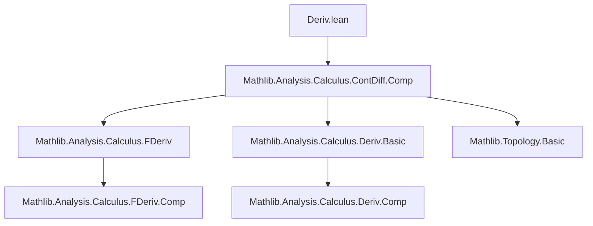

### Technical Brief: Higher Differentiability in One Dimension (`Deriv.lean`)

---

#### **1. Key Definitions & Theorems**

| Name | Type / Signature | Purpose |
|------|------------------|---------|
| `derivWithin` | `f : 𝕜 → F → derivWithin f s : s → F` | Local derivative on a subset `s`, used when domain has boundary or non-open structure. |
| `deriv` | `f : 𝕜 → F → deriv f : 𝕜 → F` | Global derivative on the whole space (total derivative), defined via `derivWithin f univ`. |
| `ContDiffOn 𝕜 n f s` | Predicate | `f` is $C^n$ (n-times continuously differentiable) on `s` w.r.t. field `𝕜`. |
| `ContDiff 𝕜 n f` | Predicate | `f` is $C^n$ globally (i.e., on `univ : Set 𝕜`). |
| `contDiffOn_succ_iff_derivWithin` | `ContDiffOn 𝕜 (n + 1) f s ↔ ...` | Characterizes $C^{n+1}$ via differentiability + $C^n$ of `derivWithin`. |
| `contDiffOn_succ_iff_deriv_of_isOpen` | `ContDiffOn 𝕜 (n + 1) f s ↔ ...` | Same as above, but uses `deriv` (not `derivWithin`) when `s` is open. |
| `contDiff_succ_iff_deriv` | `ContDiff 𝕜 (n + 1) f ↔ ...` | Global version: $C^{n+1}$ iff differentiable and `deriv f` is $C^n$. |
| `contDiff_infty_iff_deriv` | `ContDiff 𝕜 ∞ f ↔ ...` | Smoothness ($C^\infty$) equivalent to differentiability + $C^\infty$ of derivative. |
| `ContDiff.deriv'` | `ContDiff 𝕜 (n + 1) f → ContDiff 𝕜 n (deriv f)` | Derivative of a $C^{n+1}$ function is $C^n$. |
| `ContDiff.iterate_deriv` | `ContDiff 𝕜 ∞ f → ContDiff 𝕜 ∞ (deriv^[n] f)` | All iterated derivatives of a smooth function are smooth. |
| `ContDiff.iterate_deriv'` | `ContDiff 𝕜 (n + k) f → ContDiff 𝕜 n (deriv^[k] f)` | Finite-order version: $C^{n+k}$ implies $C^n$ for $k$-th derivative. |

---

#### **2. Naming Conventions**

- **Prefixes**:
  - `contDiffOn_...`: Relates to `ContDiffOn` (local version).
  - `contDiff_...`: Relates to `ContDiff` (global version).
  - `derivWithin_...`: Properties involving `derivWithin`.
  - `continuousOn_deriv_...`: Continuity of derivatives.
- **Suffixes**:
  - `_iff_deriv`: Equivalence with differentiability + derivative regularity.
  - `_of_isOpen`: Specialization for open domains.
  - `_within`: Refers to `derivWithin`.
- **Function names**:
  - `iterate_deriv`, `iterate_deriv'`: Iterated derivative notation `deriv^[n]`.

---

#### **3. Tactic Stack**

Frequently used tactics:
- `rw`: Rewriting using equivalences like `contDiffOn_succ_iff_derivWithin`.
- `simp`: Simplification with lemmas about `deriv`, `derivWithin`, `isOpen_univ`, etc.
- `fun_prop`: Propagation of functorial properties (e.g., `ContDiff.deriv'`).
- `exact`, `apply`, `intro`, `cases`: Basic proof structure.
- `ext`: Extensionality for function equality.
- ` rfl`: Reflexivity for trivial equalities like `∞ = ∞ + 1`.

---

#### **4. Proof Logic**

- **Inductive-style reasoning** on smoothness order `n` (especially in `iterate_deriv'`).
- **Equivalence-based decomposition**: Proving $C^{n+1}$ by reducing to $C^n$ of derivative.
- **Case analysis on `n = ω`**: Handling finite vs infinite smoothness separately.
- **Domain-specific simplifications**:
  - Use of `UniqueDiffOn` to identify `derivWithin` with `fderivWithin`.
  - Use of `isOpen s` to replace `derivWithin` with `deriv`.
- **Functorial propagation (`fun_prop`)**: Leveraging `ContDiff` as a functorial property over composition and projection.

---

#### **5. Imports & Dependencies**

- **Primary import**:
  ```lean
  import Mathlib.Analysis.Calculus.ContDiff.Comp
  ```
  This provides foundational results about `ContDiff`, including chain rule, composition, and basic properties of `ContDiffOn`.

- **Implicit dependencies** (via `Mathlib.Analysis.Calculus.ContDiff.Comp`):
  - `Mathlib.Analysis.Calculus.FDeriv`
  - `Mathlib.Analysis.Calculus.FDeriv.Comp`
  - `Mathlib.Analysis.Calculus.Deriv.Basic`
  - `Mathlib.Analysis.Calculus.Deriv.Comp`
  - `Mathlib.Analysis.Calculus.InverseFunctionTheorem`
  - `Mathlib.Analysis.Calculus.MeanValueTheorem`
  - `Mathlib.Topology.Basic` (for `isOpen`, `UniqueDiffOn`, etc.)

---

#### **6. Mermaid Diagrams**

##### **Dependency Graph (Module Level)**



##### **Overview of Theoretical Flow**


##### **Proof Strategy Flow (Example: `contDiff_succ_iff_deriv`)**
```mermaid
graph TD
  A[Goal: ContDiff 𝕜 (n+1) f] --> B[Use contDiffOn_univ]
  B --> C[Apply contDiffOn_succ_iff_deriv_of_isOpen]
  C --> D[Use isOpen_univ]
  D --> E[Reduce to Differentiable f ∧ ContDiff n (deriv f)]
  E --> F[Apply lemmas like contDiff_infty_iff_deriv for ∞ case]
```

---

#### **7. Summary**

This file bridges the abstract Fréchet derivative framework (`fderiv`) with the concrete one-dimensional derivative (`deriv`), enabling simpler reasoning about smoothness in real or complex analysis. It establishes foundational equivalences between $C^{n+1}$ regularity and regularity of the derivative, with special attention to open domains and uniqueness of limits (via `UniqueDiffOn`). The results are crucial for developing calculus of smooth functions in one variable, especially in preparation for Taylor expansions, analyticity criteria, and infinite-dimensional generalizations.

--- 

Let me know if you'd like a formalized dependency graph in `leanpkg` format or a visualization of the `iterate_deriv` induction.
