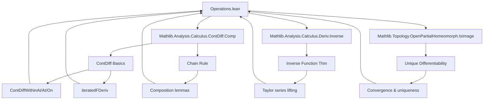
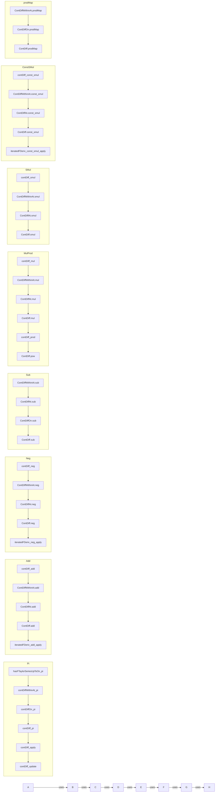

### Technical Brief: `Operations.lean` — Higher Differentiability of Standard Operations

---

#### **1. Key Definitions & Theorems**

| Name | Type / Signature | Purpose |
|------|------------------|---------|
| `HasFTaylorSeriesUpToOn` | `n : WithTop ℕ∞ → (E → F) → (E → ℕ → E [×n]→L[𝕜] F) → Set E → Prop` | Expresses that a function admits a Taylor series up to order `n` on a set. |
| `ContDiffWithinAt`, `ContDiffAt`, `ContDiffOn`, `ContDiff` | `n : WithTop ℕ∞ → (E → F) → Set E → E → Prop` | Standard hierarchy of $C^n$ regularity: local within a set, at a point, on a domain, globally. |
| `iteratedFDerivWithin`, `iteratedFDeriv` | `i : ℕ → (E → F) → Set E → E → E [×i]→L[𝕜] F` | $i$-th iterated (Fréchet) derivative, within a set or globally. |
| `ContinuousMultilinearMap.pi`, `piₗᵢ` | `∀ i, E [×n]→L[𝕜] F' i → E [×n]→L[𝕜] ∀ i, F' i` | Isomorphism between product of multilinear maps and multilinear maps into a product. |
| `contDiff_add`, `contDiff_mul`, `contDiff_neg`, `contDiff_smul` | `ContDiff 𝕜 n (fun p ↦ p.1 + p.2)` etc. | Smoothness of basic operations on codomain (e.g., addition, multiplication, scalar mult). |
| `ContDiff.add`, `ContDiff.mul`, `ContDiff.neg`, `ContDiff.smul` | `ContDiff n f → ContDiff n g → ContDiff n (f + g)` etc. | Closure of $C^n$ functions under pointwise operations. |
| `iteratedFDeriv_add_apply`, `iteratedFDeriv_mul_apply`, `iteratedFDeriv_neg_apply`, `iteratedFDeriv_const_smul_apply` | `iteratedFDeriv i (f + g) = iteratedFDeriv i f + iteratedFDeriv i g` etc. | Leibniz-type formulas for iterated derivatives of operations. |
| `contDiff_pi`, `contDiffWithinAt_pi`, `contDiffAt_pi` | `ContDiff n Φ ↔ ∀ i, ContDiff n (Φ i)` | Smoothness of product-type functions is equivalent to smoothness of each component. |
| `contDiff_update`, `contDiff_single` | `ContDiff n (update x i)`, `ContDiff n (Pi.single i)` | Smoothness of basic operations on dependent functions (e.g., updating a coordinate). |
| `contDiff_apply`, `contDiff_apply_apply` | `ContDiff n (fun f ↦ f i)`, `ContDiff n (fun f ↦ f i j)` | Evaluation maps are smooth (projections in function spaces). |

---

#### **2. Naming Conventions**

- **Prefixes**:
  - `contDiff_`: smoothness of *operations on functions* (e.g., `contDiff_add`, `contDiff_mul`).
  - `ContDiff._`: closure properties of *functions* under operations (e.g., `ContDiff.add`, `ContDiff.mul`).
  - `iteratedFDeriv_`: formulas for *iterated derivatives* under operations.
  - `hasFTaylorSeriesUpToOn_`: compatibility of Taylor series with constructions (e.g., `hasFTaylorSeriesUpToOn_pi`).
- **Suffixes**:
  - `_withinAt`, `_at`, `_on`, (no suffix): correspond to `ContDiffWithinAt`, `ContDiffAt`, `ContDiffOn`, `ContDiff`.
  - `_apply`: explicit formula for the derivative (e.g., `iteratedFDeriv_add_apply`).
  - `_apply'`: variant using lambda notation `(fun x ↦ …)` instead of function variables.
- **Other**:
  - `prodMap`, `prodMk`: product maps and projections.
  - `const_smul`, `smul_const`: scalar multiplication with constant scalar or constant vector.

---

#### **3. Tactic Stack**

- **Core automation**:
  - `simp`, `simp_rw`, `rw`: heavy use for rewriting definitions and equalities.
  - `exact`, `refine`, `convert`: for structured proof construction.
  - `induction` (with `Finset.induction_on`, `Finset.cons_induction`): for finite sums/products.
  - `intro`, `ext`, `ext1`: for functional extensionality and multilinear map equality.
- **Analysis-specific**:
  - `contDiffWithinAt.comp`, `contDiffWithinAt.prodMk`: composition and pairing rules.
  - `hasFDerivWithinAt.comp_hasFDerivWithinAt`: chain rule for Taylor series.
  - `analyticOn.comp_analyticOn`, `analyticOn.pi`: for analyticity in the $ω$-case.
- **Topological/linear algebra**:
  - `continuousLinearMap_comp`, `continuous.comp_continuousOn`, `continuousOn_pi`: continuity arguments.
  - `fderivWithin_congr'`, `iteratedFDerivWithin_congr_set`: local equivalence lemmas.
  - `uniqueDiffOn_univ`, `UniqueDiffOn.inter`: unique differentiability assumptions.

---

#### **4. Proof Logic**

- **Structure**:
  - Most proofs follow a **two-tiered strategy**:
    1. **Smoothness of the operation itself** (e.g., `contDiff_add`): show the binary operation on the codomain is $C^n$ as a map $F × F → F$.
    2. **Closure under composition/pairing**: lift this to pointwise operations on functions via `contDiff_* .comp` and `prodMk`.
  - For **iterated derivatives**, proofs often proceed by:
    - **Induction on $i$** (order of derivative).
    - Base case: `simp` using definitions.
    - Inductive step: apply `fderivWithin` to the induction hypothesis, use chain rule (`fderivWithin_comp` or variants), and linearity of derivative.
  - For **product-type functions** (`Pi` section), proofs use:
    - Projection maps (`ContinuousLinearMap.proj`) to reduce to components.
    - Isomorphism `piₗᵢ` to translate between product multilinear maps and multilinear maps into products.
    - In the $ω$-case, use `analyticOn.pi` and intersections of neighborhoods.

- **Common patterns**:
  - `rw [← contDiffWithinAt_univ]` to move between global and local versions.
  - `simpa only [sub_eq_add_neg] using …` to reduce subtraction to addition + negation.
  - `Finset.sum_induction`, `Finset.prod_induction` for finite sums/products.
  - `funext` + `contDiffAt` → `contDiff` via `contDiff_iff_contDiffAt`.

---

#### **5. Imports & Dependencies**

| Import | Role |
|--------|------|
| `Mathlib.Analysis.Calculus.ContDiff.Comp` | Chain rule, composition of $C^n$ maps. |
| `Mathlib.Analysis.Calculus.Deriv.Inverse` | Inverse function theorem (used implicitly via `HasFTaylorSeriesUpToOn` properties). |
| `Mathlib.Topology.OpenPartialHomeomorph.IsImage` | Technical tools for local behavior and unique differentiability. |
| `Mathlib.Analysis.Calculus.ContDiff.Basic` (implied via `ContDiff` scope) | Core definitions of `ContDiff*`, `iteratedFDeriv*`. |
| `Mathlib.Analysis.Calculus.FDeriv.ContinuousMultilinear` | Multilinear maps, continuous multilinear maps, `E [×n]→L[𝕜] F`. |
| `Mathlib.Analysis.Calculus.FDeriv.Basic` | Fréchet derivative, `fderivWithin`, `hasFDerivWithinAt`. |
| `Mathlib.Analysis.Calculus.FormalMultilinearSeries` | Formal Taylor series, `HasFTaylorSeriesUpToOn`, `ftaylorSeriesWithin`. |

---

#### **6. Mermaid Diagrams**

##### **Dependency Graph (High-Level)**

##### **Overview of File Structure**

---

#### **7. Summary**

This file formalizes the foundational closure properties of $C^n$ functions under standard algebraic and categorical operations: addition, subtraction, multiplication, scalar multiplication, composition with bilinear maps, products, and dependent products (`Pi` types). It establishes both *smoothness* (`ContDiff*`) and *derivative formulas* (`iteratedFDeriv*`) for these operations, with careful handling of local vs global, within-set vs at-point, and finite vs infinite differentiability (`ω`). The proofs rely heavily on the chain rule, continuity of multilinear maps, and induction on derivative order.

The file is a cornerstone for higher-order calculus in `Mathlib`, enabling later developments such as the inverse/implicit function theorems, manifolds, and Taylor’s theorem with remainder.
