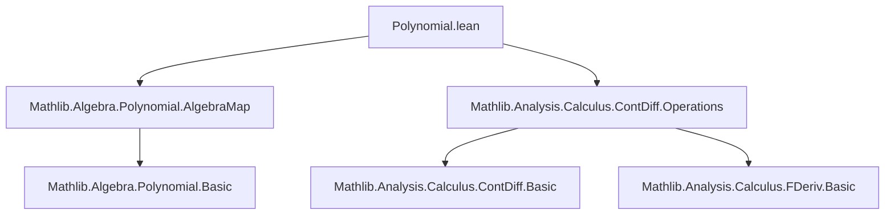
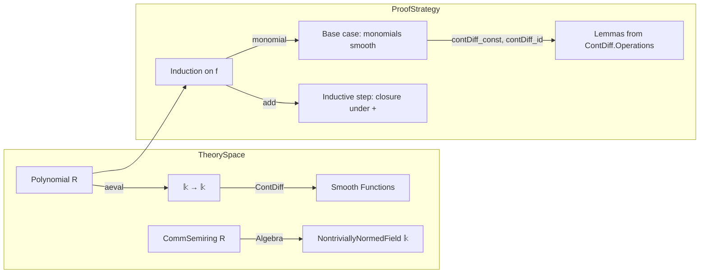

**Technical Metadata Brief: `Polynomial.lean`**

---

### 1. **Key Definitions & Theorems**

| Name | Type / Signature | Purpose |
|------|------------------|---------|
| `contDiff_aeval` | `∀ {R 𝕜}, [CommSemiring R] [NontriviallyNormedField 𝕜] [Algebra R 𝕜], (f : Polynomial R) → (n : WithTop ℕ∞), ContDiff 𝕜 n (aeval f)` | Proves that for any polynomial `f` over a commutative semiring `R`, the evaluation map `x ↦ f.aeval x` is `Cⁿ` (i.e., `n`-times continuously differentiable) for all `n : WithTop ℕ∞` (including `∞`). |

- **`aeval`**: Standard evaluation of a polynomial at a point in an algebra — defined in `Mathlib.Algebra.Polynomial.AlgebraMap`.
- **`ContDiff`**: Smoothness predicate from `Mathlib.Analysis.Calculus.ContDiff`, where `ContDiff 𝕜 n g` means `g : 𝕜 → 𝕜` is `n`-times continuously differentiable over the normed field `𝕜`.
- **`WithTop ℕ∞`**: Extended natural numbers with `∞`, used to express finite and infinite differentiability uniformly.

---

### 2. **Naming Conventions**

- **Prefixes**:
  - `contDiff_`: Indicates smoothness-related lemmas (e.g., `contDiff_aeval`).
- **Suffixes**:
  - `_add`, `_mul`, `_pow`: Used in tactic proofs for structural induction over polynomial constructors (`add`, `monomial`).
- **Function names**:
  - `aeval`: Standard abbreviation for *algebra evaluation* of a polynomial.

No explicit `is_`, `mul_`, or `dist_` prefixes/suffixes appear in this file.

---

### 3. **Tactic Stack**

- **`induction ... using Polynomial.induction_on'`**: Structural induction on polynomials (via `add` and `monomial` constructors).
- **`simpa using`**: Simplifies the goal using the provided lemma (e.g., `fc.add gc`, `contDiff_const.mul (contDiff_id.pow _)`).
- **`contDiff_const.mul`**, **`contDiff_id.pow`**: Lemmas from `ContDiff` library used to build up smoothness of monomials.

No heavy automation (e.g., `aesop`, `ring`, `simp_rw`) is used — the proof is highly structured and relies on known closure properties of `ContDiff`.

---

### 4. **Proof Logic**

- **Inductive structure**: Proof proceeds by polynomial induction:
  1. **Base case (`monomial n a`)**: Show `x ↦ a * xⁿ` is smooth. This uses:
     - `contDiff_const`: constant functions are smooth.
     - `contDiff_id`: identity function is smooth.
     - Closure under multiplication and powers (`mul`, `pow`) to conclude monomials are smooth.
  2. **Inductive step (`add f g`)**: Use closure of `ContDiff` under addition (`fc.add gc`).

- **No case analysis or rewriting beyond induction and simplification** — proof is concise and leverages existing smoothness closure lemmas.

---

### 5. **Imports**

| Import | Role |
|--------|------|
| `Mathlib.Algebra.Polynomial.AlgebraMap` | Provides `aeval`, algebra structure on polynomial evaluation, and basic polynomial algebra. |
| `Mathlib.Analysis.Calculus.ContDiff.Operations` | Provides closure properties of `ContDiff` (e.g., under addition, multiplication, powers, constants). |

These imports define the ambient setting: polynomials over an algebra over a nontrivially normed field, and smooth function calculus.

---

### 8. **Mermaid Diagrams**

#### **Dependency Graph (File-Level)**

#### **Theoretical Overview (Module Scope)**

#### **Summary**

This module establishes a foundational result: *all polynomial functions over a commutative semiring `R`, when viewed as functions on a nontrivially normed field `𝕜` via algebra evaluation, are infinitely differentiable (`C^∞`)*. The proof is short, elegant, and relies on structural induction and standard closure properties of smooth functions.

--- 

Let me know if you'd like the corresponding `leanpkg.toml` snippet or a formalized dependency graph in `graphviz` format.
