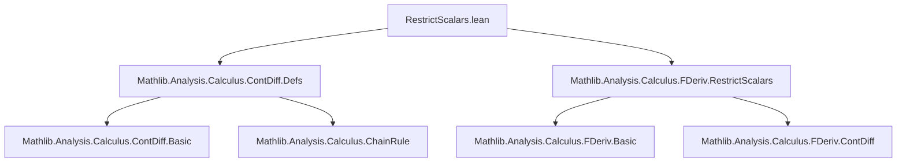

### Technical Brief: `RestrictScalars.lean`

---

#### **1. Key Definitions & Theorems**

| Name | Type / Signature | Purpose |
|------|------------------|---------|
| `restrictScalars` | `ContinuousLinearMap (𝕜' →L[𝕜'] F) (𝕜 →L[𝕜] F)` (implicit via `NormedAlgebra 𝕜 𝕜'`) | Restricts scalars along the inclusion `𝕜 ⊆ 𝕜'`, turning a `𝕜'`-linear map into a `𝕜`-linear map. |
| `fderivWithin_restrictScalars_comp` | `fderivWithin 𝕜 ((restrictScalars 𝕜) ∘ φ) s x = (restrictScalars 𝕜) ∘ ((fderivWithin 𝕜' φ s x).restrictScalars 𝕜)` | Derivation rule for chain rule with scalar restriction applied to a `𝕜'`-differentiable map into continuous multilinear maps. |
| `ContDiffWithinAt.restrictScalars_iteratedFDerivWithin_eventuallyEq` | `(h : ContDiffWithinAt 𝕜' n f s x) → (hs : UniqueDiffOn 𝕜 s) → (hx : x ∈ s) → (restrictScalars 𝕜) ∘ iteratedFDerivWithin 𝕜' n f s =ᶠ[𝓝[s] x] iteratedFDerivWithin 𝕜 n f s` | Shows that the `n`th iterated *within*-Fréchet derivative over `𝕜` is *eventually equal* (near `x` in `s`) to scalar restriction of the `𝕜'`-derivative. |
| `ContDiffAt.restrictScalars_iteratedFDeriv_eventuallyEq` | `(h : ContDiffAt 𝕜' n f x) → (restrictScalars 𝕜) ∘ iteratedFDeriv 𝕜' n f =ᶠ[𝓝 x] iteratedFDeriv 𝕜 n f` | Global version (on whole space) of the above, using `Set.univ`. |
| `ContDiffAt.restrictScalars_iteratedFDeriv` | `(h : ContDiffAt 𝕜' n f x) → ((restrictScalars 𝕜) ∘ iteratedFDeriv 𝕜' n f) x = iteratedFDeriv 𝕜 n f x` | Pointwise equality of derivatives at `x`, deduced from the previous theorem via `eq_of_nhds`. |

---

#### **2. Naming Conventions**

- **Prefixes**:
  - `restrictScalars_`: for lemmas theorems about scalar restriction.
  - `fderivWithin_`, `iteratedFDerivWithin_`, `iteratedFDeriv_`: standard Fréchet derivative notation.
- **Suffixes**:
  - `_comp`: for composition rules.
  - `_eventuallyEq`: for results stated up to eventual equality (i.e., modulo neighborhoods).
  - `_nhds` / `_nhdsWithin`: for neighborhood-based reasoning.
- **Variables**:
  - `𝕜`, `𝕜'`: base fields, with `𝕜 ⊆ 𝕜'`.
  - `E`, `F`: normed spaces over both fields.
  - `φ`, `f`: functions; `φ` often maps into multilinear maps.
  - `n`: natural number for differentiability class.

---

#### **3. Tactic Stack**

- **Core tactics**:
  - `induction n with | zero | succ n hn =>`: structural induction on `n`.
  - `filter_upwards [h₁, h₂, h₃]`: to combine filters and handle eventual equalities.
  - `rw [...]`: rewriting using lemmas like `fderivWithin_restrictScalars_comp`, `iteratedFDerivWithin_succ_apply_left`.
  - `simp only [...]`, `simp`: simplification using definitions and algebraic properties.
  - `ext a b`, `ext m`: extensionality for functions/multilinear maps.
  - `convert ... <;> simp [...]`: to reduce goals via convertible expressions.
  - `fun_prop`, `tauto`, `simp`: for propositional reasoning and typeclass inference.
  - `have t₀ := h.of_le ...`, `have t₁ : ∀ᶠ ... := ...`: local assumptions for induction step.

---

#### **4. Proof Logic**

- **Inductive structure** on `n` (number of derivatives):
  - **Base case (`n = 0`)**: reduces to continuity and definition of `iteratedFDerivWithin 0`.
  - **Inductive step (`n ↦ n+1`)**:
    1. Uses `ContDiffWithinAt.of_le` to get lower-order differentiability.
    2. Establishes a neighborhood filter condition for `ContDiffWithinAt` of order `n+1`.
    3. Applies `fderivWithin_restrictScalars_comp` to relate `fderivWithin` of scalar-restricted map to scalar restriction of `fderivWithin`.
    4. Uses induction hypothesis (`hn`) to replace `iteratedFDerivWithin 𝕜' n` with scalar restriction of `iteratedFDerivWithin 𝕜 n`.
    5. Leverages `UniqueDiffOn` to ensure chain rule applies (via `UniqueDiffWithinAt`).
    6. Concludes via `eq_of_nhds` for pointwise equality.

- **Key logical flow**:
  > *Induction on `n` → reduce to first derivative case → apply chain rule for scalar restriction → use IH to handle higher-order terms → conclude via filter equality.*

---

#### **5. Imports**

- `Mathlib.Analysis.Calculus.ContDiff.Defs`: definitions of `ContDiffAt`, `ContDiffWithinAt`, `iteratedFDeriv`, etc.
- `Mathlib.Analysis.Calculus.FDeriv.RestrictScalars`: foundational scalar restriction lemmas for first-order Fréchet derivatives.

> These imports define the *first-order* scalar restriction theory, which this file extends to *iterated* derivatives.

---

#### **6. Mermaid Diagrams**

##### **Dependency Graph (Module Level)**



##### **Theoretical Overview (This File)**

```mermaid
flowchart LR
  subgraph "Scalar Restriction Setup"
    K[𝕜] -->|algebra| K'[𝕜']
    E[NormedSpace 𝕜 E] -->|tower| E'[NormedSpace 𝕜' E]
    F[NormedSpace 𝕜 F] -->|tower| F'[NormedSpace 𝕜' F]
  end

  subgraph "First-Order Theory"
    C1[restrictScalars] -->|chain rule| R1[fderivWithin_restrictScalars_comp]
  end

  subgraph "Iterated Derivatives"
    R1 -->|induction| R2[ContDiffWithinAt.restrictScalars_iteratedFDerivWithin_eventuallyEq]
    R2 -->|univ| R3[ContDiffAt.restrictScalars_iteratedFDeriv_eventuallyEq]
    R3 -->|eq_of_nhds| R4[ContDiffAt.restrictScalars_iteratedFDeriv]
  end

  R4 -->|pointwise equality| P[iteratedFDeriv 𝕜 n f x = (restrictScalars 𝕜) ∘ iteratedFDeriv 𝕜' n f x]
```

---

#### **7. Summary**

This file extends scalar restriction theory from first-order Fréchet derivatives to *iterated* derivatives. It shows that under suitable differentiability and uniqueness assumptions (e.g., `UniqueDiffOn`), the `n`th iterated derivative over a subfield `𝕜` coincides with scalar restriction of the `n`th derivative over an extension field `𝕜'`. The proofs rely on induction, filter-based reasoning, and the chain rule for scalar restriction. The results are foundational for analysis over subfields (e.g., real vs. complex differentiability) and are used in contexts like complexification or restriction of analytic structures.
