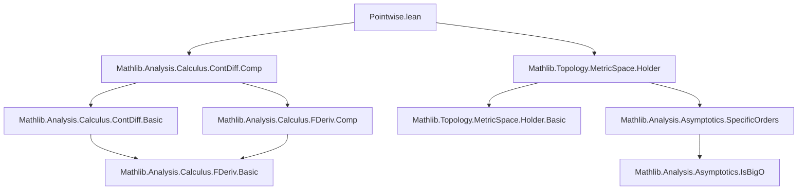

### Technical Brief: `Pointwise.lean` — `ContDiffPointwiseHolderAt`

---

#### **1. Key Definitions & Theorems**

| Name | Type | Purpose |
|------|------|---------|
| `ContDiffPointwiseHolderAt k α f a` | `Prop` | Predicate stating that `f` is $C^k$ at `a$ and its $k$-th derivative satisfies $D^k f(x) - D^k f(a) = O(\|x - a\|^\alpha)$ as $x \to a$. |
| `ContDiffPointwiseHolderAt.contDiffAt` | `ContDiffAt ℝ k f a` | Projection: $C^{k+(\alpha)}$ implies $C^k$. |
| `ContDiffPointwiseHolderAt.isBigO` | `(iteratedFDeriv ℝ k f · - iteratedFDeriv ℝ k f a) =O[𝓝 a] (‖· - a‖ ^ α)` | Hölder-type growth condition on the $k$-th derivative. |
| `ContDiffPointwiseHolderAt.of_exponent_le` | `β ≤ α → ContDiffPointwiseHolderAt k β f a` | Weaker exponent implies stronger big-O condition. |
| `ContDiffPointwiseHolderAt.of_order_lt` | `l < k → ContDiffPointwiseHolderAt l β f a` | Lower order derivative inherits $C^{k+(\alpha)}$ regularity. |
| `ContDiffPointwiseHolderAt.comp` | `k ≠ 0 → ContDiffPointwiseHolderAt k α (g ∘ f) a` | Composition of $C^{k+(\alpha)}$ maps (requires $k \ne 0$ for differentiability). |
| `ContDiffPointwiseHolderAt.fderiv` | `l < k → ContDiffPointwiseHolderAt l α (fderiv ℝ f) a` | Derivative of a $C^{k+(\alpha)}$ function is $C^{l+(\alpha)}$. |
| `ContDiffPointwiseHolderAt.iteratedFDeriv` | `l + m ≤ k → ContDiffPointwiseHolderAt l α (iteratedFDeriv ℝ m f) a` | Higher-order derivatives inherit regularity. |
| `zero_order_iff` | `ContDiffPointwiseHolderAt 0 α f a ↔ ContDiffAt ℝ 0 f a ∧ (f · - f a) =O[𝓝 a] (‖· - a‖ ^ α)` | Characterization for $k = 0$. |
| `zero_exponent_iff` | `ContDiffPointwiseHolderAt k 0 f a ↔ ContDiffAt ℝ k f a` | $\alpha = 0$ recovers pure $C^k$ regularity. |

---

#### **2. Naming Conventions**

- **Prefixes**:
  - `contDiffPointwiseHolderAt_`: module-level predicate.
  - `contDiffAt_`, `contDiffOn_`, `contDiff_`: inherited from `ContDiffAt`/`ContDiffOn`.
  - `isBigO_`, `of_`, `eventually_`, `norm_`, `tendsto_`: standard asymptotic/filter naming.
- **Suffixes**:
  - `_iff`: equivalence lemmas.
  - `_left_comp`, `_right_comp`: composition with linear maps on left/right.
  - `_on`, `_at`: local vs. global context (e.g., `HolderOnWith`, `ContDiffPointwiseHolderAt`).
- **Variables**:
  - `k`, `l`, `m`: natural numbers (order of differentiability).
  - `α`, `β`: elements of `I = [0,1]` (Hölder exponents).
  - `f`, `g`: functions.
  - `a`: base point.

---

#### **3. Tactic Stack**

| Tactic | Usage Frequency | Purpose |
|--------|------------------|---------|
| `simp` / `simp_rw` | High | Simplify definitions, especially `iteratedFDeriv_zero_eq_comp`, `contDiffPointwiseHolderAt_iff`. |
| `rw` | High | Rewrite using equivalences (`iff` lemmas), e.g., `zero_order_iff`, `zero_exponent_iff`. |
| `exact` / `refine` | High | Construct proofs using known facts (e.g., `isBigO.of_bound`, `of_norm_left`). |
| `filter_upwards` | Medium | Handle `eventually`-based arguments (e.g., in `comp` proof). |
| `calc` | Medium | Chain big-O estimates (e.g., `isBigO` in `comp`, `fderiv`). |
| `induction` | Medium | Structural induction on `m` in `iteratedFDeriv`. |
| `aesop` / `norm_num` | Low | Not used here; heavy reliance on analysis-specific lemmas. |
| `mod_cast` | Medium | Cast natural inequalities across type boundaries (`ℕ` ↔ `WithTop ℕ∞`). |
| `contrapose!` | Low | For contradiction-based arguments (e.g., in `comp` proof). |

---

#### **4. Proof Logic**

- **Structure**: Most proofs follow a *decomposition* pattern:
  1. **Split** the predicate into its two components: `contDiffAt` and `isBigO`.
  2. **Prove `contDiffAt`** using existing lemmas (`ContDiffAt`, `ContDiffOn`, `fderiv_right`, etc.).
  3. **Prove `isBigO`** via:
     - `isBigO.of_bound`, `of_norm_left`, `trans`, `comp_tendsto`, `rpow_rpow_nhdsGE_zero_of_le_of_imp`.
     - Leveraging `HolderOnWith`, `tendsto_norm_sub_self_nhdsGE`, and `norm.isBoundedUnder_le`.
- **Induction**: Used in `iteratedFDeriv` to reduce to base case (`m = 0`) and step (`m+1`).
- **Case analysis**: On `k = 0` or `k ≠ 0`, or on `DifferentiableAt` disjunctions (e.g., in `comp_of_differentiableAt`).
- **Filter-based reasoning**: Heavy use of `𝓝 a` (neighborhood filter), `eventually`, and `isBigO` with respect to it.

---

#### **5. Imports & Dependencies**

| Module | Purpose |
|--------|---------|
| `Mathlib.Analysis.Calculus.ContDiff.Comp` | `ContDiffAt`, `ContDiffOn`, `fderiv`, `iteratedFDeriv`, chain rule, Taylor expansion (`ftaylorSeries`, `taylorComp`). |
| `Mathlib.Topology.MetricSpace.Holder` | `HolderOnWith`, `isBigO` with power functions, norm-based asymptotics. |
| `Asymptotics`, `Filter`, `Set` | General asymptotic and topological machinery. |
| `unitInterval`, `NNReal`, `Top` | For `I = [0,1]`, nonnegative reals, and topology. |

---

#### **6. Mermaid Diagrams**

##### **Dependency Graph (Module-Level)**



##### **Overview of `ContDiffPointwiseHolderAt` Theory**

```mermaid
graph TD
  CP[ContDiffPointwiseHolderAt k α f a] --> CD[ContDiffAt ℝ k f a]
  CP --> HO[isBigO: D^k f(x) - D^k f(a) = O(||x-a||^α)]

  CP -->|of_exponent_le| CP'
  CP -->|of_order_lt| CP''
  CP -->|comp| CP'''
  CP -->|fderiv| CP''''
  CP -->|iteratedFDeriv| CP'''''

  CP -->|zero_exponent_iff| CD
  CP -->|zero_order_iff| CD0[ContDiffAt ℝ 0 f a ∧ ...]

  CP -->|of_contDiffOn_holderOnWith| CP_on[ContDiffPointwiseHolderAt k α f a]
  CP_on -->|from| ContDiffOn
  CP_on -->|and| HolderOnWith
```

---

#### **7. Summary**

This file introduces the *pointwise Hölder* regularity class $C^{k+(\alpha)}$ for maps between normed spaces, refining the classical $C^k$ class by imposing a Hölder condition on the $k$-th derivative *at a point*. It is motivated by applications in geometric analysis (e.g., Morse-Sard-type theorems). The theory is built atop `ContDiffAt` and `HolderOnWith`, with proofs emphasizing filter/asymptotic reasoning and structural induction. The predicate is stable under composition (for $k \ne 0$), differentiation, and linear operations, making it suitable for local analysis of nonlinear operators.
