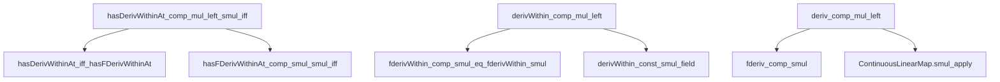
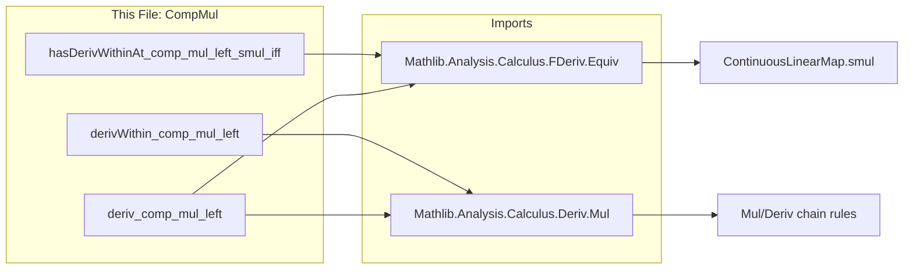

**Technical Brief: `CompMul.lean`**

---

### 1. **Key Definitions & Theorems**

| Name | Type | Purpose |
|------|------|---------|
| `hasDerivWithinAt_comp_mul_left_smul_iff` | `HasDerivWithinAt (f ∘ (c * ·)) (c • f') s x ↔ HasDerivWithinAt f f' (c • s) (c * x)` | Equivalence of existence of *within*-derivatives under linear change of variable $x \mapsto c \cdot x$. |
| `derivWithin_comp_mul_left` | `derivWithin (f ∘ (c * ·)) s x = c • derivWithin f (c • s) (c * x)` | Chain rule for *within*-derivatives under scaling: derivative of $x \mapsto f(cx)$ within set $s$ at $x$ equals $c$ times derivative of $f$ within scaled set $c \cdot s$ at $c x$. |
| `deriv_comp_mul_left` | `deriv (f ∘ (c * ·)) x = c • deriv f (c * x)` | Chain rule for (global) derivatives: derivative of $x \mapsto f(cx)$ at $x$ is $c \cdot f'(cx)$. |

All three theorems hold *without* assuming differentiability of $f$ or ambient differentiability structure (e.g., `UniqueDiffWithinAt`), due to Lean’s convention that undefined derivatives evaluate to `0`.

---

### 2. **Naming Conventions**

- **Prefixes**:
  - `hasDerivWithinAt_...`: asserts existence of a *within*-derivative.
  - `derivWithin_...`: computes the *within*-derivative value.
  - `deriv_...`: computes the (global) derivative value.
- **Suffixes**:
  - `_comp_mul_left`: indicates composition on the *left* with multiplication-by-$c$ map $x \mapsto c \cdot x$.
  - `_smul`: emphasizes scalar multiplication (`•`) structure.
- **Operators used**:
  - `c * ·`: pointwise multiplication by scalar $c$.
  - `c • f'`: scalar multiplication in the codomain (normed space $E$).
  - `c • s`: pointwise scalar multiplication of a set.

---

### 3. **Tactic Stack**

- `simp only [...]`: heavily used to normalize expressions using definitional equalities and lemmas.
- `rw [...]`: rewrites using previously established derivative chain rules (`fderivWithin_comp_smul_eq_fderivWithin_smul`, `fderiv_comp_smul`, etc.).
- `derivWithin`, `deriv`: used to unfold definitions of derivatives in terms of `fderivWithin`/`fderiv`.
- `Pi.smul_def`, `smul_eq_mul`: simplify scalar multiplication in function spaces or fields.

No heavy automation (e.g., `aesop`, `linarith`) is used—proofs rely on structured rewriting and known calculus lemmas.

---

### 4. **Proof Logic**

- **Core idea**: Reduce derivative statements for $x \mapsto f(cx)$ to known chain rules for `ContinuousLinearMap.smul`.
- **Steps**:
  1. Use equivalence between `HasDerivWithinAt` and `HasFDerivWithinAt` (via `hasDerivWithinAt_iff_hasFDerivWithinAt`).
  2. Apply `hasFDerivWithinAt_comp_smul_smul_iff`, which encodes the chain rule for composition with scalar multiplication (a continuous linear map).
  3. For `derivWithin_comp_mul_left`, unfold `derivWithin` as `fderivWithin` and apply `fderivWithin_comp_smul_eq_fderivWithin_smul`.
  4. For `deriv_comp_mul_left`, use `fderiv_comp_smul` and simplify using `ContinuousLinearMap.smul_apply`.

No induction or case analysis is needed—the proofs are direct applications of pre-existing chain rules for `ContinuousLinearMap`.

---

### 5. **Imports**

- `Mathlib.Analysis.Calculus.FDeriv.Equiv`: provides equivalence lemmas between Fréchet and Gâteaux derivatives, and tools for `ContinuousLinearMap` composition.
- `Mathlib.Analysis.Calculus.Deriv.Mul`: contains chain rules for multiplication and scalar multiplication, especially `fderivWithin_comp_smul_eq_fderivWithin_smul`, `fderiv_comp_smul`, and related lemmas.

These imports define the foundational calculus machinery used in the file.

---

### 6. **Mermaid Diagrams**

#### **Dependency Graph (Theorems → Lemmas)**

#### **Overview of File & Theory Context**

---

### 7. **Mathematical Summary**

This file formalizes the elementary chain rule for scalar multiplication in one dimension:

$$
\frac{d}{dx} f(c x) = c \cdot f'(c x)
$$

It works in the general setting of normed vector spaces over a nontrivially normed field $\mathbb{K}$, and handles both *within*-derivative (relative to a set $s$) and *global* derivative cases. Crucially, it avoids regularity assumptions by leveraging Lean’s convention that undefined derivatives are `0`.

--- 

Let me know if you'd like a formalization-level proof sketch or a comparison with similar files (e.g., `CompAdd.lean`, `CompInv.lean`).
