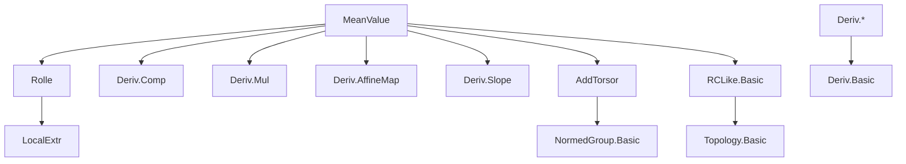
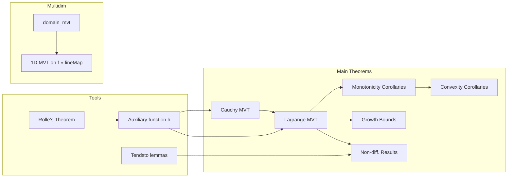

### Technical Brief: `MeanValue.lean`

---

#### **1. Key Definitions & Theorems**

| Name | Type / Signature | Purpose |
|------|------------------|---------|
| `exists_ratio_hasDerivAt_eq_ratio_slope` | `∃ c ∈ Ioo a b, (g b - g a) * f' c = (f b - f a) * g' c` | **Cauchy’s MVT** in `HasDerivAt` form (avoids division by zero). |
| `exists_ratio_hasDerivAt_eq_ratio_slope'` | Extended version with limits at endpoints | Generalized Cauchy MVT for possibly discontinuous endpoints (via `Tendsto`). |
| `exists_hasDerivAt_eq_slope` | `∃ c ∈ Ioo a b, f' c = (f b - f a) / (b - a)` | **Lagrange’s MVT** in `HasDerivAt` form. |
| `exists_deriv_eq_slope` | `∃ c ∈ Ioo a b, deriv f c = (f b - f a) / (b - a)` | Lagrange MVT in `deriv` form (uses differentiability ⇒ `HasDerivAt`). |
| `exists_deriv_eq_slope'` | `∃ c ∈ Ioo a b, deriv f c = slope f a b` | Same as above, using `slope` definition. |
| `domain_mvt` | `∃ z ∈ segment x y, f y - f x = f' z (y - x)` | Multidimensional Lagrange MVT for `f : E → ℝ` on convex domain. |
| `Convex.mul_sub_lt_image_sub_of_lt_deriv` | `C < deriv f ⇒ C * (y - x) < f y - f x` | Growth comparison: if derivative > constant, function grows faster than linear. |
| `mul_sub_lt_image_sub_of_lt_deriv` | Special case on `ℝ` (convex = `univ`) | Same as above, for globally differentiable `f`. |
| `strictMonoOn_of_deriv_pos` | `0 < deriv f ⇒ StrictMonoOn f D` | Positivity of derivative ⇒ strict monotonicity on convex domain. |
| `strictMono_of_deriv_pos` | `0 < deriv f ⇒ StrictMono f` | Global version of above. |
| `monotoneOn_of_deriv_nonneg` | `0 ≤ deriv f ⇒ MonotoneOn f D` | Nonnegative derivative ⇒ monotonicity. |
| `antitoneOn_of_deriv_nonpos` | `deriv f ≤ 0 ⇒ AntitoneOn f D` | Nonpositive derivative ⇒ antitonicity. |
| `strictAnti_of_deriv_neg` | `deriv f < 0 ⇒ StrictAnti f` | Negative derivative ⇒ strictly decreasing. |
| `not_differentiableWithinAt_of_deriv_tendsto_atTop_Ioi` | `deriv f → ∞` from right ⇒ not differentiable from right | Shows that blow-up of derivative prevents one-sided differentiability. |

---

#### **2. Naming Conventions**

- **Prefixes**:
  - `exists_`: existential MVT statements (`exists_hasDerivAt_eq_slope`, `exists_deriv_eq_slope`).
  - `mul_sub_`, `image_sub_`: inequalities comparing `f(y) - f(x)` with linear bounds.
  - `strictMonoOn_`, `antitoneOn_`, `monotoneOn_`: monotonicity consequences of derivative sign.
  - `not_differentiableWithinAt_of_deriv_`: negative differentiability results.

- **Suffixes**:
  - `_of_lt_deriv`, `_of_le_deriv`, `_of_deriv_pos`, `_of_deriv_neg`: specify derivative condition.
  - `_gt`, `_ge`, `_lt`, `_le`: comparison direction in assumptions.
  - `'` (prime): extended or alternative versions (e.g., `exists_ratio_hasDerivAt_eq_ratio_slope'`).

- **Pattern**:  
  `theorem name [prime] [of_...] [of_...] [of_...] : ...`  
  e.g., `Convex.mul_sub_lt_image_sub_of_lt_deriv`

---

#### **3. Tactic Stack**

- **Core tactics**:
  - `rcases`, `obtain`, `rw`, `rwa`, `convert`, `simp`, `simp only`, `linarith`, `ring`, `field_simp`, `norm_num`.
- **Analysis-specific**:
  - `filter_upwards`, `eventually_mem_nhdsWithin`, `tendsto_*`, `nhds_basis_*`, `eventually_of_forall`.
- **Differentiability & continuity**:
  - `differentiableWithinAt_of_derivWithin_ne_zero`, `hasDerivAt_id`, `hasDerivAt_const`, `hasDerivAt.comp`, `deriv.comp`, `deriv.neg`, `deriv.fun_neg`.
- **Set-theoretic reasoning**:
  - `Ioo_subset_Icc_self`, `Ioc_subset_Ioi_self`, `Icc_mem_nhds`, `Ioi_mem_nhds`, `segment_eq_image_lineMap`.

---

#### **4. Proof Logic**

- **Structure of MVT proofs**:
  1. **Construct auxiliary function** `h = (g b - g a) * f - (f b - f a) * g`.
  2. Show `h a = h b`, `h` continuous on `[a, b]`, differentiable on `(a, b)`.
  3. Apply **Rolle’s Theorem** (`exists_hasDerivAt_eq_zero`) to get `c ∈ (a, b)` with `h' c = 0`.
  4. Unfold `h' c = 0` to obtain the desired equality.

- **Monotonicity proofs**:
  - Use MVT to write `(f y - f x) / (y - x) = f' c`.
  - Apply assumption on `f' c` (e.g., `> 0`) and algebraic manipulation.

- **Non-differentiability proofs**:
  - Assume differentiability ⇒ derive contradiction via:
    - Slope vs derivative comparison (`hasDerivWithinAt_iff_tendsto_slope`).
    - Use `Tendsto` assumptions to force slope to be both `<` and `>` than same bound.

- **Multidimensional MVT**:
  - Reduce to 1D via `g(t) = lineMap x y t`, apply 1D MVT to `f ∘ g`, then reinterpret.

---

#### **5. Imports**

| Module | Purpose |
|--------|---------|
| `Mathlib.Analysis.Calculus.Deriv.AffineMap` | Affine maps, `lineMap`, differentiability of affine paths. |
| `Mathlib.Analysis.Calculus.Deriv.Comp` | Chain rule (`deriv.comp`, `hasDerivAt.comp`). |
| `Mathlib.Analysis.Calculus.Deriv.Mul` | Product rule, constants. |
| `Mathlib.Analysis.Calculus.Deriv.Slope` | Definition of `slope`, `slope_def_field`. |
| `Mathlib.Analysis.Calculus.LocalExtr.Rolle` | Rolle’s theorem (`exists_hasDerivAt_eq_zero`, `exists_hasDerivAt_eq_zero'`). |
| `Mathlib.Analysis.Normed.Group.AddTorsor` | For `segment`, `lineMap`, convex geometry in normed spaces. |
| `Mathlib.Analysis.RCLike.Basic` | Real-closed field basics, `Icc`, `Ioo`, `Ioc`, topology of `ℝ`. |

---

#### **6. Mermaid Diagrams**

##### **Dependency Graph (Top-Level)**

##### **Overview of File Structure**

---

#### **7. Theory Scope**

- **Core**: Classical real analysis on intervals, especially mean value theorems and their consequences.
- **Scope**:
  - One-dimensional MVTs (Cauchy, Lagrange).
  - Monotonicity, convexity, and growth estimates from derivative sign/bounds.
  - One-sided differentiability failure when derivative diverges.
  - Multidimensional extension via convex geometry and line segments.
- **Exclusions**:
  - No complex analysis.
  - No higher-order MVTs (e.g., Taylor’s theorem).
  - No integral-based proofs (purely differential approach).

---

This file is a cornerstone of real differential calculus in `Mathlib`, enabling downstream results in analysis (e.g., L’Hôpital’s rule, convex analysis, ODE uniqueness).
