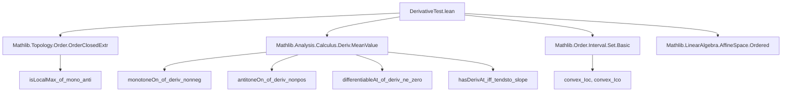

### Technical Brief: `DerivativeTest.lean`

---

#### **1. Key Definitions & Theorems**

| Name | Type | Purpose |
|------|------|---------|
| `isLocalMax_of_deriv_Ioo` | `lemma` | First-derivative test for local maxima on an open interval $(a,b,c)$ with explicit endpoints; uses monotonicity derived from derivative sign conditions. |
| `isLocalMin_of_deriv_Ioo` | `lemma` | Dual of `isLocalMax_of_deriv_Ioo`, for minima, via $-f$. |
| `isLocalMax_of_deriv'` | `lemma` | Filter-based version of the first-derivative test using left/right neighborhood filters (`𝓝[<]`, `𝓝[>]`). |
| `isLocalMin_of_deriv'` | `lemma` | Filter-based minimum version of the first-derivative test. |
| `isLocalMax_of_deriv` | `theorem` | Standard first-derivative test using the nonempty punctured neighborhood filter `𝓝[≠]`. |
| `isLocalMin_of_deriv` | `theorem` | Minimum version of `isLocalMax_of_deriv`. |
| `eventually_nhdsWithin_sign_eq_of_deriv_pos` | `lemma` | If $f(x_0)=0$ and $f'(x_0)>0$, then near $x_0$, $\mathrm{sign}(f(x)) = \mathrm{sign}(x - x_0)$. |
| `eventually_nhdsWithin_sign_eq_of_deriv_neg` | `lemma` | Analogous to above for $f'(x_0) < 0$. |
| `deriv_*_of_sign_deriv` (6 lemmas) | `lemma` | Translate sign conditions on $\mathrm{sign}(\mathrm{deriv}\,f)$ into one-sided derivative sign conditions (e.g., `deriv_pos_left_of_sign_deriv`). |
| `isLocalMax_of_sign_deriv` | `theorem` | First-derivative test phrased in terms of sign of derivative matching $\mathrm{sign}(x_0 - x)$ (i.e., decreasing through zero). |
| `isLocalMin_of_sign_deriv` | `theorem` | Minimum version using $\mathrm{sign}(x - x_0)$. |
| `isLocalMin_of_deriv_deriv_pos` | `theorem` | Second-derivative test: if $f'(x_0)=0$ and $f''(x_0)>0$, then $x_0$ is a local minimum. |
| `isLocalMax_of_deriv_deriv_neg` | `theorem` | Maximum version: $f'(x_0)=0$, $f''(x_0)<0$ ⇒ local maximum. |

---

#### **2. Naming Conventions**

- **Prefixes**:
  - `isLocal*`: Indicates a local extremum conclusion.
  - `deriv_*`: Refers to properties of the derivative (e.g., `deriv_pos_left_of_sign_deriv`).
  - `eventually_*`: Statements about behavior in filters (neighborhoods).
- **Suffixes**:
  - `_Ioo`: Interval-based version using open interval $(a,c)$ with $a < b < c$.
  - `_of_deriv`: Based on derivative sign conditions.
  - `_of_sign_deriv`: Based on sign of derivative.
  - `_of_deriv_deriv_*`: Second-derivative test variants.
- **Logical variants**:
  - `'` (prime): Filter-based version (e.g., `isLocalMax_of_deriv'`).
  - No prime: Standard version using `𝓝[≠]`.

---

#### **3. Tactic Stack**

Frequently used tactics:
- `simp_all`: Simplify using assumptions and definitions.
- `filter_upwards`: For proving statements about filters (especially `eventually`).
- `rw`, `rwa`: Rewrite using equalities, often with `at` or `*`.
- `exact`, `refine`, `obtain`: Construct proofs stepwise.
- `tauto`: For propositional logic simplifications (e.g., filter inclusion).
- `cases`, `left/right`: For disjunctions or sign cases.
- `neg`, `neg_neg`: Simplify expressions involving negation.
- `mem_compl_iff`, `mem_singleton_iff`, `Ne.eq_def`: Set membership and inequality manipulations.

---

#### **4. Proof Logic**

- **Structure of main proofs**:
  - **First-derivative test** (`isLocalMax_of_deriv_Ioo`):
    1. Use `ContinuousAt` + differentiability on intervals to get continuity on closed/half-open intervals.
    2. Apply `monotoneOn_of_deriv_nonneg` / `antitoneOn_of_deriv_nonpos` to get monotonicity.
    3. Use `isLocalMax_of_mono_anti` (from `OrderClosedExtr`) to conclude extremum.
  - **Filter-based versions**:
    1. Extract concrete intervals from filter conditions using `nhdsLT_basis` / `nhdsGT_basis`.
    2. Reduce to `isLocalMax_of_deriv_Ioo` / `isLocalMin_of_deriv_Ioo`.
  - **Sign-based versions**:
    1. Translate sign condition on $\mathrm{deriv}\,f$ into one-sided derivative sign conditions via lemmas like `deriv_pos_left_of_sign_deriv`.
    2. Apply `isLocalMax_of_deriv`.
  - **Second-derivative test**:
    1. Use `eventually_nhdsWithin_sign_eq_of_deriv_pos` to get sign behavior of $f$ near root $x_0$.
    2. Combine with $f'(x_0)=0$ to deduce sign of $\mathrm{deriv}\,f$ near $x_0$.
    3. Apply `isLocalMin_of_sign_deriv`.

- **Common pattern**: Reduce extremum statements to monotonicity or sign behavior, leveraging:
  - `DifferentiableOn` ⇒ `ContinuousOn`
  - Derivative sign ⇒ monotonicity/antitonicity
  - Sign of derivative ⇒ sign of function near root (via slope approximation)

---

#### **5. Imports**

| Module | Purpose |
|--------|---------|
| `Mathlib.Topology.Order.OrderClosedExtr` | Provides `isLocalMax_of_mono_anti`, key for extremum from monotonicity. |
| `Mathlib.Analysis.Calculus.Deriv.MeanValue` | Provides `monotoneOn_of_deriv_nonneg`, `antitoneOn_of_deriv_nonpos`, and related calculus lemmas. |
| `Mathlib.Order.Interval.Set.Basic` | Interval theory (`Ioo`, `Ioc`, `Ico`, convexity). |
| `Mathlib.LinearAlgebra.AffineSpace.Ordered` | Ordered affine spaces (used for real line structure). |

---

#### **6. Mermaid Diagrams**

##### **Dependency Graph (High-Level)**



##### **Overview of Theoretical Flow**

```mermaid
flowchart LR
  subgraph FirstDeriv
    A1[Derivative sign on Ioo] --> A2[Monotonicity on Ioc/Ico]
    A2 --> A3[Extremum via isLocalMax_of_mono_anti]
    A1 --> B1[Filter version via nhdsLT/nhdsGT]
    B1 --> B2[isLocalMax_of_deriv']
    B2 --> B3[isLocalMax_of_deriv]
  end

  subgraph SignDeriv
    C1[sign(deriv f) = sign(x₀ - x)] --> C2[One-sided derivative signs]
    C2 --> C3[isLocalMax_of_deriv]
  end

  subgraph SecondDeriv
    D1[f'(x₀)=0, f''(x₀)>0] --> D2[sign(deriv f) = sign(x - x₀)]
    D2 --> D3[isLocalMin_of_sign_deriv]
  end

  FirstDeriv --> FirstDerivExtremum
  SignDeriv --> SignDerivExtremum
  SecondDeriv --> SecondDerivExtremum
```

---

#### **7. Summary**

This module formalizes classical calculus derivative tests in Lean 4, emphasizing:
- **Robustness**: Multiple formulations (interval, filter, sign-based).
- **Modularity**: Second-derivative test derived from first-derivative test.
- **Precision**: Careful handling of differentiability, continuity, and one-sided behavior.
- **Generality**: Works for functions not necessarily twice differentiable everywhere (e.g., piecewise-defined like $x^2 + 1[x \ge 0]$).

The proofs rely heavily on monotonicity criteria from the mean value theorem and order-theoretic extremum characterizations.
