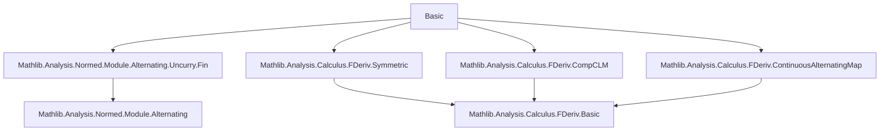

**Technical Brief: `Basic.lean` — Exterior Derivative of Differential Forms on Normed Spaces**

---

### **1. Key Definitions & Theorems**

| Name | Type / Signature | Purpose |
|------|------------------|---------|
| `extDeriv` | `(ω : E → E [⋀^Fin n]→L[𝕜] F) → x : E → E [⋀^Fin (n + 1)]→L[𝕜] F` | Exterior derivative operator on global $n$-forms; defined via `alternatizeUncurryFin (fderiv ω x)` |
| `extDerivWithin` | `(ω : E → E [⋀^Fin n]→L[𝕜] F) → s : Set E → x : E → E [⋀^Fin (n + 1)]→L[𝕜] F` | Localized exterior derivative within a set $s$, using `fderivWithin` |
| `extDerivWithin_univ` | `extDerivWithin ω univ = extDeriv ω` | Relates localized and global exterior derivatives |
| `extDerivWithin_add`, `extDeriv_add` | Linearity over addition of forms | Proves $d(\omega_1 + \omega_2) = d\omega_1 + d\omega_2$ under differentiability assumptions |
| `extDerivWithin_smul`, `extDeriv_smul` | Linearity over scalar multiplication | Proves $d(c \cdot \omega) = c \cdot d\omega$ |
| `extDerivWithin_constOfIsEmpty`, `extDeriv_constOfIsEmpty` | $d(\text{constOfIsEmpty } f) = \text{ofSubsingleton } (df)$ | Identifies $d$ on 0-forms with the usual derivative (1-form) |
| `extDerivWithin_apply`, `extDeriv_apply` | Explicit formula: $d\omega(x; v_0,\dots,v_n) = \sum_i (-1)^i D_x \omega(\dots,\widehat{v_i},\dots)(v_i)$ | Realizes the standard coordinate-free definition of $d$ |
| `extDerivWithin_extDerivWithin_apply`, `extDeriv_extDeriv_apply` | $d^2 = 0$ under smoothness assumptions (`ContDiffWithinAt`, `ContDiffAt`) | Core theorem: second exterior derivative vanishes |
| `extDeriv_pullback`, `extDerivWithin_pullback` | $d(f^*\omega) = f^*(d\omega)$ | Pullback commutes with $d$ under compatibility conditions |

---

### **2. Naming Conventions**

- **Prefixes**:
  - `extDeriv*`: Exterior derivative (global or localized)
  - `constOfIsEmpty*`, `ofSubsingleton*`: Specialized constructors for low-degree forms
  - `alternatizeUncurryFin*`: Alternatingization of multilinear maps over `Fin`
- **Suffixes**:
  - `_within`: Localized version (within a set)
  - `_univ`: Special case where the set is `univ`
  - `_fun_`: Functional notation version (e.g., `fun x ↦ ...`)
  - `_smul`, `_add`: Behavior under module operations
- **Logical suffixes**:
  - `_eq`, `_eqOn`, `_apply`: Equality statements, pointwise or functional
  - `_congr`, `_eventuallyEq`: Congruence / equivalence under neighborhood filters

---

### **3. Tactic Stack**

Frequently used tactics in proofs:

| Tactic | Role |
|--------|------|
| `simp` | Simplification using lemmas like `extDerivWithin_univ`, `fderivWithin_add`, etc. |
| `rw` | Rewriting using definitions (`extDeriv`, `extDerivWithin`, `fderivWithin`, etc.) |
| `congr 1` | Congruence for function extensionality (e.g., in `extDerivWithin_extDerivWithin_apply`) |
| `have` / `refine` | Intermediate lemma construction (e.g., differentiability assumptions) |
| `ext` | Extensionality for functions/maps (especially alternating maps) |
| `apply` / `exact` | Direct application of known theorems (e.g., `alternatizeUncurryFin_alternatizeUncurryFinCLM_comp_of_symmetric`) |
| `calc` | Chain of equalities (used in `extDerivWithin_extDerivWithin_apply`) |
| `intro` / `rintro` | Introducing hypotheses/variables in structured proofs |
| `simp +unfoldPartialApp` | Advanced simplification with partial application unfolding (in `extDerivWithin_pullback`) |

---

### **4. Proof Logic**

The logical flow in most proofs follows this pattern:

1. **Unfold definitions** (`extDeriv`, `extDerivWithin`, `fderiv`, `alternatizeUncurryFin`)  
2. **Apply chain rules / linearity** of `fderiv`/`fderivWithin` (e.g., `fderivWithin_add`, `fderivWithin_const_smul_field`)  
3. **Use structural properties** of `alternatizeUncurryFin`:  
   - `alternatizeUncurryFin_add`, `alternatizeUncurryFin_smul`  
   - `alternatizeUncurryFinCLM`, `alternatizeUncurryFin_alternatizeUncurryFinCLM_comp_of_symmetric`  
4. **Leverage smoothness assumptions** (`ContDiffWithinAt`, `UniqueDiffWithinAt`) to justify differentiability of higher derivatives  
5. **Apply symmetry results** (e.g., `isSymmSndFDerivWithinAt`) to conclude $d^2 = 0$  
6. **Use filter-based congruence lemmas** (`Filter.EventuallyEq.*`) for local behavior and independence of representatives  

In particular, the proof of $d^2 = 0$ proceeds by:
- Expanding `extDerivWithin (extDerivWithin ω s) s x` as a double alternatingization,
- Recognizing the inner derivative as symmetric (via `isSymmSndFDerivWithinAt`),
- Applying the identity `alternatizeUncurryFin ∘ alternatizeUncurryFinCLM = 0` on symmetric maps.

---

### **5. Imports & Dependencies**

**Primary imports** define the ambient context:

```lean
Mathlib.Analysis.Normed.Module.Alternating.Uncurry.Fin
Mathlib.Analysis.Calculus.FDeriv.Symmetric
Mathlib.Analysis.Calculus.FDeriv.CompCLM
Mathlib.Analysis.Calculus.FDeriv.ContinuousAlternatingMap
```

These provide:
- Alternating maps over `Fin` and their uncurrying (`Uncurry.Fin`)
- Symmetry of higher Fréchet derivatives (`Symmetric`)
- Chain rule for composition with continuous linear maps (`CompCLM`)
- Calculus of `ContinuousAlternatingMap`-valued functions

**Core structures used**:
- `NontriviallyNormedField 𝕜`
- `NormedAddCommGroup`, `NormedSpace` over `𝕜`
- `Filter`, `Topological` structures (`nhdsWithin`, `closure`, `interior`)
- `ContDiff`, `DifferentiableAt`, `UniqueDiffWithinAt`

---

### **6. Mermaid Diagrams**

#### **Dependency Graph (Module-Level)**



#### **Overview of Theory Flow**

```mermaid
flowchart LR
  A[Differential n-forms: E → E [⋀^n]→L F] --> B[extDeriv: dω]
  B --> C[Linearity: d(ω₁+ω₂)=dω₁+dω₂]
  B --> D[Scalar action: d(cω)=c dω]
  B --> E[d on 0-forms = df]
  B --> F[d² = 0 under smoothness]
  B --> G[Pullback compatibility: d(f*ω)=f*(dω)]

  C --> H[Exterior algebra structure]
  F --> I[De Rham complex]
  G --> J[Natural transformations, functoriality]
```

---

### **7. Summary**

This file formalizes the **exterior derivative** $d$ for differential forms on normed vector spaces, using a **bundled** representation via `ContinuousAlternatingMap`. It establishes foundational properties:
- **Linearity** over addition and scalar multiplication,
- **Agreement with classical derivative** on 0- and 1-forms,
- **Nilpotency** $d^2 = 0$ under sufficient smoothness,
- **Functoriality** under pullbacks.

The formalization is designed to support future development of de Rham cohomology and calculus on manifolds, as indicated in the `TODO` section.

--- 

Let me know if you'd like a formalization of the next step (e.g., de Rham complex, Poincaré lemma, or manifold extension).
