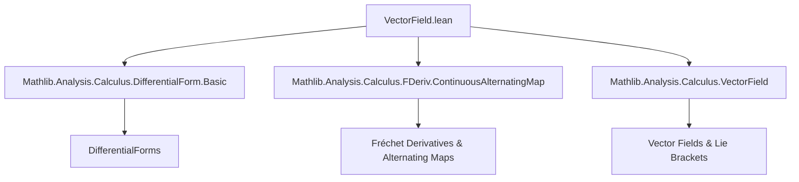
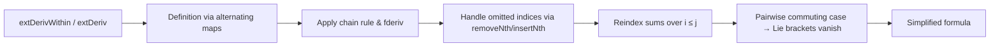

**Technical Brief: `VectorField.lean` — Evaluation of the Exterior Derivative on Vector Fields**

---

### **1. Key Definitions & Theorems**

| Name | Type / Signature | Purpose |
|------|------------------|---------|
| `extDerivWithin` | `E → (⋀^k E →L[𝕜] F) → s → x → (Fin k → E → E) → F` | Exterior derivative of a differential form *within* a set `s` at `x`, evaluated on vector fields. Generalizes `dω` to constrained settings (e.g., manifolds with boundary). |
| `extDeriv` | `E → (⋀^k E →L[𝕜] F) → x → (Fin k → E → E) → F` | Exterior derivative of a differential form *at* a point `x`, evaluated on vector fields (global version). |
| `lieBracketWithin` | `(V W : E → E) → s → x → E` | Lie bracket of vector fields *within* a set `s` at `x`, accounting for constraints (e.g., tangency to `s`). |
| `lieBracket` | `(V W : E → E) → x → E` | Standard Lie bracket (commutator) of vector fields at `x`. |
| `removeNth`, `insertNth`, `vecCons` | `Fin n → α → Fin (n-1) → α`, etc. | Index manipulation for alternating maps; used to omit/insert arguments in `ω`. |
| `extDerivWithin_apply_vectorField` | `theorem` | Main formula: expresses `extDerivWithin ω s x (V · x)` as sum of directional derivatives minus sum over Lie brackets. |
| `extDeriv_apply_vectorField` | `theorem` | Global version of the above, assuming differentiability at `x`. |
| `extDerivWithin_apply_vectorField_of_pairwise_commute` | `theorem` | Simplified formula when vector fields pairwise commute (i.e., all Lie brackets vanish). |
| `extDeriv_apply_vectorField_of_pairwise_commute` | `theorem` | Global version of the commuting case. |

---

### **2. Naming Conventions**

- **Prefixes**:
  - `extDeriv*`: Exterior derivative (within or at a point).
  - `lieBracket*`: Lie bracket (within or at a point).
  - `removeNth`, `insertNth`, `castSucc`, `succ`, `predAbove`, `succAbove`: Index manipulation for finite types (`Fin n`).
- **Suffixes**:
  - `Within`: Constrained version (e.g., on a subset `s`).
  - No suffix: Unconstrained (global) version.
- **Variables**:
  - `ω`: Differential form.
  - `V i`: Vector fields indexed by `Fin (n + 1)` or `Fin (n + 2)`.
  - `i, j`: Indices in `Fin n`, often with constraints like `i ≤ j`.

---

### **3. Tactic Stack**

- **Core tactics**:
  - `simp` / `simp only`: Extensive simplification using lemmas about `fderiv`, `extDeriv`, `lieBracket`, and `removeNth`.
  - `rw`: Rewriting using lemmas like `Fin.removeNth_removeNth_eq_swap`, `Fin.succAbove_of_le_castSucc`, etc.
  - `refine`: To construct proofs with holes (e.g., `?_`).
  - `symm`: To reverse equalities.
  - `sum_congr`, `Fintype.sum_congr`: To reindex sums.
  - `Fin.sum_sum_eq_sum_triangle_add`: To convert nested sums over `i : Fin (n+1), j ≥ i` into triangular sums.
- **Advanced lemmas used**:
  - `fderivWithin_continuousAlternatingMap_apply_apply`
  - `map_insertNth`, `map_removeNth`
  - `smul_add`, `add_sub_assoc`, `sub_eq_self`, `sub_eq_add_neg`
  - `pow_add`, `mul_smul`, `smul_comm`

---

### **4. Proof Logic**

- **Structure**:
  1. **Induction on `n`** (implicitly via `cases n` in `extDerivWithin_apply_vectorField_of_pairwise_commute`).
  2. **Index manipulation**:
     - Use of `Fin` arithmetic (`castSucc`, `succ`, `predAbove`, `succAbove`) to align formal indexing with informal `i < j`.
     - Swapping omitted indices via `Fin.removeNth_removeNth_eq_swap`.
  3. **Application of chain rule & alternating map properties**:
     - `fderivWithin_continuousAlternatingMap_apply_apply` handles differentiation of alternating maps.
     - `extDerivWithin_apply` is the definition of `extDerivWithin` in terms of alternating multilinear maps.
  4. **Sum reindexing**:
     - Convert sum over `(i, j)` with `i ≤ j` in `Fin (n+1)` to sum over `(i, j+1)` with `i < j+1` in `Fin (n+2)`.
     - Parity adjustment: sign flips due to index shift (`(-1)^{i+j}` vs `(-1)^{i + (j+1)}`).
  5. **Vanishing Lie bracket case**:
     - Reduce to zero using `hcomm` and `map_coord_zero`.

- **Key insight**: The formalization uses `Fin (n+1)` for the sum over pairs to avoid `i = j` and align with `i < j` in informal math, at the cost of sign adjustment.

---

### **5. Imports & Dependencies**

- **Core dependencies**:
  ```lean
  Mathlib.Analysis.Calculus.DifferentialForm.Basic
  Mathlib.Analysis.Calculus.FDeriv.ContinuousAlternatingMap
  Mathlib.Analysis.Calculus.VectorField
  ```
- **Key abstractions used**:
  - `ContinuousAlternatingMap`: Model for differential forms.
  - `VectorField`: Type of vector fields and Lie brackets.
  - `fderivWithin`, `fderiv`: Fréchet derivatives (within/at a point).
  - `extDerivWithin`, `extDeriv`: Exterior derivative (within/at a point).
  - `lieBracketWithin`, `lieBracket`: Lie brackets.

---

### **6. Mermaid Diagrams**

#### **Dependency Graph (Module-Level)**



#### **Overview of Theoretical Flow**



#### **Index Mapping (Formal ↔ Informal)**

```mermaid
flowchart LR
  A[Formal: i : Fin (n+1), j ≥ i] -->|castSucc i, succ j| B[Informal: i < j in Fin (n+2)]
  A -->|parity shift| C[Sign: (-1)^{i+j} vs (-1)^{i+j+1}]
  C --> D[Overall sign flip: + → -]
```

---

### **7. Summary**

This file formalizes the **Cartan formula** for the exterior derivative of differential forms evaluated on vector fields, including the correction term involving Lie brackets. It carefully handles finite-type indexing (`Fin n`) and index shuffling to match standard mathematical conventions, while accounting for sign conventions introduced by reindexing. The theorems are stated both in constrained (`extDerivWithin`) and unconstrained (`extDeriv`) settings, with a clean corollary for commuting vector fields.

The formalization demonstrates Lean’s strength in managing high-level differential geometry with precise index control and alternating multilinear algebra.
