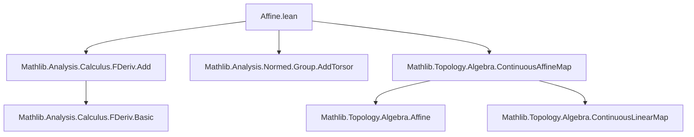
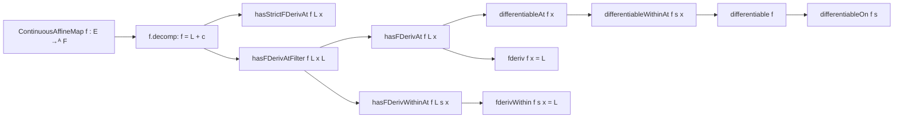

### Technical Brief: `Affine.lean`

---

#### **1. Key Definitions & Theorems**

| Name | Type / Signature | Purpose |
|------|------------------|---------|
| `ContinuousAffineMap` | Typeclass-free namespace | Encapsulates continuous affine maps $ f : E \to^A F $ between normed spaces over a nontrivially normed field $ \mathbb{k} $. |
| `f.decomp` | $ f = \text{contLinear} + \text{const}(f(0)) $ | Decomposition of a continuous affine map into its continuous linear part and a constant. |
| `hasStrictFDerivAt` | $ \text{HasStrictFDerivAt } f\ f.\text{contLinear}\ x $ | States that $ f $ has a strict Fréchet derivative at $ x $, equal to its continuous linear part. |
| `hasFDerivAtFilter` | $ \text{HasFDerivAtFilter } f\ f.\text{contLinear}\ x\ L $ | Generalizes derivative existence to filters (e.g., within subsets). |
| `hasFDerivWithinAt`, `hasFDerivAt` | $ \text{HasFDerivWithinAt } f\ f.\text{contLinear}\ s\ x $, $ \text{HasFDerivAt } f\ f.\text{contLinear}\ x $ | Special cases of `hasFDerivAtFilter`. |
| `differentiableAt`, `differentiableWithinAt`, `differentiable`, `differentiableOn` | Various differentiability properties | Derive smoothness from derivative existence. |
| `fderiv`, `fderivWithin` | $ \text{fderiv } \mathbb{k}\ f\ x = f.\text{contLinear} $, under `UniqueDiffWithinAt` | Identifies the actual derivative (as a linear map) with the continuous linear part. |

All theorems are marked with `@[fun_prop]`, indicating they are useful for functional propagation in type class inference.

---

#### **2. Naming Conventions**

- **Prefixes**:
  - `has*`: asserts existence of a derivative-like object (`hasFDerivAt`, `hasStrictFDerivAt`, etc.).
  - `differentiable*`: asserts differentiability (not just existence of derivative).
  - `fderiv*`: identifies the derivative itself.
- **Suffixes**:
  - `At`: pointwise (e.g., `hasFDerivAt`).
  - `WithinAt`: relative to a set (e.g., `hasFDerivWithinAt`).
  - `On`: global over a set (e.g., `differentiableOn`).
- **Field-specific**:
  - `𝕜` for the base field (standard in Mathlib).
  - `E`, `F` for normed spaces over $ \mathbb{k} $.

---

#### **3. Tactic Stack**

- `rw [f.decomp]`: Rewrites using the decomposition of affine maps.
- `simpa using ...`: Simplifies goals using assumptions and applies a given proof.
- `exact ...`: Directly solves a goal.
- `rw [...]`: Rewriting using lemmas like `DifferentiableAt.fderivWithin`.
- `fun _ => ...`: Used in lambda-abstraction for pointwise properties.

No heavy automation (e.g., `linarith`, `ring`, `norm_cast`) is used—proofs are mostly structural and rely on known derivative lemmas.

---

#### **4. Proof Logic**

- **Structure**: All proofs follow a uniform pattern:
  1. Use `f.decomp` to write $ f = L + c $, where $ L $ is continuous linear and $ c $ constant.
  2. Apply known derivative rules:
     - Continuous linear maps are differentiable with derivative $ L $.
     - Constant maps are differentiable with zero derivative.
     - Sum rule for derivatives (e.g., `hasStrictFDerivAt.add`).
  3. Simplify using `simpa` or `exact`.

- **Induction / Cases**: Not used—proofs are direct and rely on pre-established calculus lemmas.

---

#### **5. Imports**

| Import | Role |
|--------|------|
| `Mathlib.Analysis.Calculus.FDeriv.Add` | Derivative properties for additive maps (e.g., sum rule). |
| `Mathlib.Analysis.Normed.Group.AddTorsor` | Structural facts about torsors and translations (used implicitly in affine structure). |
| `Mathlib.Topology.Algebra.ContinuousAffineMap` | Core definitions and basic properties of `ContinuousAffineMap`. |

These imports define the ambient setting: Fréchet derivatives, continuity, and affine structure.

---

#### **8. Mermaid Diagrams**

##### **Dependency Graph**

##### **Overview of File Content**

---

#### **Summary**

This file formalizes the foundational calculus of continuous affine maps: they are everywhere differentiable, with derivative equal to their linear part. The proofs are short and rely on decomposition and standard derivative rules. The naming and structure follow Mathlib conventions, emphasizing modularity and reuse of existing calculus infrastructure.
