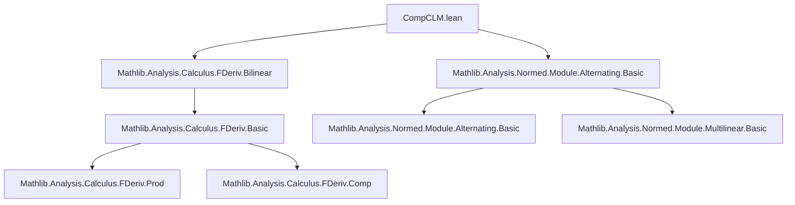
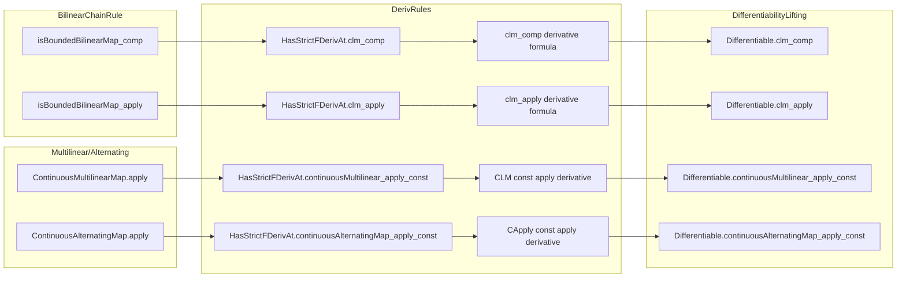

### Technical Brief: `CompCLM.lean`

---

#### **1. Key Definitions & Theorems**

| Name | Type / Signature | Purpose |
|------|------------------|---------|
| `compL 𝕜 F G H` | `C(L(E, F), C(L(F, G), L(E, G)))` | Continuous bilinear map representing composition of continuous linear maps. |
| `applyL 𝕜 F G` | `C(L(F, G), C(F, G))` | Continuous bilinear map representing application (evaluation) of a continuous linear map. |
| `HasStrictFDerivAt.clm_comp` | `HasStrictFDerivAt c c' x → HasStrictFDerivAt d d' x → HasStrictFDerivAt (y ↦ c y ∘ d y) ...` | Chain rule for composition of families of continuous linear maps. |
| `HasStrictFDerivAt.clm_apply` | `HasStrictFDerivAt c c' x → HasStrictFDerivAt u u' x → HasStrictFDerivAt (y ↦ c y (u y)) ...` | Chain rule for application of a family of continuous linear maps to a family of vectors. |
| `HasStrictFDerivAt.continuousMultilinear_apply_const` | `HasStrictFDerivAt c c' x → HasStrictFDerivAt (y ↦ c y u) (c'.flipMultilinear u) x` | Derivative of applying a differentiable family of continuous multilinear maps to a *constant* tuple. |
| `HasStrictFDerivAt.continuousAlternatingMap_apply_const` | `HasStrictFDerivAt c c' x → HasStrictFDerivAt (y ↦ c y u) (c'.flipAlternating u) x` | Derivative of applying a differentiable family of continuous alternating maps to a *constant* tuple. |
| `fderiv_clm_comp` | `fderiv (y ↦ c y ∘ d y) x = ...` | Explicit formula for Fréchet derivative of composition of CLMs. |
| `fderiv_clm_apply` | `fderiv (y ↦ c y (u y)) x = ...` | Explicit formula for Fréchet derivative of application. |
| `fderiv_continuousMultilinear_apply_const` | `fderiv (y ↦ c y u) x = (fderiv c x).flipMultilinear u` | Derivative commutes with application to constant in multilinear case. |
| `fderiv_continuousAlternatingMap_apply_const` | `fderiv (y ↦ c y u) x = (fderiv c x).flipAlternating u` | Derivative commutes with application to constant in alternating case. |

---

#### **2. Naming Conventions**

- **Prefixes**:
  - `clm_`: pertains to *continuous linear maps*.
  - `continuousMultilinear_`: pertains to *continuous multilinear maps*.
  - `continuousAlternatingMap_`: pertains to *continuous alternating maps*.
  - `flip_` / `flipMultilinear_` / `flipAlternating_`: denote flipping arguments to turn a map into a linear map in the second argument (e.g., `c'.flipMultilinear u` applies `c'` with `u` fixed in the multilinear slot).
- **Suffixes**:
  - `_comp`: composition of CLMs.
  - `_apply`: application of CLM to vector.
  - `_const`: application to a *constant* (i.e., independent of `x`).
- **Predicate suffixes**:
  - `HasStrictFDerivAt`, `HasFDerivAt`, `HasFDerivWithinAt`, `DifferentiableAt`, `DifferentiableWithinAt`, `DifferentiableOn`, `Differentiable`: standard Fréchet differentiability predicates.

---

#### **3. Tactic Stack**

- **Core tactics**:
  - `exact`, `by exact`: used to resolve unification issues in `HasFDeriv*` proofs.
  - `simp [thm]`: used in `fderiv_*_apply` lemmas to simplify using prior `fderiv_*` theorems.
  - `have := Fintype.ofFinite ι`: to derive finite type class instances from `Finite ι`.
- **Library lemmas**:
  - `isBoundedBilinearMap_comp.hasStrictFDerivAt`, `isBoundedBilinearMap_apply.hasStrictFDerivAt`: bilinear chain rule.
  - `.comp x`, `.comp_hasFDerivWithinAt x`: composition with derivative.
  - `.prodMk`: to combine two derivative hypotheses into one for product space.
  - `.hasFDerivAt`, `.hasStrictFDerivAt`: to lift derivative properties through continuous multilinear/alternating maps.

---

#### **4. Proof Logic**

- **Structure**:
  - All proofs follow a *modular chain-rule pattern*:
    1. Identify the underlying *bounded bilinear map* (`compL` or `applyL`).
    2. Apply the general chain rule for bounded bilinear maps (`isBoundedBilinearMap_*.hasStrictFDerivAt`).
    3. Use `prodMk` to combine derivative assumptions on components.
    4. Conclude via `.comp` or `.comp_hasFDerivWithinAt`.
- **Multilinear/Alternating Cases**:
  - Use `ContinuousMultilinearMap.apply` / `ContinuousAlternatingMap.apply` as *linear* maps (via `hasFDerivAt`).
  - Then apply standard chain rule: `hasFDerivAt.comp`.
  - For `Differentiable*` properties, lift via `hasFDeriv*` + `.differentiable*`.
- **Finite/Fintype handling**:
  - `Finite ι` → `Fintype ι` via `Fintype.ofFinite`, needed to instantiate `ContinuousMultilinearMap`/`ContinuousAlternatingMap` typeclass instances.

---

#### **5. Imports**

| Import | Purpose |
|--------|---------|
| `Mathlib.Analysis.Calculus.FDeriv.Bilinear` | Provides chain rule for bounded bilinear maps (`isBoundedBilinearMap_*`). |
| `Mathlib.Analysis.Normed.Module.Alternating.Basic` | Defines `ContinuousAlternatingMap`, `flipAlternating`, etc. |

---

#### **6. Theory Overview & Dependencies**

##### **Mermaid: Module Dependency Graph**

##### **Mermaid: Data Flow / Theory Overview**

---

#### **7. Summary**

This file formalizes *chain rules* for derivatives involving:
- **Composition** of families of continuous linear maps,
- **Application** of such maps to families of vectors,
- **Application to constants** in the multilinear and alternating settings.

It leverages:
- General chain rules for bounded bilinear maps,
- Structural properties of `ContinuousMultilinearMap` and `ContinuousAlternatingMap`,
- Typeclass inference (`Finite`, `Fintype`, `NormedSpace`) to handle finite index sets.

The results are foundational for higher-order calculus on normed spaces, especially in contexts involving tensorial or multilinear structures (e.g., differential geometry, PDEs on manifolds).
