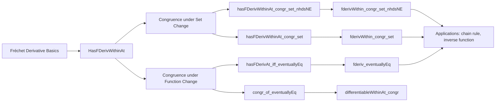

### Technical Brief: `Congr.lean` — Fréchet Derivative Congruence Properties

---

#### **1. Key Definitions & Theorems**

| Name | Type / Signature | Purpose |
|------|------------------|---------|
| `HasFDerivWithinAt f f' s x` | `Prop` | $f$ has Fréchet derivative `f'` at `x` *within* set `s`. |
| `HasStrictFDerivAt f f' x` | `Prop` | $f$ has *strict* Fréchet derivative `f'` at `x`. |
| `DifferentiableWithinAt 𝕜 f s x` | `Prop` | $f$ is differentiable at `x` within `s`. |
| `fderivWithin 𝕜 f s x` | `E →L[𝕜] F` | The (unique) derivative of `f` at `x` within `s`, when it exists. |
| `fderiv 𝕜 f x` | `E →L[𝕜] F` | The (global) Fréchet derivative of `f` at `x`. |
| `hasFDerivWithinAt_congr_set_nhdsNE` | `s =ᶠ[𝓝[≠] x] t → HasFDerivWithinAt f f' s x ↔ HasFDerivWithinAt f f' t x` | Congruence of *within*-derivative under equality of sets away from `x`. |
| `hasFDerivWithinAt_congr_set` | `s =ᶠ[𝓝 x] t → …` | Same, under full neighborhood equality (weaker hypothesis). |
| `hasFDerivWithinAt_congr_set'` | `[T1Space E] → s =ᶠ[𝓝[{y}ᶜ] x] t → …` | Congruence when sets agree on complement of `{y}`, especially useful when `y = x`. |
| `differentiableWithinAt_congr_set_nhdsNE` | `s =ᶠ[𝓝[≠] x] t → … ↔ …` | Congruence of differentiability within sets (same hypotheses as above). |
| `fderivWithin_congr_set_nhdsNE` | `s =ᶠ[𝓝[≠] x] t → fderivWithin f s x = fderivWithin f t x` | Equality of derivatives under set congruence away from `x`. |
| `fderivWithin_congr_set` | `s =ᶠ[𝓝 x] t → … = …` | Same for full neighborhood. |
| `Filter.EventuallyEq.hasFDerivAt_iff` | `f₀ =ᶠ[𝓝 x] f₁ → HasFDerivAt f₀ f' x ↔ HasFDerivAt f₁ f' x` | Derivability is invariant under eventual equality of functions. |
| `Filter.EventuallyEq.differentiableAt_iff` | `f₀ =ᶠ[𝓝 x] f₁ → … ↔ …` | Differentiability invariant under eventual equality. |
| `HasFDerivWithinAt.congr_of_eventuallyEq` | `f₁ =ᶠ[𝓝[s] x] f → f₁ x = f x → HasFDerivWithinAt f₁ f' s x` | Derivative existence transfers along eventual equality *within* `s`. |
| `fderivWithin_congr` | `EqOn f₁ f s → f₁ x = f x → fderivWithin f₁ s x = fderivWithin f s x` | Equality of derivatives when functions agree *on* `s`. |
| `Filter.EventuallyEq.fderiv` | `f₁ =ᶠ[𝓝 x] f → fderiv f₁ =ᶠ[𝓝 x] fderiv f` | Derivative map is continuous w.r.t. uniform eventual equality. |

---

#### **2. Naming Conventions**

- **Prefixes**:
  - `hasFDerivWithinAt_`, `differentiableWithinAt_`, `fderivWithin_`: indicate properties/objects related to *within*-derivatives.
  - `hasStrictFDerivAt_`: for strict derivatives.
  - `congr_`, `eventually_`, `eventuallyEq_`: denote congruence / eventual equality lemmas.
  - `mono`: for monotonicity (subset) arguments.
  - `of_eventuallyEq`, `of_mem`, `of_nhds`: indicate hypotheses derived from eventual equality, membership, or neighborhood conditions.

- **Suffixes**:
  - `_nhdsNE`: “neighborhoods non-empty” — uses `𝓝[≠] x` (punctured neighborhoods), avoids T₁ assumption.
  - `_nhds`: uses full neighborhood `𝓝 x`.
  - `_set'`, `_set_nhdsNE`, `_set`: variants for set congruence.
  - `_eventually_congr_set`: for *functions* of sets (e.g., `fderivWithin f s` as a function of `s`).
  - `_of_nhds`, `_of_nhdsWithin`, `_of_insert`: special cases for neighborhoods relative to sets.

---

#### **3. Tactic Stack**

| Tactic | Usage Frequency | Role |
|--------|-----------------|------|
| `simp only [...]` | Very High | Simplify using definitional equivalences, especially `hasFDerivWithinAt`, `fderivWithin`, `differentiableWithinAt`. |
| `rw [...]` | High | Rewrite using lemmas like `hasFDerivWithinAt_diff_singleton_self`, `nhdsWithin_inter'`, etc. |
| `exact`, `refine`, `apply` | Medium | Build proofs by chaining implications or using `↔`-elimination. |
| `cases` / `rcases` | Medium | For case splits (e.g., `eq_or_ne x y`). |
| `filter_mono`, `inf_le_left`, `subset_insert`, `nhdsWithin_mono` | Medium | Manipulate filters/neighborhoods. |
| `eventually_*` tactics (`eventually_nhds_nhdsWithin`, `eventually_mem_nhdsWithin`) | Medium | Handle eventual equality manipulations. |
| `aesop` / `tauto` | Low | Not used here — proofs are mostly algebraic/filter-theoretic. |
| `ring` / `linarith` | Very Low | Not needed — no arithmetic in the core logic. |

---

#### **4. Proof Logic**

- **Structure**: Most proofs follow a *two-step equivalence* pattern:
  1. Reduce to a known equivalence (e.g., `hasFDerivWithinAt_diff_singleton_self`).
  2. Use filter equality (`𝓝[s \ {x}] x = 𝓝[t \ {x}] x`) derived from `s =ᶠ[𝓝[≠] x] t`.
- **Key Techniques**:
  - **Set modification**: Removing or inserting points (e.g., `{x}`) using `diff_eq`, `inter_comm`, `nhdsWithin_inter'`.
  - **Filter monotonicity**: `h.filter_mono`, `nhdsWithin_mono`, `inf_le_left`.
  - **Eventual equality propagation**: `eventually_eventually_nhds`, `eventually_nhds_nhdsWithin`.
  - **Uniqueness of derivative**: Used implicitly via `fderivWithin` definition (` classical; simp only [...]`).
- **Induction**: Not used — all arguments are local (pointwise) and rely on filter calculus.

---

#### **5. Imports**

- **Primary**:
  ```lean
  Mathlib.Analysis.Calculus.FDeriv.Basic
  ```
  Provides foundational definitions: `HasFDerivAt`, `HasFDerivWithinAt`, `fderivWithin`, `differentiableWithinAt`, etc.

- **Open scopes**:
  - `Filter`, `Asymptotics`, `ContinuousLinearMap`, `Set`, `Metric`, `Topology`, `NNReal`, `ENNReal`

- **Assumptions**:
  - `NontriviallyNormedField 𝕜`
  - `AddCommGroup`, `Module`, `TopologicalSpace` on `E`, `F`
  - Optional: `T1Space E`, `T2Space F`, `ContinuousAdd`, `ContinuousSMul`, `UniqueDiffWithinAt`

---

#### **6. Mermaid Diagrams**

##### **Dependency Graph (Module-Level)**

```mermaid
graph TD
  A[Congr.lean] --> B[Mathlib.Analysis.Calculus.FDeriv.Basic]
  B --> C[Mathlib.Analysis.Calculus.FDeriv.Definition]
  B --> D[Mathlib.Topology.Basic]
  B --> E[Mathlib.MeasureTheory.Integral.Basic]  %% indirect via topology/analysis
  C --> F[Mathlib.LinearAlgebra.NormedSpace.Basic]
  C --> G[Mathlib.Topology.Algebra.Module.Basic]
```

##### **Overview of Theory Flow**



##### **Key Proof Strategy Flow (Example: `hasFDerivWithinAt_congr_set_nhdsNE`)**

```mermaid
flowchart LR
  A[s =ᶠ[𝓝[≠] x] t] --> B[𝓝[s \ {x}] x = 𝓝[t \ {x}] x]
  B --> C[HasFDerivWithinAt f f' s x ↔ HasFDerivWithinAt f f' (s \ {x}) x]
  C --> D[↔ HasFDerivWithinAt f f' (t \ {x}) x]
  D --> E[↔ HasFDerivWithinAt f f' t x]
  E --> F[Conclusion]
```

---

#### **7. Summary**

This file formalizes *local stability* of Fréchet differentiability and derivatives under:
- **Set perturbations** (removing points, changing domains),
- **Function perturbations** (eventual equality, agreement on subsets),
- **Neighborhood refinements** (punctured vs full, relative to sets).

It is foundational for calculus in infinite-dimensional spaces, especially for proving invariance of derivatives under smooth coordinate changes, extension lemmas, and chain rules.

Let me know if you'd like a formalized dependency graph for the entire `Mathlib.Analysis.Calculus.FDeriv` hierarchy.
