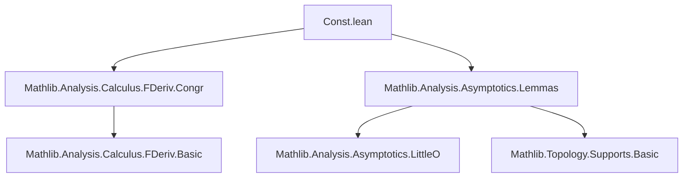

### Technical Brief: `Const.lean` — Fréchet Derivative of Constant Functions

---

#### **1. Key Definitions & Theorems**

| Name | Type / Signature | Purpose |
|------|------------------|---------|
| `hasStrictFDerivAt_const` | `HasStrictFDerivAt (fun _ => c) (0 : E →L[𝕜] F) x` | Shows constant function has strict Fréchet derivative zero. |
| `hasFDerivAt_const` | `HasFDerivAt (fun _ => c) (0 : E →L[𝕜] F) x` | Standard Fréchet differentiability of constant functions. |
| `hasFDerivWithinAt_const` | `HasFDerivWithinAt (fun _ => c) (0 : E →L[𝕜] F) s x` | Differentiability within a set `s`. |
| `hasFDerivAtFilter_const` | `HasFDerivAtFilter (fun _ => c) (0 : E →L[𝕜] F) x L` | Differentiability with respect to an arbitrary filter `L`. |
| `differentiableAt_const` | `DifferentiableAt 𝕜 (fun _ => c) x` | Immediate corollary: constant functions are differentiable. |
| `differentiableWithinAt_const` | `DifferentiableWithinAt 𝕜 (fun _ => c) s x` | Differentiability within a subset. |
| `differentiable_const` | `Differentiable 𝕜 (fun _ => c)` | Globally differentiable constant functions. |
| `differentiableOn_const` | `DifferentiableOn 𝕜 (fun _ => c) s` | Differentiable on any subset. |
| `fderiv_const` | `fderiv 𝕜 (fun _ => c) = 0` | The Fréchet derivative of a constant function is identically zero. |
| `fderivWithin_const` | `fderivWithin 𝕜 (fun _ => c) s = 0` | The restricted derivative is zero. |
| `fderiv_of_notMem_tsupport` | `x ∉ tsupport f → fderiv 𝕜 f x = 0` | Derivative vanishes outside the topological support. |
| `support_fderiv_subset` | `support (fderiv 𝕜 f) ⊆ tsupport f` | Support of derivative lies in topological support of `f`. |
| `HasCompactSupport.fderiv` | `HasCompactSupport f → HasCompactSupport (fderiv 𝕜 f)` | Compact support preserved under differentiation. |

**Special cases** (via typeclass inference):  
- `hasFDerivAt_zero`, `hasFDerivAt_one`, `hasFDerivAt_natCast`, `hasFDerivAt_intCast`, `hasFDerivAt_ofNat`  
- Same for `differentiable*`, `fderiv*`, etc.

---

#### **2. Naming Conventions**

- **Prefixes**:
  - `has*FDeriv*`: asserts existence of a Fréchet derivative (strict, within, at filter, etc.)
  - `differentiable*`: asserts differentiability (at, within, on, globally)
  - `fderiv*`: computes or asserts equality of the derivative
- **Suffixes**:
  - `_const`: general constant function
  - `_zero`, `_one`, `_natCast`, `_intCast`, `_ofNat`: specific constant functions (via typeclasses)
- **Pattern**: `hasFDerivAt_*`, `differentiableWithinAt_*`, `fderivWithin_*`, `fderiv_*`

---

#### **3. Tactic Stack**

- **Core tactics**:
  - `simp`, `rw`, `refine`, `exact`, `ext`
- **Specialized**:
  - `congr_of_eventuallyEq`: for proving equality of derivatives via eventual equality
  - `of_isLittleOTVS`: leverages little-o behavior to prove derivative existence
  - `of_not_accPt`, `subsingleton`, `eq_empty_or_singleton_of_subsingleton`: for degenerate domain cases
- **Automation**:
  - `aesop` not used explicitly here (proofs are mostly direct)
  - `ring`/`linarith` not needed (linear algebra over normed fields handled via `ContinuousLinearMap` lemmas)

---

#### **4. Proof Logic**

- **General pattern**:
  1. Reduce to `hasStrictFDerivAt_const` (or `hasFDerivAt_const`) via typeclass specializations.
  2. Use `of_isLittleOTVS` + `IsLittleOTVS.zero` + `congr_left` to show the little-o condition holds.
  3. Derive differentiability via `differentiableAt` constructor: `⟨0, hasFDerivAt_const _ _⟩`.
  4. For `fderiv*`, use `fderivWithin`, `fderiv`, and `if_pos` + `hasFDerivWithinAt_*`.
  5. For support-related lemmas: use `tsupport` definition (`tsupport f = closure (support f)`) and `eventuallyEq` characterizations.

- **Subsingleton case**:
  - Use `hasFDerivWithinAt_singleton` (via `of_not_accPt`) and `subsingleton_univ.eq_singleton_of_mem`.
  - Derive global differentiability via `hasFDerivAt_of_subsingleton`.

- **Eventual constancy**:
  - `hasFDerivAt_zero_of_eventually_const` uses `congr_of_eventuallyEq` with `hasFDerivAt_const`.

---

#### **5. Imports**

| Module | Purpose |
|--------|---------|
| `Mathlib.Analysis.Calculus.FDeriv.Congr` | Congruence lemmas for derivatives (e.g., `congr_of_eventuallyEq`, `hasFDerivAt.congr`) |
| `Mathlib.Analysis.Asymptotics.Lemmas` | Asymptotic analysis tools: `IsLittleOTVS`, `eventuallyEq`, `tsupport`, `support`, `accPt`, `clusterPt`, etc. |

**Key ambient structures**:
- `NontriviallyNormedField 𝕜`
- `AddCommGroup`, `Module`, `TopologicalSpace` for `E`, `F`
- Typeclasses: `One`, `NatCast`, `IntCast`, `OfNat`, `Subsingleton`, `HasCompactSupport`

---

#### **6. Mermaid Diagrams**

##### **Dependency Graph (Top-Level)**



##### **Overview of File Structure**

```mermaid
flowchart LR
  subgraph "Core Theory"
    A[Constant Function Derivatives] --> B[Strict FDeriv]
    A --> C[FDeriv at Filter]
    A --> D[FDeriv Within Set]
    A --> E[FDeriv at Point]
  end

  subgraph "Special Cases"
    B --> B1[0, 1, n, z, ofNat]
    C --> C1[Same]
    D --> D1[Same]
    E --> E1[Same]
  end

  subgraph "Differentiability"
    E --> F[DifferentiableAt]
    D --> G[DifferentiableWithinAt]
    A --> H[Differentiable]
    D --> I[DifferentiableOn]
  end

  subgraph "Derivative Computation"
    E --> J[fderiv]
    D --> K[fderivWithin]
  end

  subgraph "Support Theory"
    J --> L[support_fderiv_subset]
    K --> M[tsupport_fderiv_subset]
    L --> N[HasCompactSupport.fderiv]
  end

  subgraph "Degenerate Cases"
    O[Subsingleton E] --> P[hasFDerivAt_of_subsingleton]
    Q[Singleton {x}] --> R[hasFDerivWithinAt_singleton]
  end
```

##### **Theoretical Scope**

- **Domain**: Fréchet calculus over normed vector spaces over a nontrivially normed field.
- **Scope**: 
  - Derivatives of constant functions (including numerals via typeclasses).
  - Local/global differentiability.
  - Behavior on subsets and filters.
  - Interaction with topological support and compact support.
- **Related theories**:
  - `Mathlib.Analysis.Calculus.FDeriv.*` (chain rule, product rule, etc.)
  - `Mathlib.Analysis.Asymptotics.*` (big-O, little-o, asymptotics)
  - `Mathlib.Topology.Supports.*` (support, essential support, compact support)

---

#### **7. Summary**

This file formalizes the foundational fact that **constant functions have zero Fréchet derivative**, in all standard variants (strict, within, at filter, etc.), and for all numerals definable via typeclasses (`0`, `1`, `n : ℕ`, `z : ℤ`, `ofNat`). It also connects differentiability with support-theoretic properties (e.g., derivative vanishes outside the topological support), and handles degenerate domains (subsingletons, singletons). The proofs rely heavily on `IsLittleOTVS` and congruence principles for derivatives, and are highly uniform across variants — a hallmark of Lean’s `fun_prop` infrastructure.
