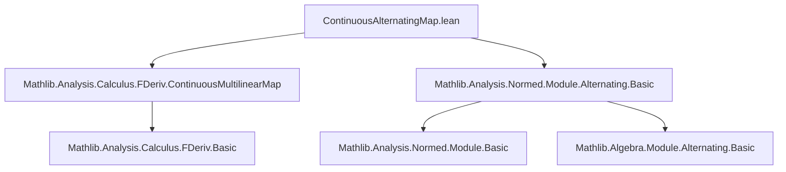
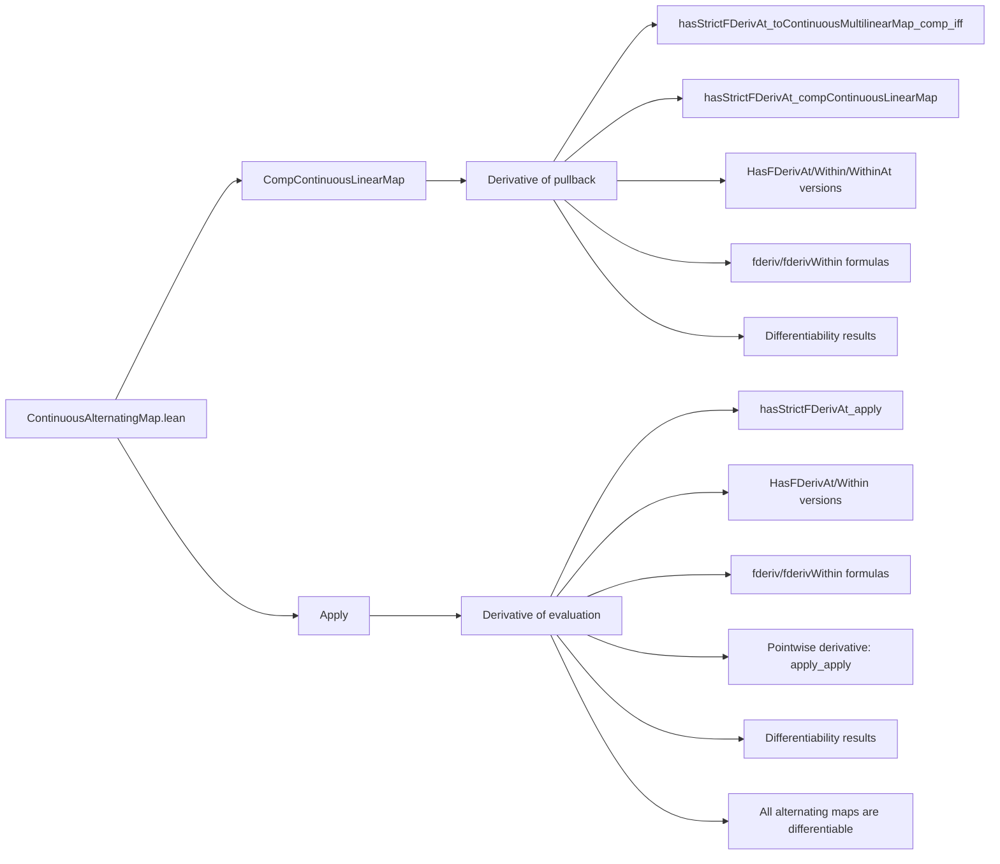

### Technical Brief: `ContinuousAlternatingMap.lean`

---

#### **1. Key Definitions & Theorems**

| Name | Type / Signature | Purpose |
|------|------------------|---------|
| `toContinuousMultilinearMap` | `ContinuousAlternatingMap E ι F G → ContinuousMultilinearMap E ι F G` | Forgets alternation, views a continuous alternating map as a continuous multilinear map. |
| `toContinuousMultilinearMapCLM` | `ContinuousAlternatingMap E ι F G →L[𝕜] ContinuousMultilinearMap E ι F G` | Continuous linear version of the above; used for derivative computations. |
| `compContinuousLinearMap` | `(G [⋀^ι]→L[𝕜] H) → (F →L[𝕜] G) → (F [⋀^ι]→L[𝕜] H)` | Pullback of a continuous alternating map along a continuous linear map. |
| `compContinuousLinearMapCLM` | `(F →L[𝕜] G) →L[𝕜] (G [⋀^ι]→L[𝕜] H) →L[𝕜] (F [⋀^ι]→L[𝕜] H)` | Continuous linear version of `compContinuousLinearMap`. |
| `fderivCompContinuousLinearMap` | `(G [⋀^ι]→L[𝕜] H) → (F →L[𝕜] G) →L[𝕜] (F [⋀^ι]→L[𝕜] H)` | Derivative of `compContinuousLinearMap` w.r.t. the alternating map argument. |
| `apply` | `𝕜 → F → G → (F [⋀^ι]→L[𝕜] G) →L[𝕜] (ι → F) → G` | Evaluation map: applies a continuous alternating map to a tuple of vectors. |
| `hasStrictFDerivAt_toContinuousMultilinearMap_comp_iff` | `↔` | Equivalence between strict differentiability of `f` and of `toContinuousMultilinearMap ∘ f`. |
| `hasStrictFDerivAt_compContinuousLinearMap` | `HasStrictFDerivAt ...` | Derivative formula for pullback operation `(f, g) ↦ f.compContinuousLinearMap g`. |
| `continuousAlternatingMap_apply` (various forms) | `HasFDerivAt`, `fderiv`, etc. | Derivative of `x ↦ f x (g · x)` — evaluation of alternating map at varying arguments. |
| `differentiable` (for alternating maps) | `Differentiable 𝕜 f` | Any continuous alternating map is differentiable. |

---

#### **2. Naming Conventions**

- **Prefixes**:
  - `hasStrictFDerivAt_`, `hasFDerivAt_`, `hasFDerivWithinAt_`: assert differentiability (strict / non-strict / within set).
  - `continuousAlternatingMap_`: properties of operations on `ContinuousAlternatingMap`.
  - `fderivWithin_`, `fderiv_`: explicit derivative formulas.
- **Suffixes**:
  - `_compContinuousLinearMap`: pullback operation.
  - `_apply`, `_apply_apply`: evaluation at vectors; `_apply_apply` gives pointwise evaluation of derivative.
- **Other**:
  - `CLM` suffix: *Continuous Linear Map* version (e.g., `compContinuousLinearMapCLM`).
  - `linearDeriv`: derivative of underlying multilinear map.

---

#### **3. Tactic Stack**

- **Core tactics**:
  - `rw`, `simp`, `simp_rw`, `convert`, `exact`, `refine`
- **Analysis-specific**:
  - `hasStrictFDerivAt_iff_isLittleOTVS`, `isBigOTVS.trans_isLittleOTVS`
  - `LinearMap.isBigOTVS_rev_comp`, `isEmbedding_toContinuousMultilinearMap.nhds_eq_comap`
- **Multilinear/Alternating-specific**:
  - `ContinuousMultilinearMap.hasStrictFDerivAt_compContinuousLinearMap`
  - `hasStrictFDerivAt_id`, `hasStrictFDerivAt_pi.mpr`
- **Structure & simplification**:
  - `cases nonempty_fintype ι`, `classical`, `fun_prop`, `Function.update`

---

#### **4. Proof Logic**

- **Induction / finite case analysis**:
  - Many proofs assume `Finite ι` or `Fintype ι`, and often use `cases nonempty_fintype ι` to reduce to finite index sets.
- **Reduction to multilinear case**:
  - Use `toContinuousMultilinearMap` and `toContinuousMultilinearMapCLM` to lift alternating maps to multilinear ones, where known derivative formulas exist.
- **Chain rule composition**:
  - Derivatives of composite operations (e.g., pullback, evaluation) are proven via:
    - `hasStrictFDerivAt.comp`, `hasFDerivAt.comp`, `hasFDerivWithinAt.comp_hasFDerivWithinAt`
    - `prodMk`, `prodMap`, `hasStrictFDerivAt_pi.mpr`
- **Summation over finite index set**:
  - Derivative of evaluation involves sum over `i : ι`, using `∑ i, ...`.
- **Differentiability lifting**:
  - From `HasFDerivAt` to `DifferentiableAt` via `differentiableWithinAt`, `differentiableAt`.

---

#### **5. Imports**

| Module | Purpose |
|--------|---------|
| `Mathlib.Analysis.Calculus.FDeriv.ContinuousMultilinearMap` | Derivative theory for continuous multilinear maps (used as base for alternating case). |
| `Mathlib.Analysis.Normed.Module.Alternating.Basic` | Basic theory of alternating maps, including `ContinuousAlternatingMap` type and basic operations. |

---

#### **6. Mermaid Diagrams**

##### **Dependency Graph (Module Level)**

##### **Overview of File Structure**

---

#### **7. Summary**

This file formalizes **calculus of continuous alternating maps** in the context of normed spaces over a nontrivially normed field. It extends known multilinear calculus results to the alternating setting via the embedding `toContinuousMultilinearMapCLM`, and proves:

- Chain rule formulas for:
  - Pullback along a continuous linear map (`compContinuousLinearMap`)
  - Evaluation of alternating maps at variable arguments (`apply`)
- Differentiability and explicit derivative expressions in multiple modes (`fderiv`, `fderivWithin`, strict/non-strict).
- As a corollary, **every continuous alternating map is differentiable**.

The proofs rely heavily on:
- Reduction to multilinear case,
- Finite-index case analysis,
- Standard chain rule tactics in `Mathlib`’s `FDeriv` library.

--- 

Let me know if you'd like a **dependency graph of definitions** or a **proof sketch for a specific theorem**.
