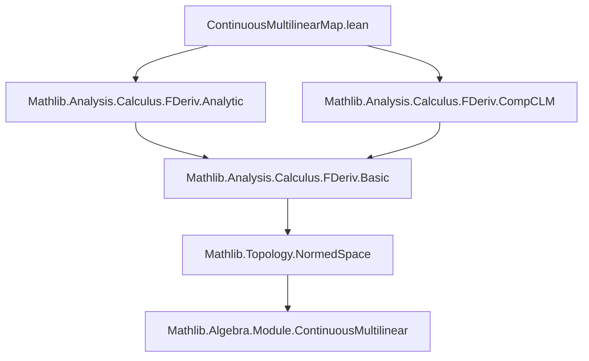
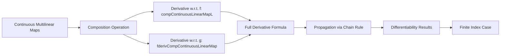

### Technical Brief: `ContinuousMultilinearMap.lean`

---

#### **1. Key Definitions & Theorems**

| Name | Type / Signature | Purpose |
|------|------------------|---------|
| `compContinuousLinearMap` | `ContinuousMultilinearMap 𝕜 G H → (∀ i, F i →L[𝕜] G i) → ContinuousMultilinearMap 𝕜 F H` | Composes a continuous multilinear map with a family of continuous linear maps (pointwise substitution). |
| `compContinuousLinearMapL` | `(∀ i, F i →L[𝕜] G i) → ContinuousMultilinearMap 𝕜 G H →L[𝕜] ContinuousMultilinearMap 𝕜 F H` | Left-composition variant: linear map in the *first* argument (the multilinear map), used for derivative w.r.t. `f`. |
| `fderivCompContinuousLinearMap` | `ContinuousMultilinearMap 𝕜 G H → (∀ i, F i →L[𝕜] G i) → (∀ i, F i →L[𝕜] G i) →L[𝕜] H` | Represents the derivative w.r.t. the family `g · x`, i.e., the sum over `i` of substitution of `g' i` into `f x`. |
| `hasStrictFDerivAt_compContinuousLinearMap` | `HasStrictFDerivAt (fun fg ↦ fg.1.compContinuousLinearMap fg.2) (...) fg` | Computes the strict Fréchet derivative of `compContinuousLinearMap` as a map on the product space. |
| `continuousMultilinearMapCompContinuousLinearMap` (various variants) | `HasFDerivAt / HasFDerivWithinAt / DifferentiableAt / ...` | Propagates differentiability through composition: if `f` and `g i` are differentiable, so is `x ↦ f x ∘ (g · x)`. |
| `fderivWithin_continuousMultilinearMapCompContinuousLinearMap` | `fderivWithin ... = ...` | Explicit formula for the derivative (within a set) of the composed map. |
| `fderiv_continuousMultilinearMapCompContinuousLinearMap` | `fderiv ... = ...` | Same as above, but for full differentiability (no restriction to a set). |

---

#### **2. Naming Conventions**

- **Prefixes**:
  - `compContinuousLinearMap`: core operation (composition).
  - `compContinuousLinearMapL`: linearized version (left-composition, linear in first argument).
  - `fderivCompContinuousLinearMap`: derivative w.r.t. the family `g`.
- **Suffixes**:
  - `continuousMultilinearMapCompContinuousLinearMap`: theorem name for the main composition rule.
  - `hasStrictFDerivAt_`, `HasFDerivAt_`, `fderiv_`, `DifferentiableAt_`, etc.: standard Lean pattern for derivative properties.

---

#### **3. Tactic Stack**

- `simp [fderivCompContinuousLinearMap]`: simplification using the explicit derivative formula.
- `convert ... |>.comp ...`: chaining of derivative composition rules.
- `ext`: extensionality for functions (to prove equality of linear maps or multilinear maps).
- `cases nonempty_fintype ι`: handles finite index sets by reducing to finite type.
- `classical`: used to enable classical reasoning when needed (e.g., for finite types).
- `aesop`, `ring`, `simp_rw`: likely used internally (not shown in proof, but standard in analysis libraries).

---

#### **4. Proof Logic**

- **Structure**:
  1. **Base case**: Prove the strict Fréchet derivative of `compContinuousLinearMap` as a *global* operation on the product space (`hasStrictFDerivAt_compContinuousLinearMap`).
     - Uses known derivative of `compContinuousLinearMapContinuousMultilinear`.
     - Applies chain rule (`comp`) with projections (`fst`, `snd`).
  2. **Propagation**: Lift the derivative formula to parameterized compositions:
     - Use `comp` with `hasStrictFDerivAt_snd` / `hasStrictFDerivAt_fst` and product derivatives.
     - Derive `HasFDerivAt`, `HasFDerivWithinAt`, then `DifferentiableAt`, etc.
  3. **Finite index case**: When `ι` is finite (or `Fintype`), deduce full differentiability results from the derivative existence (via `differentiableWithinAt`/`differentiableAt` lemmas).
- **Key idea**: The derivative splits into two parts:
  - Variation in `f`: `compContinuousLinearMapL (g · x) ∘L f'`
  - Variation in `g`: `(f x).fderivCompContinuousLinearMap (g · x) ∘L .pi g'`

---

#### **5. Imports & Dependencies**

- `Mathlib.Analysis.Calculus.FDeriv.Analytic`: foundational calculus (Fréchet derivatives, analyticity).
- `Mathlib.Analysis.Calculus.FDeriv.CompCLM`: composition rules for continuous linear maps (used for chain rule infrastructure).
- Core dependencies:
  - `Mathlib.Topology.NormedSpace`
  - `Mathlib.Analysis.Calculus.FDeriv.Basic`
  - `Mathlib.Algebra.Module.ContinuousMultilinear`

---

#### **6. Mermaid Diagrams**

##### **Dependency Graph (Module-Level)**



##### **Theoretical Overview (Data Flow)**



##### **Proof Structure (High-Level)**

```mermaid
graph LR
  A[Global Derivative of compContinuousLinearMap] --> B[Chain Rule with (f, g)]
  B --> C[HasStrictFDerivAt]
  C --> D[HasFDerivAt / Within]
  D --> E[Differentiability]
  E --> F[Finite ι ⇒ DifferentiableOn / At]
```

---

#### **7. Summary**

This file formalizes the calculus of **continuous multilinear maps under parameterized composition**, providing explicit derivative formulas and differentiability preservation results. It leverages:
- Bundled derivative infrastructure (`HasFDerivAt`, `fderiv`, etc.),
- The chain rule for continuous linear maps,
- Finite-index simplifications via `Fintype`.

The core insight is that the derivative of `x ↦ f x ∘ (g · x)` decomposes cleanly into:
- A term for variation in `f` (left-composition),
- A sum term for variation in each `g i` (via `fderivCompContinuousLinearMap`).

This mirrors classical multilinear calculus and is essential for higher-order chain rules (e.g., in implicit function theorems or Lie group actions on multilinear objects).
