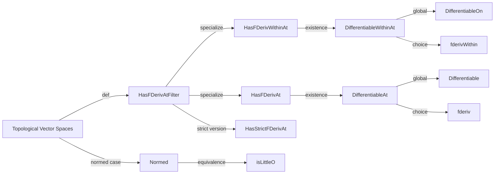

### Technical Brief: `Defs.lean` — Fréchet Derivative Definitions in Lean 4

---

#### **1. Key Definitions & Theorems**

| Name | Type / Structure | Purpose |
|------|------------------|---------|
| `HasFDerivAtFilter` | `structure` | Defines Fréchet differentiability of `f` at `x` along a filter `L`, via `isLittleOTVS`. Generalizes both `HasFDerivAt` and `HasFDerivWithinAt`. |
| `HasFDerivWithinAt` | `def` | Special case of `HasFDerivAtFilter` where `L = 𝓝[s] x`, i.e., derivative *within* set `s`. |
| `HasFDerivAt` | `def` | Special case of `HasFDerivAtFilter` where `L = 𝓝 x`, i.e., standard Fréchet derivative at `x`. |
| `HasStrictFDerivAt` | `structure` | Strict differentiability: $ f(x) - f(y) - f'(x - y) = o(\|(x, y) - (x, x)\|) $ as $(x, y) \to (x, x)$. Used in inverse function theorem. |
| `DifferentiableWithinAt` | `def` | Existence (not uniqueness) of a derivative within set `s` at `x`. |
| `DifferentiableAt` | `def` | Existence of a derivative at point `x`. |
| `DifferentiableOn` | `def` | Differentiability within `s` at all points of `s`. |
| `Differentiable` | `def` | Global differentiability on the whole space. |
| `fderivWithin` | `irreducible_def` | Returns a derivative if it exists (and is nonzero); otherwise returns `0`. Depends on classical choice. |
| `fderiv` | `irreducible_def` | `fderivWithin f univ`, i.e., derivative on the whole space. |
| `hasFDerivAtFilter_iff_isLittleO` | `theorem` | Equivalence between `HasFDerivAtFilter` (via `isLittleOTVS`) and `isLittleO`, for seminormed spaces. |
| `hasStrictFDerivAt_iff_isLittleO` | `theorem` | Same as above for strict differentiability. |
| `fderivWithin_zero_of_not_differentiableWithinAt` | `theorem` | If `f` is not differentiable within `s` at `x`, then `fderivWithin f s x = 0`. |
| `fderivWithin_univ` | `theorem` | `fderivWithin f univ = fderiv f`. |

---

#### **2. Naming Conventions**

- **Prefixes**:
  - `HasFDeriv*`: predicate for existence of a derivative (with qualifiers: `At`, `WithinAt`, `AtFilter`, `Strict`).
  - `Differentiable*`: predicate for *existence* of a derivative (not uniqueness).
  - `fderiv*`: *computable* derivative (with fallback to `0`).
- **Suffixes**:
  - `WithinAt`: derivative restricted to a set `s`.
  - `At`: derivative at a point (full neighborhood).
  - `AtFilter`: derivative along an arbitrary filter (most general).
  - `Strict`: strict differentiability (two-point condition).
- **Structure naming**:
  - `of_isLittleOTVS` field in `HasFDerivAtFilter` and `HasStrictFDerivAt` encodes the little-o condition.

---

#### **3. Tactic Stack**

- `simp` / `rw`: for rewriting definitions (`hasFDerivAtFilter_iff_isLittleOTVS`, `hasFDerivAtFilter_iff_isLittleO`, etc.).
- `ext`: extensionality for functions (used in `fderivWithin_univ`).
- `classical`: used implicitly via `Classical.choose` in `DifferentiableWithinAt` and `fderivWithin`.
- `isLittleOTVS_iff_isLittleO`: bridge between TVS and normed-space formulations.

No heavy automation (e.g., `aesop`, `ring`, `linarith`) appears in this file — it's definitionally lean.

---

#### **4. Proof Logic**

- **Definition-first approach**: All definitions are given in terms of `isLittleOTVS` (to avoid norm dependence), then specialized to `isLittleO` in normed settings.
- **Uniqueness not assumed**: Derivatives are defined via *existence* (`∃ f'`), and uniqueness is deferred to `TangentCone.lean` via `UniqueDiffWithinAt`.
- **Computational choice**: `fderivWithin` and `fderiv` use classical choice + fallback to `0`, ensuring definability but requiring uniqueness assumptions for correctness.
- **No induction or case analysis** in this file — purely definitional and equivalence-based reasoning.

---

#### **5. Imports & Dependencies**

- **Core imports**:
  ```lean
  Mathlib.Analysis.Asymptotics.TVS
  ```
- **Key dependencies**:
  - `Filter`, `Asymptotics`, `ContinuousLinearMap`, `Set`, `Metric`, `TopologicalSpace`, `NNReal`, `ENNReal`.
  - `NontriviallyNormedField` (ensures field is not discrete).
  - `AddCommGroup`, `Module`, `TopologicalSpace`, `SeminormedAddCommGroup`, `NormedSpace`.

---

#### **6. Theory Overview & Dependency Diagram**

##### **Module Scope**
This file (`Defs.lean`) defines the *core logical foundation* for Fréchet calculus in Lean:
- Derivative notions (`HasFDeriv*`, `Differentiable*`)
- Derivative selector (`fderiv*`)
- Equivalences between TVS- and normed-space formulations.

It is *not* about proving properties (e.g., chain rule, bilinearity), which are deferred to:
- `Basic.lean`: elementary properties
- `Const.lean`, `Linear.lean`, `Bilinear.lean`, `Add.lean`, `Mul.lean`, `Comp.lean`, `Inverse.lean`

##### **Mermaid Diagrams**

**Dependency Graph (top-level):**
```mermaid
graph TD
  A[Defs.lean] --> B[Basic.lean]
  A --> C[Const.lean]
  A --> D[Linear.lean]
  A --> E[Bilinear.lean]
  A --> F[Add.lean]
  A --> G[Mul.lean]
  A --> H[Comp.lean]
  A --> I[TangentCone.lean] %% for uniqueness
  A --> J[Inverse.lean]
  A --> K[TVS.lean] %% via Asymptotics.TVS
```

**Conceptual Flow (within `Defs.lean`):**


---

#### **7. Notes on Design Choices**

- **`isLittleOTVS` → `isLittleO`**: Allows generality in TVS, then simplifies in normed settings.
- **Non-discrete field assumption**: Ensures derivative theory is nontrivial (e.g., avoids pathological behavior over finite fields).
- **`irreducible_def` for `fderiv*`**: Prevents unfolding, avoids dependence on classical choice in proofs.
- **Fallback to `0`**: Makes `fderiv` total, but correctness only guaranteed under uniqueness assumptions (`UniqueDiffWithinAt`).

---

#### **8. Tags & Keywords**

`derivative`, `differentiable`, `Fréchet`, `calculus`, `strict differentiability`, `little-o`, `topological vector space`, `continuous linear map`, `filter`, `tangent cone`, `uniqueness`.

--- 

Let me know if you'd like a formalized dependency graph (e.g., for `leanproject`), or a summary of how `TangentCone.lean` interacts with this file.
