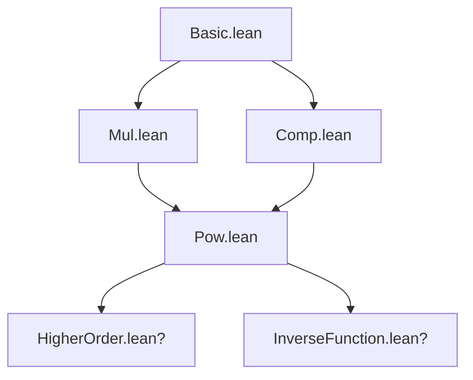
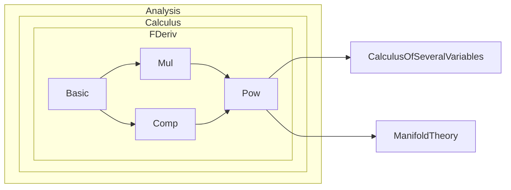

### Technical Brief: `Pow.lean` — Fréchet Derivative of Power Functions

---

#### **1. Key Definitions & Theorems**

| Name | Type / Purpose |
|------|----------------|
| `aux` | Technical lemma: verifies a summation identity used to inductively prove derivative formulas. |
| `HasStrictFDerivAt.fun_pow'` | General non-commutative chain rule for `fun x ↦ f x ^ n`. |
| `HasStrictFDerivAt.pow'` | Equivalent formulation for `f ^ n` (pointwise power of function). |
| `hasStrictFDerivAt_pow'` | Special case: derivative of `x ↦ x ^ n` on the base ring `𝔸`. |
| `HasFDerivWithinAt.fun_pow'`, `pow'`, `hasFDerivWithinAt_pow'` | Analogues of above for *within*-derivatives (local behavior on subset `s`). |
| `HasFDerivAt.fun_pow'`, `pow'`, `hasFDerivAt_pow'` | Analogues for *global* Fréchet derivatives at a point. |
| `DifferentiableWithinAt.fun_pow`, `pow`, `differentiableWithinAt_pow` | Propagation of differentiability through powers (within-at). |
| `DifferentiableAt.fun_pow`, `pow`, `differentiableAt_pow` | Propagation for differentiability at a point. |
| `DifferentiableOn.fun_pow`, `pow`, `differentiableOn_pow` | Propagation on a set. |
| `Differentiable.fun_pow`, `pow`, `differentiable_pow` | Propagation for globally differentiable functions. |
| `fderiv_fun_pow'`, `fderiv_pow'`, `fderiv_pow_ring'` | Explicit formulas for `fderiv` in non-commutative case. |
| `fderivWithin_fun_pow'`, `fderivWithin_pow'`, `fderivWithin_pow_ring'` | Same for `fderivWithin`. |
| `aux_sum_eq_pow` | Key simplification lemma in *commutative* case: collapses sum to $n \cdot f(x)^{n-1} \cdot f'$. |
| `HasStrictFDerivAt.pow`, `hasStrictFDerivAt_pow` | Commutative-case derivative: $(f^n)' = n \cdot f^{n-1} \cdot f'$. |
| `HasFDerivWithinAt.pow`, `hasFDerivWithinAt_pow`, etc. | Same for FDerivWithin and FDerivAt. |
| `fderiv_fun_pow`, `fderiv_pow`, `fderiv_pow_ring` | Explicit derivative formulas in commutative case. |
| `fderivWithin_fun_pow`, `fderivWithin_pow`, `fderivWithin_pow_ring` | Same for within-derivatives. |

---

#### **2. Naming Conventions**

- **`pow'` suffix**: Non-commutative version (sum over $i$ of $f(x)^{n-1-i} \cdot f' \cdot f(x)^i$).
- **`pow` (no `'`)**: Commutative version (simplified to $n \cdot f(x)^{n-1} \cdot f'$).
- **`fun_pow'` / `fun_pow`**: Derivative of `fun x ↦ f x ^ n`.
- **`pow'` / `pow`**: Derivative of `(f ^ n)` (pointwise power of function).
- **`_ring'` / `_ring`**: Special case where $f = \mathrm{id}$ on the ring itself.
- **`_within'` / `_within`**: For `fderivWithin`.
- **`aux` / `aux_sum_eq_pow`**: Internal helper lemmas.

---

#### **3. Tactic Stack**

Frequently used tactics:
- `simp`, `simp_rw`: Simplify using definitions (`pow_succ'`, `smul`, `Finset.sum`, etc.).
- `rw`: Rewrite using lemmas like `pow_succ'`, `Finset.sum_range_succ`, `tsub_add_eq_add_tsub`.
- `congr!`: Congruence reasoning with multiple layers (used in `aux`).
- `exact`, `refine`: Apply known derivative lemmas (`mul'`, `congr_fderiv`, `pow'`).
- `simpa`: Simplify and discharge goal using assumptions.
- `intro`, `cases`, `induction`: Structural reasoning (especially in `aux` and inductive proofs).
- `ring`: Implicitly used in simplifications of scalar multiplication and exponent arithmetic.

---

#### **4. Proof Logic**

- **Inductive structure** on $n$ (natural number exponent).
- Base cases:
  - $n = 0$: derivative of constant $1$ is $0$ (handled via `hasFDerivAt_const`).
  - $n = 1$: derivative is just $f'$ (identity case).
- Inductive step ($n \mapsto n+1$):
  - Use product rule (`mul'`) on $f^{n+1} = f \cdot f^n$.
  - Apply induction hypothesis to $f^n$.
  - Use `aux` (or `aux_sum_eq_pow` in commutative case) to simplify the resulting sum.
  - Conclude via `congr_fderiv` or `fderiv` uniqueness.

- **Non-commutative case** requires careful ordering: $f'$ appears *between* powers of $f(x)$.
- **Commutative case** collapses the sum using `aux_sum_eq_pow`, yielding the familiar scalar multiple.

---

#### **5. Imports**

- `Mathlib.Analysis.Calculus.FDeriv.Mul`: Product rule for Fréchet derivative.
- `Mathlib.Analysis.Calculus.FDeriv.Comp`: Chain rule (used implicitly via `congr_fderiv`, etc.).

---

#### **6. Theory Overview & Dependency Diagram**

##### **High-Level Theory Flow**

```
Fréchet Derivative Basics (Basic.lean)
         ↓
   Product Rule (Mul.lean)
         ↓
   Chain Rule & Composition (Comp.lean)
         ↓
         ┌───────────────────────────────────────────────┐
         │               Pow.lean                        │
         │  • Noncommutative power rule (sum form)      │
         │  • Commutative power rule (scalar multiple)  │
         │  • Propagation of differentiability          │
         └───────────────────────────────────────────────┘
         ↓
   Higher-order calculus, inverse function theorem, etc.
```

##### **Mermaid Diagrams**

**Dependency Graph (Module Level)**



**Module Structure Overview**



---

#### **7. Summary**

This file formalizes the **Fréchet derivative of power functions** in both **commutative** and **non-commutative normed algebras**, covering:
- Strict, within, and global Fréchet derivatives.
- Propagation of differentiability (at, on, within).
- Explicit derivative formulas in both settings.

The non-commutative case uses a sum over all placements of the derivative $f'$ between powers of $f(x)$, while the commutative case simplifies to the familiar scalar multiple $n \cdot f^{n-1} \cdot f'$.

The proofs rely heavily on:
- Induction on $n$,
- The product rule (`mul'`),
- Summation manipulation (`Finset.sum`, `smul`, `pow_succ'`),
- And ring-theoretic simplifications (`aux`, `aux_sum_eq_pow`).

This is foundational for higher-order calculus and analysis on Banach algebras.
