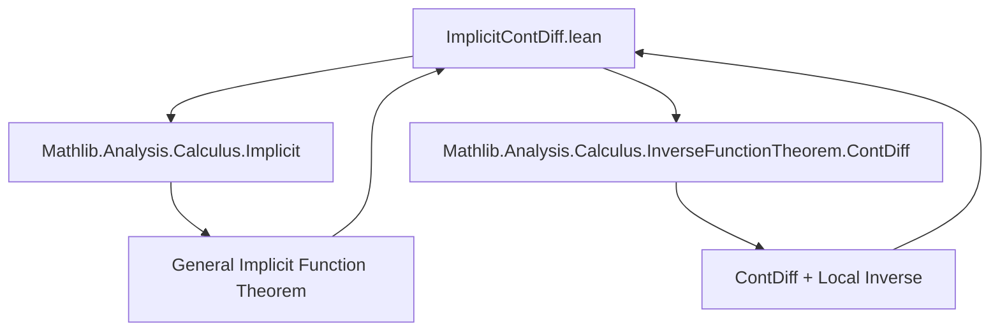
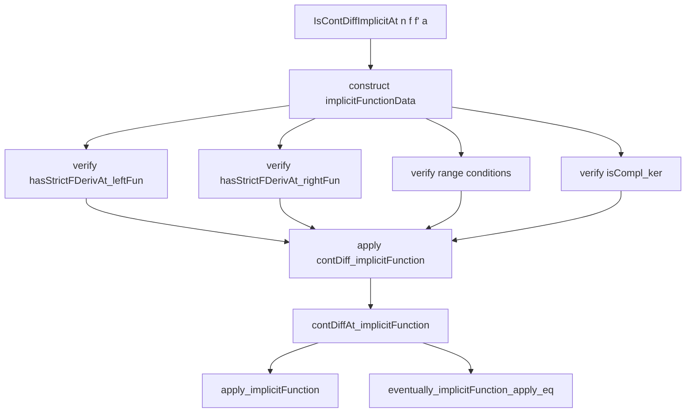

### Technical Brief: `ImplicitContDiff.lean`

---

#### **1. Key Definitions & Theorems**

| Name | Type / Signature | Purpose |
|------|------------------|---------|
| `contDiff_implicitFunction` | `ContDiffAt 𝕜 n φ.implicitFunction.uncurry (φ.prodFun φ.pt)` | Shows that the *uncurried* implicit function (from `ImplicitFunctionData`) is $C^n$ at the base point, assuming the left/right components are $C^n$ and $n \ne 0$. |
| `IsContDiffImplicitAt` | `Prop` | Predicate encoding sufficient conditions for $f : E × F → G$ to admit a $C^n$ implicit function: differentiability, $C^n$ regularity, and invertibility of the partial derivative w.r.t. $F$. |
| `implicitFunctionData` | `ImplicitFunctionData 𝕜 (E × F) E G` | Constructs a generic `ImplicitFunctionData` instance from `IsContDiffImplicitAt`, setting up the left function as projection `fst`, right function as `f`, and verifying required structural properties (e.g., range conditions, complemented kernel). |
| `implicitFunctionAux` | `E → G → E × F` | Helper function returning the full pair `(x, φ(x))` via the general implicit function theorem. |
| `implicitFunction` | `E → F` | The actual implicit function $\varphi(x)$ defined by solving $f(x, \varphi(x)) = f(a)$. |
| `contDiffAt_implicitFunction` | `ContDiffAt 𝕜 n h.implicitFunction a.1` | Main theorem: if $f$ is $C^n$ at $(a, b)$ and the partial derivative w.r.t. $F$ is an isomorphism, then the implicit function $\varphi$ is $C^n$ at $a$. |
| `apply_implicitFunction` | `∀ᶠ x in 𝓝 a.1, f (x, h.implicitFunction x) = f a` | Local satisfaction of the implicit equation: $f(x, \varphi(x)) = f(a)$ near $a$. |
| `eventually_implicitFunction_apply_eq` | `∀ᶠ xy in 𝓝 a, f xy = f a → h.implicitFunction xy.1 = xy.2` | Local uniqueness condition: if $f(xy) = f(a)$, then $xy$ lies on the graph of $\varphi$. |

---

#### **2. Naming Conventions**

- **Predicates**: `is_` prefix (`IsContDiffImplicitAt`)
- **Data constructors**: `implicitFunctionData`, `implicitFunctionAux`, `implicitFunction`
- **Properties/lemmas**: `contDiff_`, `contDiffAt_`, `apply_`, `eventually_`, `implicitFunctionData_*`, `implicitFunction_*`
- **Suffixes**:
  - `_aux`: auxiliary definitions (e.g., `implicitFunctionAux`)
  - `_def`: definitional equalities (e.g., `implicitFunction_def`)
  - `_pt`: point-related equalities (e.g., `implicitFunctionData_pt`)
  - `_apply`: application lemmas (e.g., `implicitFunction_apply`, `apply_implicitFunction`)
- **`uncurry`**: used when working with functions of type `E → F → G` vs `E × F → G`.

---

#### **3. Tactic Stack**

| Tactic | Usage Frequency | Purpose |
|--------|-----------------|---------|
| `rw` | High | Rewriting definitions (e.g., `implicitFunction`, `uncurry_curry`, `toOpenPartialHomeomorph`) |
| `simp` / `simp_rw` | High | Simplifying projections, products, and `Prod`-based equalities |
| `fun_prop` | Medium | Propagating `ContDiffAt` and `HasFDerivAt` properties |
| `exact` / `apply` | Medium | Applying lemmas like `contDiff_implicitFunction`, `hasStrictFDerivAt'`, etc. |
| `ext` | Medium | Extensionality proofs for linear maps, submodules, and products |
| `aesop` / `abel` | Low | Automating algebraic simplifications (e.g., in `isCompl_ker`) |
| `cases` / `obtain` | Low | Extracting surjectivity/injectivity consequences from `bijective` |
| `have`, `set`, `refine` | Medium | Structuring proof steps, especially in `contDiffAt_implicitFunction` |

---

#### **4. Proof Logic**

- **Structure**: The proof proceeds in two phases:
  1. **Setup**: From `IsContDiffImplicitAt n f f' a`, construct `ImplicitFunctionData` (`implicitFunctionData`) satisfying all hypotheses of the *general* implicit function theorem.
     - Key steps: verify `hasStrictFDerivAt`, range conditions (`range_leftDeriv`, `range_rightDeriv`), and complemented kernel (`isCompl_ker`).
  2. **Application**: Apply `contDiff_implicitFunction` (from `ImplicitFunctionData.contDiff_implicitFunction`) to deduce $C^n$ regularity of the implicit function.
     - Use `fun_prop` to propagate smoothness through product and composition.
     - Use `implicitFunction_def` and `uncurry_curry` to relate the uncurried and curried forms.

- **Typical Flow**:
  ```text
  [Assume] h : IsContDiffImplicitAt n f f' a
  → construct h.implicitFunctionData
  → apply contDiff_implicitFunction to h.implicitFunctionData
     using hl = ContDiffAt fst, hr = ContDiffAt f, hn = n ≠ 0
  → simplify using implicitFunction_def
  → conclude ContDiffAt n φ a.1
  ```

- **Key Lemmas Used**:
  - `ContDiffAt.hasStrictFDerivAt'`
  - `Prod.fst.prodMk`, `Function.uncurry_curry`
  - `HasStrictFDerivAt.localInverse_def`
  - `LinearMap.range_eq_top_of_surjective`

---

#### **5. Imports**

| Module | Purpose |
|--------|---------|
| `Mathlib.Analysis.Calculus.Implicit` | General implicit function theorem (`ImplicitFunctionData`, `implicitFunction`, etc.) |
| `Mathlib.Analysis.Calculus.InverseFunctionTheorem.ContDiff` | Smoothness results for local inverses and related constructions |

---

#### **6. Theory Overview & Dependency Diagram**

##### **Module Overview**

This file formalizes the *classical* implicit function theorem in the setting of Banach spaces over a `RCLike` field (e.g., $\mathbb{R}$ or $\mathbb{C}$), showing that if the defining equation $f$ is $C^n$, then so is the implicit function $\varphi$, provided the partial derivative w.r.t. the second variable is an isomorphism.

It leverages a *generalized* implicit function theorem (from `Mathlib.Analysis.Calculus.Implicit`) and specializes it to this setting by constructing a suitable `ImplicitFunctionData` instance.

##### **Mermaid Diagrams**

**Dependency Graph (Top-Level)**



**Theoretical Flow (Within File)**



---

#### **7. Summary**

This file bridges the abstract implicit function theorem (for `ImplicitFunctionData`) with the concrete setting of $C^n$ equations $f(x, y) = c$. It ensures that the regularity of $f$ is inherited by the implicit function $\varphi$, under the standard invertibility condition on the partial derivative. The formalization is modular, relying heavily on existing infrastructure for `ContDiffAt`, `HasFDerivAt`, and `ImplicitFunctionData`.

**TODOs** (as noted in the file):
- Local uniqueness of $\varphi$
- Explicit formula for the derivative $D\varphi$

These would likely be added in subsequent files or as extensions of `IsContDiffImplicitAt`.
