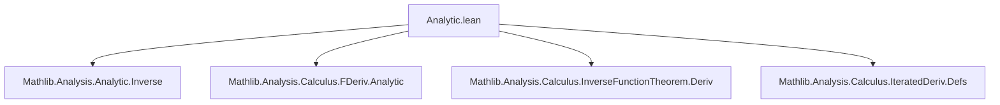

**Technical Brief: `Analytic.lean` — Analyticity of Local Inverses**

---

### 1. **Key Definitions & Theorems**

| Name | Type / Signature | Purpose |
|------|------------------|---------|
| `analyticAt_localInverse` | `AnalyticAt 𝕜 f x → deriv f x ≠ 0 → AnalyticAt 𝕜 (hf.hasStrictDerivAt.localInverse _ _ _ hf') (f x)` | Proves that the local inverse of an analytic function (at a point where derivative ≠ 0) is itself analytic. |
| `analyticAt_comp_iff_of_deriv_ne_zero` | `AnalyticAt 𝕜 f x → deriv f x ≠ 0 → AnalyticAt 𝕜 (g ∘ f) x ↔ AnalyticAt 𝕜 g (f x)` | Establishes equivalence of analyticity of a composition $g \circ f$ at $x$ and $g$ at $f(x)$, under non-vanishing derivative of $f$. |

---

### 2. **Naming Conventions**

- **Prefixes**:
  - `analyticAt_`: for lemmas about analyticity at a point.
  - `hasStrictDerivAt_`, `hasFPowerSeriesAt_`: for objects derived from strict differentiability / power series expansions.
- **Suffixes**:
  - `_localInverse`: refers to the local inverse constructed via the inverse function theorem.
  - `_comp_iff_of_deriv_ne_zero`: encodes a biconditional involving composition and a derivative condition.

Other recurring patterns:
- `mk0`: constructing a unit in `𝕜` from a nonzero element.
- `Equiv.unitsEquivAut`: identification of nonzero scalars with continuous linear automorphisms.

---

### 3. **Tactic Stack**

Frequent tactics used in proofs:
- `let` / `have`: local definitions and intermediate facts.
- `refine`: to construct proofs with holes to be filled later.
- `simp [i]`: simplification using the definition of `i`.
- `congr`: congruence rule for function extensionality.
- `rw [← this]`: rewriting using a previously proven equality.
- `eventually_right_inverse`: used to justify equality almost everywhere (in a neighborhood), for congruence.

No heavy automation like `aesop` or `ring`; relies on structured use of `simp`, `rw`, and known lemmas from `Mathlib`.

---

### 4. **Proof Logic**

- **First lemma (`analyticAt_localInverse`)**:
  1. Construct a continuous linear equivalence `i` from multiplication by `deriv f x`.
  2. Use `hf.hasStrictDerivAt` to get a strict F-differentiable map.
  3. Convert to an `OpenPartialHomeomorph` `R`.
  4. Apply `R.hasFPowerSeriesAt_symm`, which requires:
     - `x ∈ R.source` (trivial from construction),
     - `hf.hasFPowerSeriesAt` (analyticity gives this),
     - and a compatibility condition (handled by `ext; simp`).
  5. Conclude analyticity of the inverse via `analyticAt`.

- **Second lemma (`analyticAt_comp_iff_of_deriv_ne_zero`)**:
  1. One direction (`→`) is nontrivial:
     - Use the local inverse `r` (analytic by first lemma).
     - Rewrite $g$ as $g = (g \circ f) \circ r$ near $f(x)$.
     - Apply composition of analytic maps and congruence (using that $r$ is a right inverse of $f$ near $x$).
  2. Other direction (`←`) is immediate from `AnalyticAt.comp`.

Induction or case analysis is not used; the proofs rely on structural properties of analytic maps and the inverse function theorem.

---

### 5. **Imports**

| Import | Role |
|--------|------|
| `Mathlib.Analysis.Analytic.Inverse` | Provides `hasFPowerSeriesAt_symm`, local inverse theory. |
| `Mathlib.Analysis.Calculus.FDeriv.Analytic` | Links Fréchet differentiability and analyticity. |
| `Mathlib.Analysis.Calculus.InverseFunctionTheorem.Deriv` | Supplies `localInverse`, `hasStrictDerivAt.localInverse`, and related lemmas. |
| `Mathlib.Analysis.Calculus.IteratedDeriv.Defs` | Defines iterated derivatives and related notation (used implicitly via `deriv`). |

Also requires:
- `[NontriviallyNormedField 𝕜]`
- `[CompleteSpace 𝕜]`
- `[CharZero 𝕜]`

These ensure the setting for analytic functions over Banach spaces (here, $𝕜$ as a 1-dimensional space over itself).

---

### 6. **Mermaid Diagrams**

#### **Dependency Graph (Module-Level)**



#### **Overview of Theoretical Flow**

```mermaid
flowchart LR
  subgraph Setup
    H1[Analytic f at x] 
    H2[deriv f x ≠ 0]
  end

  H1 --> H3[HasStrictDerivAt f at x]
  H3 --> H4[OpenPartialHomeomorph R]
  H4 --> H5[Symmetric power series for R⁻¹ at f(x)]
  H5 --> H6[AnalyticAt of local inverse]

  H1 & H2 --> H7[Local inverse r is analytic at f(x)]
  H7 --> H8[g ∘ f analytic ⇔ g analytic at f(x)]
```

---

### 7. **Summary**

This module formalizes a foundational result in analytic function theory: *local invertibility preserves analyticity*. It leverages the inverse function theorem in the analytic category and connects composition with analyticity via change of variables. The proofs are concise and rely heavily on existing infrastructure in `Mathlib` for strict differentiability, power series, and local homeomorphisms.

Let me know if you'd like a formalized dependency graph of lemmas or a visualization of the proof term structure.
