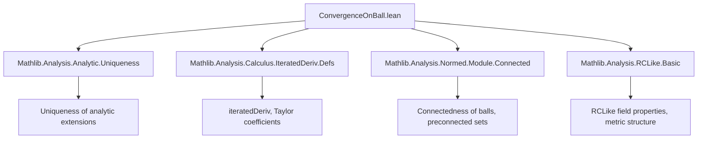

**Technical Brief: `ConvergenceOnBall.lean`**

---

### 1. **Key Definitions & Theorems**

| Name | Type / Signature | Purpose |
|------|------------------|---------|
| `AnalyticOn.hasFPowerSeriesOnSubball` | `{r : ENNReal} → 0 < r → AnalyticOn 𝕜 f (Metric.eball x r) → r ≤ p.radius → HasFPowerSeriesOnBall f p x r` | Shows that if `f` is analytic on an open ball and the radius `r` is ≤ the radius of convergence of its Taylor series `p`, then the Taylor series converges to `f` on that ball. |
| `AnalyticOn.hasFPowerSeriesOnBall` | `letI p := ...; 0 < p.radius → AnalyticOn 𝕜 f (Metric.eball x p.radius) → HasFPowerSeriesOnBall f p x p.radius` | Main theorem: if `f` is analytic on the *entire* ball of convergence of its Taylor series, then the series converges to `f` on that ball. Stronger than `AnalyticAt.hasFPowerSeriesAt`, requiring `RCLike 𝕜`. |

**Auxiliary Definitions Used:**
- `p := FormalMultilinearSeries.ofScalars 𝕜 (fun n ↦ iteratedDeriv n f x / n.factorial)`  
  → The *formal* Taylor series (as a multilinear series) of `f` at `x`.
- `p.radius` | `ENNReal`  
  → Radius of convergence of `p`.
- `HasFPowerSeriesOnBall f p x r`  
  → Predicate meaning: `f` equals the sum of `p` on the open ball `Metric.eball x r`.
- `AnalyticOnNhd 𝕜 f s`  
  → `f` is analytic on a neighborhood of each point in `s`.
- `AnalyticAt 𝕜 f x`  
  → `f` is analytic at `x`: agrees with its Taylor series on some neighborhood of `x`.

---

### 2. **Naming Conventions**

- **Prefixes:**
  - `hasFPowerSeriesOnBall` — indicates existence of a *functional* power series representation on a ball.
  - `is_` not used here; instead, predicates use `has_`, `analyticOn`, `analyticAt`.
- **Suffixes:**
  - `_subball` — for the more general version where radius `r` may be less than `p.radius`.
  - bare `_onBall` — for the sharper version where `r = p.radius`.
- **Variable naming:**
  - `𝕜` — base field (typically `ℝ` or `ℂ`, but abstracted via `RCLike`).
  - `f` — function under analysis.
  - `x` — center point of expansion.
  - `r`, `p.radius` — radii (extended nonnegative reals).
  - `p` — formal multilinear series (Taylor series).

---

### 3. **Tactic Stack**

Frequent tactics used in proofs:
- `rw` — rewriting definitions (e.g., `analyticOn_iff_analyticOnNhd`, `hasFPowerSeriesOnBall`, `EventuallyEq`).
- `simpa` — simplifying with assumptions and discharging goals.
- `apply` — applying lemmas (e.g., `eqOn_of_preconnected_of_eventuallyEq`, `hasFPowerSeriesAt`, `mono`).
- `intro`, `exact`, `symm`, `unfold`, `obtain`, `rw [EMetric.mem_nhds_iff]` — standard Lean proof scripting.
- `order` — for `ENNReal`-based ordering goals (e.g., `le_rfl`, `hr_pos`).
- `simp` — simplifying set membership, e.g., `by simp [hr_pos]`.

No heavy automation like `aesop` or `ring`; relies on structured analysis reasoning.

---

### 4. **Proof Logic**

**High-level proof strategy for `hasFPowerSeriesOnSubball`:**

1. **Rewrite analyticity condition** using `analyticOn_iff_analyticOnNhd`.
2. **Define `g(t) = p.sum(t - x)`**, the sum of the formal series — it has a known power series representation (`p`) on `Metric.eball x p.radius`.
3. **Show `g` is analytic on `Metric.eball x p.radius`**, via `p.analyticOnNhd.comp_sub`.
4. **Restrict analyticity of `g` to smaller ball** `Metric.eball x r` using monotonicity of neighborhoods.
5. **Apply uniqueness of analytic continuation**:  
   - `h.eqOn_of_preconnected_of_eventuallyEq` equates `f` and `g` on `Metric.eball x r`, using:
     - `Metric.isConnected_eball hr_pos` → preconnectedness,
     - `x ∈ Metric.eball x r` → nonempty intersection,
     - `eventuallyEq` proven via `AnalyticAt.hasFPowerSeriesAt` and uniqueness of power series.
6. **Conclude `f = g` on the ball**, and since `g` is represented by `p`, `f` has `p` as its power series on that ball.

**For `hasFPowerSeriesOnBall`:**
- Immediate corollary: set `r := p.radius`, apply previous theorem with `hr := hr`, `hs := hs`, and `le_rfl`.

---

### 5. **Imports & Dependencies**

**Core imports:**
```lean
Mathlib.Analysis.Analytic.Uniqueness  
Mathlib.Analysis.Calculus.IteratedDeriv.Defs  
Mathlib.Analysis.Normed.Module.Connected  
Mathlib.Analysis.RCLike.Basic
```

**Key dependencies:**
- `AnalyticOn`, `AnalyticAt`, `hasFPowerSeriesOnBall`, `FormalMultilinearSeries.ofScalars` — from `Mathlib.Analysis.Analytic.*`.
- `iteratedDeriv`, factorial division — from `Mathlib.Analysis.Calculus.IteratedDeriv.Defs`.
- `Metric.eball`, `isPreconnected`, `isConnected_eball` — from `Mathlib.Analysis.Normed.Module.Connected`.
- `RCLike` — abstracts `ℝ`/`ℂ`-like fields (needed for connectedness, analytic continuation, etc.).

---

### 6. **Mermaid Diagrams**

#### **Dependency Graph (Module-Level)**



#### **Overview of Theoretical Flow**

```mermaid
flowchart LR
  subgraph Setup
    P1[Formal Taylor Series p] 
    P2[Radius of convergence p.radius]
    P3[f analytic on Metric.eball x r]
  end

  subgraph Core Argument
    P4[Define g = sum of p]
    P5[g analytic on ball of radius p.radius]
    P6[f and g analytic on smaller ball]
    P7[Both agree near x (via AnalyticAt.hasFPowerSeriesAt)]
    P8[By uniqueness, f = g on Metric.eball x r]
  end

  P1 --> P4
  P2 --> P5
  P3 --> P6
  P4 --> P5
  P6 --> P7
  P7 --> P8

  P8 --> C1[HasFPowerSeriesOnBall f p x r]
```

---

### 7. **Notes & Context**

- This file resolves a subtlety: over non-archimedean fields (e.g., `ℂₚ`), analyticity *everywhere* does **not** imply global equality with Taylor series — only on the ball of convergence. The `RCLike` assumption (which excludes `p`-adic fields) ensures connectedness and uniqueness of analytic continuation.
- The theorem `hasFPowerSeriesOnBall` is strictly stronger than `AnalyticAt.hasFPowerSeriesAt`, which only gives local equality near `x`. Here, analyticity on the *entire* ball of convergence upgrades local to global equality on that ball.

--- 

Let me know if you'd like a formalized dependency graph (e.g., in `leanproject` format) or a summary of related lemmas in `Mathlib.Analysis.Analytic.*`.
